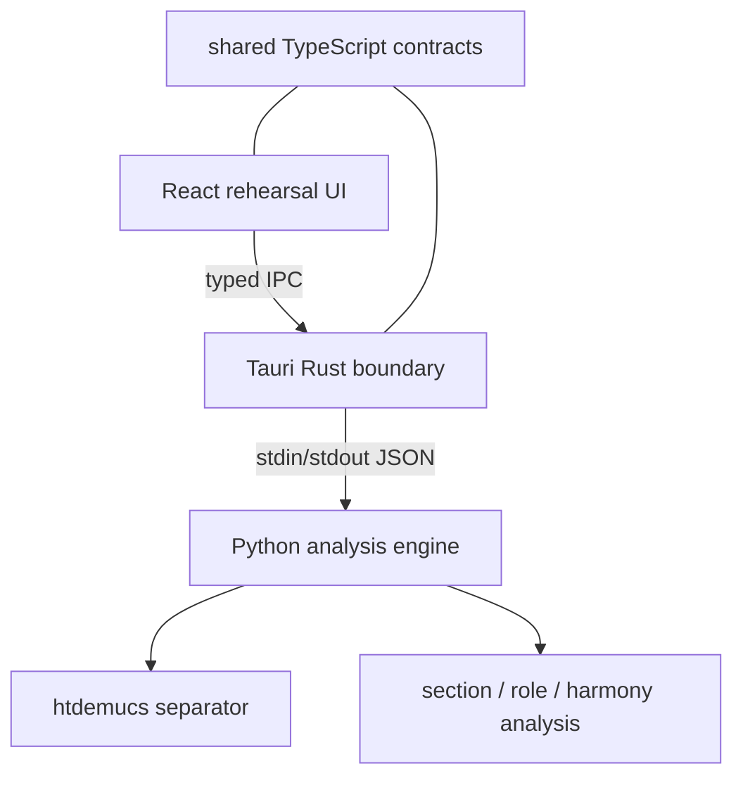
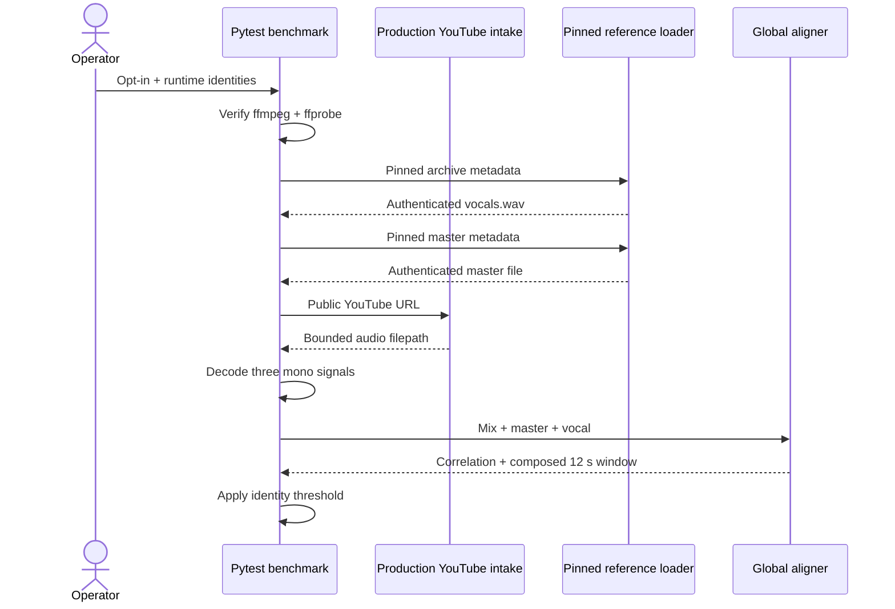
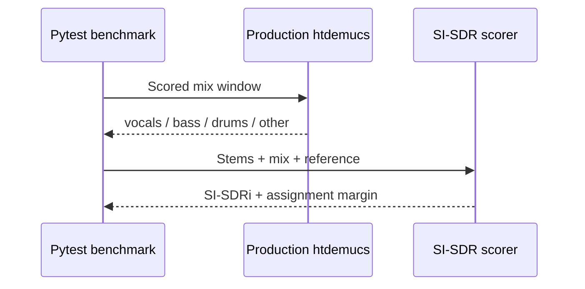
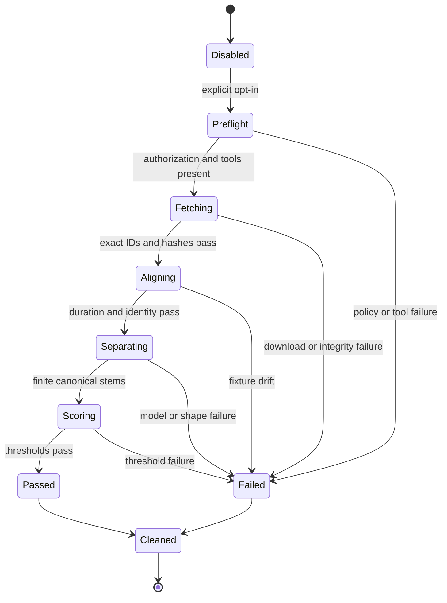
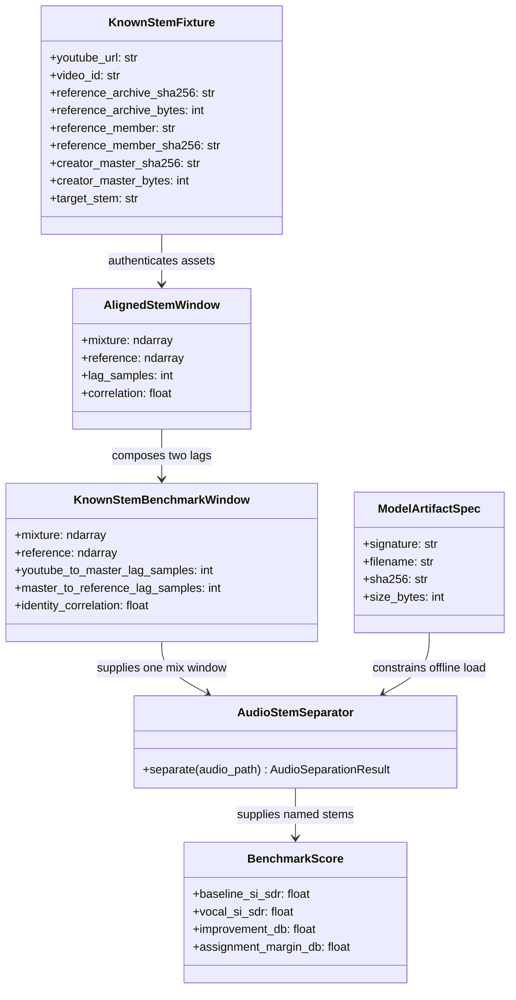
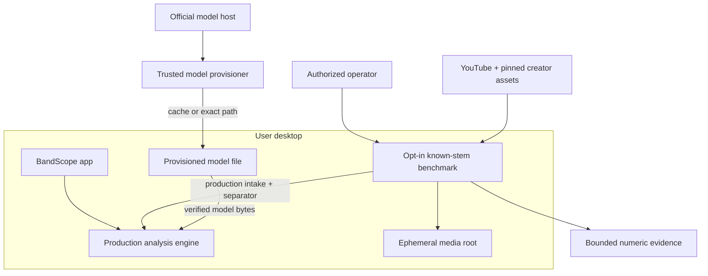
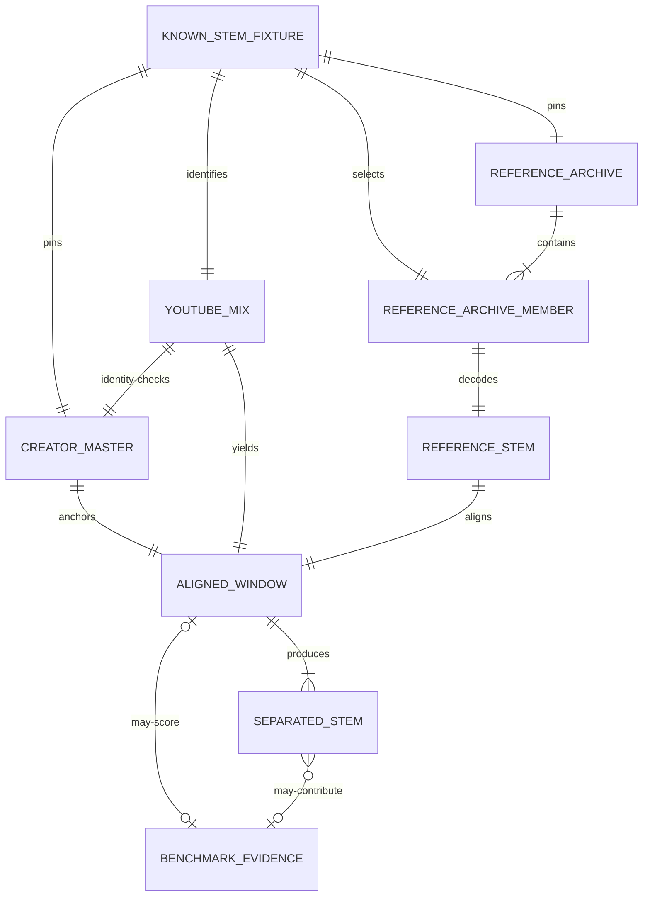

# BandScope Architecture and UML Diagrams

These diagrams describe current `develop` behavior plus the explicitly labeled active known-stem
branch. They do not imply that unmerged work is shipped.

## Component view

## Known-stem identity and alignment sequence (active branch)

## Known-stem inference and scoring sequence (active branch)

## Benchmark state model

## UML class view

`BenchmarkScore` is a logical contract planned for retained evidence; current test assertions compute
these values without instantiating a production class.

## Deployment and trust boundaries

The benchmark, not the product app, owns public fixture access and bounded evidence. Model
provisioning is a separate trusted operation; runtime loading never downloads a missing checkpoint.
The provisioned model file is persistent; media temp is not. Public hosts, model locations, media,
decoders, and model bytes are untrusted until their respective policy and integrity checks pass.

## Logical artifact relationship model (not a physical ERD)

Only `KNOWN_STEM_FIXTURE` metadata is version-controlled. An archive may contain many members, but
the fixture selects and authenticates exactly one `REFERENCE_ARCHIVE_MEMBER` before decoding it as
the reference stem. `YOUTUBE_MIX`, `CREATOR_MASTER`, `REFERENCE_ARCHIVE_MEMBER`, `REFERENCE_STEM`,
`ALIGNED_WINDOW`, and `SEPARATED_STEM` bytes are ephemeral.
`BENCHMARK_EVIDENCE` is planned as a bounded artifact, not a database row. Its aligned-window and
separated-stem relationships are optional because pre-alignment failures (such as the recorded HTTP
502) still produce valid failure evidence. ADR-0003 requires a new physical ERD only if persistence
is introduced.
