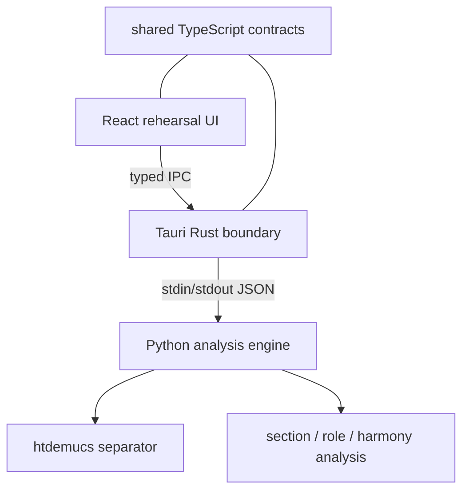
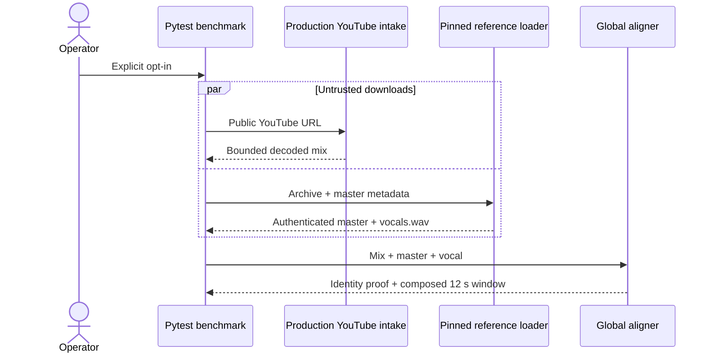
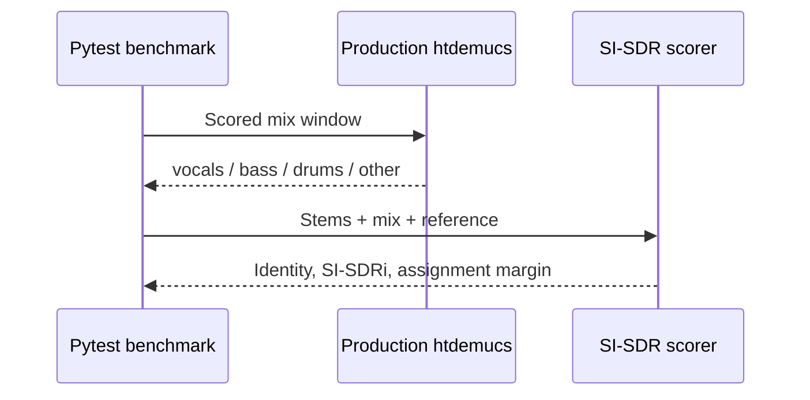
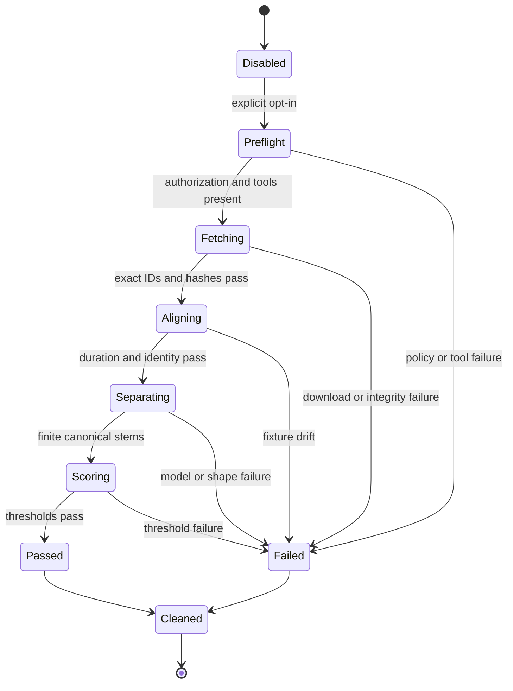
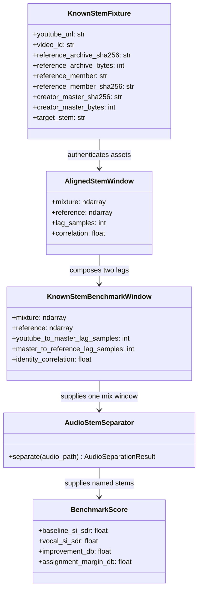
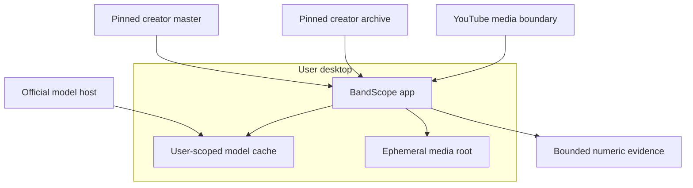
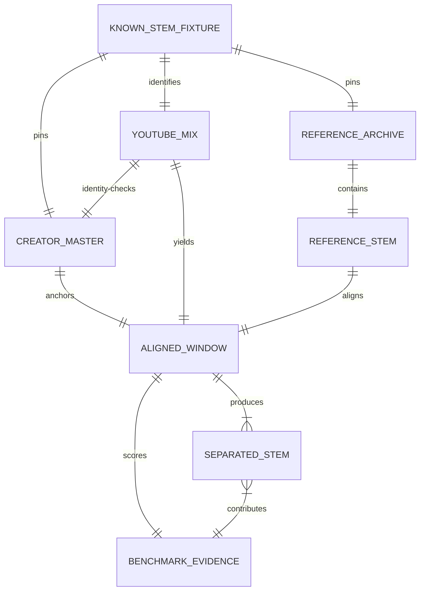

# BandScope Architecture and UML Diagrams

These diagrams describe current `develop` behavior plus the explicitly labeled active known-stem
branch. They do not imply that unmerged work is shipped.

## Component view

## Known-stem identity and alignment sequence (active branch)

## Known-stem inference and scoring sequence (active branch)

## Benchmark state model

## UML class view

`BenchmarkScore` is a logical contract planned for retained evidence; current test assertions compute
these values without instantiating a production class.

## Deployment and trust boundaries

The model cache is persistent; media temp is not. The public hosts, cache contents, media, decoders,
and model bytes are untrusted until their respective policy and integrity checks pass.

## Logical artifact relationship model (not a physical ERD)

Only `KNOWN_STEM_FIXTURE` metadata is version-controlled. `YOUTUBE_MIX`, `CREATOR_MASTER`,
`REFERENCE_STEM`, `ALIGNED_WINDOW`, and `SEPARATED_STEM` bytes are ephemeral.
`BENCHMARK_EVIDENCE` is planned as a bounded artifact, not a database row. ADR-0003 requires a new
physical ERD only if persistence is introduced.
