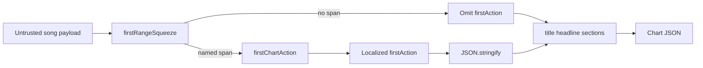

# Chart JSON first-action lead

## Decision

The ready workspace names tonight's first playable range. The chart JSON still dumped title, headline, and every section×role row first, so a player opening tonight's chart had to hunt for that same check. `generateChartSummaryJson` now prepends an optional `firstAction` object. `export.ts` stays locale-free; the workspace computes the localized lead through `firstChartAction`. If that helper cannot name a playable span on the untrusted song payload, the lead is omitted rather than invented. Because the chart body is full-band, transient role selection in the workspace does not change the exported `firstAction`.

## Security Notes

### Attack surface

Chart JSON is derived from untrusted analysis payloads. Section labels, role names, range labels, and next-action copy can carry formula-shaped values (`=`, `+`, `-`, `@`), quotes, and control characters.

### Trust boundary

`JSON.stringify` is the only chart-JSON encoder. `firstChartAction` treats the song as untrusted runtime data and fails closed. Lead values stay literal until that encoder runs. Filename sanitization for the download remains `sanitizeFilename`. This path does not write CSV.

### Logging and privacy

This export path does not add logging, telemetry, network transmission, or server-side retention. The generated Blob exists only in the local download flow until its object URL is revoked. The downloaded JSON can contain song titles, section labels, role names, arrangement notes, and other user-entered rehearsal metadata already present in the full-band chart; those values may identify people or projects, so their exposure follows wherever the user saves or shares the downloaded file rather than a new BandScope logging channel.

### Mitigations

- Do not invent a first-action object when the squeeze cannot name a playable span.
- Keep formula-shaped role names and range labels literal in the helper so encoding stays centralized in `export.ts`.
- Omit the `firstAction` key when the lead is missing or null; do not serialize a null action as guidance.
- Keep the chart lead full-band so a transient workspace role filter cannot silently change the identity of the downloaded artifact.
- Do not weaken or duplicate the existing cue-sheet formula-injection tests.

### Test points

- `apps/desktop/src/lib/export.test.ts` proves a lead object is JSON-encoded literally and that a missing/null lead does not add a key.
- `apps/desktop/src/features/workspace/firstChartAction.test.ts` proves fail-closed matching, full-band lead stability, and literal formula-shaped role names.
- `apps/desktop/src/features/workspace/Workspace.chartExport.test.tsx` proves selecting a UI role does not change the full-band chart lead or body.
- `apps/desktop/src/features/workspace/Workspace.test.tsx` proves the chart download is named as tonight's first-action chart and that the file leads with that action.

### Realistic threats

A crafted project that puts `=CMD` in a role name could otherwise teach the wrong first action if the helper invented a span, or could confuse a downstream consumer that eval'd chart JSON. BandScope does not eval the artifact.

### Remaining risk

Downstream tools that interpret JSON string values as spreadsheet formulas or scripts remain outside this encoder. Cue-sheet CSV sanitization stays in `escapeCsvField` and is not reused here.
