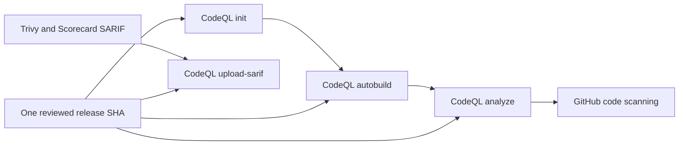

# Atomic CodeQL Action revision policy

## Decision

BandScope treats the CodeQL Action lifecycle as one supply-chain dependency. Every checked-in reference to `github/codeql-action/init`, `autobuild`, `analyze`, and `upload-sarif` must use the same reviewed full-length commit SHA and matching release annotation.

The current reviewed revision is CodeQL Action `v4.37.9` at commit `cdf488f595d80d6e07e03d4674febd5ab45fa938`. Fresh upstream resolution on 2026-09-02 found annotated tag object `a35ac6e6798d72df5475948b28efb89edc2e19ca`, which points to that commit. The tag object is unsigned, so BandScope makes no signed-tag claim; the workflow execution identity is the pinned commit SHA. The v4.37.9 release was tagged on 2026-08-26 and advances the default CodeQL bundle to `2.26.4`.

GitHub documents `init` as the phase that initializes CodeQL, `autobuild` as the optional automatic build phase, and `analyze` as the phase that finalizes the database, runs queries, and uploads results. `upload-sarif` publishes SARIF generated by other tools. These phases exchange state and therefore move together in this repository rather than through independent dependency pull requests.

## Threat and compatibility boundary

A full commit SHA is the immutable execution identity. Tags remain useful release labels but are not accepted as the workflow execution reference. Independently updating one phase can leave the repository with mixed JavaScript bundles, CodeQL CLI expectations, feature flags, or SARIF transport behavior. The atomic policy prevents both persistent drift and the transient mixed state caused by independently merged Dependabot component pull requests.

The CodeQL revision update does not broaden application filesystem, network, model, database, IPC, or credential authority.

## Pull-request Scorecard evidence

OpenSSF Scorecard is also required to materialize evidence on BandScope pull requests. The workflow uses the ordinary `pull_request` event for `develop` and `main`; it does not use `pull_request_target`. For PR runs, the second checkout that supplies repository-owned SARIF extraction and normalization scripts is pinned to `github.event.pull_request.base.sha`, so an untrusted PR head cannot replace the trusted parser executed by the evidence job. Scorecard `publish_results` remains enabled only for the repository default branch.

This is an evidence-collection boundary, not a claim that every fork or external actor receives write-capable code-scanning credentials. GitHub token permissions and repository policy still determine whether a particular run can upload SARIF.

## Dependabot routing

GitHub Actions updates use the repository's existing `area: ci-cd` taxonomy label together with `dependencies`. The former configured `github-actions` label did not exist and caused Dependabot to report a configuration error. A regression test prevents that invalid label from returning.

## Verification contract

`services/analysis-engine/tests/test_codeql_action_revision_contract.py` scans every checked-in workflow and fails unless:

1. all CodeQL Action phases use the exact `v4.37.9` commit SHA;
2. every reference carries the matching `v4.37.9` annotation; and
3. `codeql.yml` keeps `init`, `autobuild`, and `analyze` on that same revision.

The scanner deliberately recognizes mutable and malformed revision tokens such as `@v4` before enforcing the exact-SHA invariant. A tag-style reference therefore becomes a failing value rather than disappearing from the evidence set.

`test_dependabot_label_contract.py` pins the GitHub Actions update label to `area: ci-cd`. `test_scorecard_pr_code_scanning_contract.py` pins the ordinary PR trigger, default-branch-only publication, and trusted base-SHA checkout used by the PR SARIF path.

Repository CI, CodeQL, SAST, dependency/security scans, SBOM generation, central coverage evidence, automated review, independent approval, and branch protection must validate the final exact head. Results from split or predecessor pull requests are not transferable.

## Update procedure

1. Identify the newest supported CodeQL Action v4 release from the upstream repository.
2. Resolve its tag to the intended upstream commit, inspect tag verification and release notes, and record only claims supported by that evidence.
3. Update the executable contract first so the previous lifecycle becomes a deterministic RED state.
4. Update every `init`, `autobuild`, `analyze`, and `upload-sarif` reference in one canonical branch.
5. Preserve the Scorecard PR trust boundary and Dependabot routing contracts while reconciling competing lifecycle writers.
6. Run the focused contracts and complete repository gates on the resulting exact head.
7. Merge only after exact-current-head checks, current review findings, independent non-author approval, and branch protection all pass without bypass.
8. Close split dependency pull requests only after the coordinated lifecycle is accepted under the protected merge gate; never reuse their checks or approvals.

## Rollback

Rollback restores the previously accepted full-length SHA across every CodeQL Action phase in one reviewed commit. A partial rollback is prohibited. After rollback, rerun the same exact-head security, quality, SARIF publication, and review gates before accepting the branch.

## References

GitHub. (2026). *CodeQL Action v4.37.9* [Software release]. https://github.com/github/codeql-action/releases/tag/v4.37.9

GitHub. (2026). *CodeQL Bundle v2.26.4* [Software release]. https://github.com/github/codeql-action/releases/tag/codeql-bundle-v2.26.4

GitHub. (n.d.). *CodeQL code scanning for compiled languages*. GitHub Docs. Retrieved September 2, 2026, from https://docs.github.com/en/code-security/how-tos/find-and-fix-code-vulnerabilities/manage-your-configuration/codeql-for-compiled-languages

GitHub. (n.d.). *Secure use reference*. GitHub Docs. Retrieved September 2, 2026, from https://docs.github.com/en/actions/reference/security/secure-use
