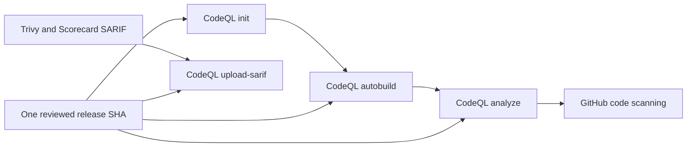

# Atomic CodeQL Action revision policy

## Decision

BandScope treats the CodeQL Action lifecycle as one supply-chain dependency. Every checked-in reference to `github/codeql-action/init`, `autobuild`, `analyze`, and `upload-sarif` must use the same reviewed full-length commit SHA and matching release annotation.

The current reviewed revision is CodeQL Action `v4.37.7` at commit `ff2f1c621b7f889edc0d3c761ac2e6a3f8cdb0dd`. The upstream release was published on August 13, 2026 and advances the default CodeQL bundle to `2.26.3`.

GitHub documents `init` as the phase that initializes CodeQL, `autobuild` as the optional automatic build phase, and `analyze` as the phase that finalizes the database, runs queries, and uploads results. `upload-sarif` publishes SARIF generated by other tools. These phases exchange state and therefore move together in this repository rather than through independent dependency pull requests.

## Threat and compatibility boundary

A full commit SHA is the immutable execution identity. Tags remain useful release labels, but they are not accepted as the workflow execution reference. GitHub identifies a full-length commit SHA as the strongest immutable action reference and supports organization policy requiring that form.

Independently updating one phase can leave the repository with mixed JavaScript bundles, CodeQL CLI expectations, feature flags, or SARIF transport behavior. Even when each individual release is valid, the mixed lifecycle has not been reviewed or tested as a unit. The atomic policy prevents both persistent drift and the transient mixed state that can occur when several Dependabot pull requests merge at different times.

The change does not alter workflow triggers, language selection, build behavior, SARIF paths, permissions, or failure handling. It changes only the immutable CodeQL Action implementation identity and version comments.

## Verification contract

`services/analysis-engine/tests/test_codeql_action_revision_contract.py` scans every workflow and fails unless:

1. all CodeQL Action phases use one exact reviewed SHA;
2. every reference carries the matching `v4.37.7` annotation; and
3. `codeql.yml` keeps `init`, `autobuild`, and `analyze` on that same revision.

The scanner intentionally recognizes mutable and malformed revision tokens such as `@v4` before enforcing the exact-SHA invariant. A tag-style reference therefore becomes a failing value instead of disappearing from the evidence set because it did not already look like a 40-character SHA.

Repository CI, CodeQL, SAST, dependency/security scans, SBOM generation, central coverage evidence, automated review, independent approval, and branch protection must all validate the final exact head. Results from split predecessor pull requests are not transferable.

## Update procedure

1. Identify the newest supported CodeQL Action v4 release from the upstream GitHub repository.
2. Verify the tag resolves to the intended upstream commit and inspect the release notes.
3. Add or update the contract expectation first and observe the RED failure against the old revision.
4. Update every `init`, `autobuild`, `analyze`, and `upload-sarif` reference in one branch.
5. Run the focused contract, workflow/static checks, and the complete repository gates.
6. Merge only after exact-current-head review and branch protection succeed without bypass.
7. Close split dependency pull requests as superseded; do not reuse their checks or approvals.

## Rollback

Rollback restores the previously accepted full-length SHA across every CodeQL Action phase in one reviewed commit. A partial rollback is prohibited. After rollback, rerun the same exact-head security, quality, SARIF publication, and review gates before accepting the branch.

## References

GitHub. (2026). *CodeQL Action v4.37.7* [Software release]. https://github.com/github/codeql-action/releases/tag/v4.37.7

GitHub. (2026). *CodeQL Bundle v2.26.3* [Software release]. https://github.com/github/codeql-action/releases/tag/codeql-bundle-v2.26.3

GitHub. (n.d.). *CodeQL code scanning for compiled languages*. GitHub Docs. Retrieved August 15, 2026, from https://docs.github.com/en/code-security/how-tos/find-and-fix-code-vulnerabilities/manage-your-configuration/codeql-for-compiled-languages

GitHub. (n.d.). *Secure use reference*. GitHub Docs. Retrieved August 15, 2026, from https://docs.github.com/en/actions/reference/security/secure-use
