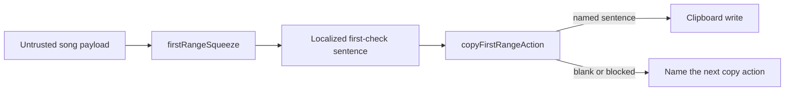

# Copy tonight's first instrument check

## Decision

The ready workspace already names tonight's first playable range. A bandmate still had to retype that sentence into KakaoTalk, Discord, or Messages before rehearsal. `copyFirstRangeAction` now writes the same localized first-check sentence already shown on the map. Blank or non-string payloads fail closed. A blocked clipboard names the next action ("select the sentence and copy it") instead of inventing a check or dumping the failure.

## Security Notes

### Attack surface

Copied text is derived from untrusted analysis payloads: role names, section labels, and scientific-pitch range labels. Clipboard write is a local user-gesture side channel.

### Trust boundary

`firstRangeSqueeze` remains the span authority. `copyFirstRangeAction` only writes a non-blank string that the workspace already rendered. It does not invent a span, does not read the clipboard, and does not dereference files or URLs. Clipboard errors are swallowed; the UI never renders exception text.

### Logging and privacy

This path does not add logging, telemetry, network transmission, or server-side retention. The copied sentence may identify a song part the user already sees on screen. Exposure follows wherever they paste it.

### Mitigations

- Reject blank, whitespace-only, and non-string payloads before any write.
- Prefer `navigator.clipboard.writeText` on a user click; fall back to a hidden `textarea` + `document.execCommand("copy")` only when that API is absent or rejects.
- Remove the fallback textarea immediately after the attempt.
- Do not log, toast, or render clipboard exception messages.
- Keep English and Korean next-action copy on the card; do not use implementation words such as clipboard API names in the buyer-visible sentence beyond the blocked-window fallback.

### Test points

- `copyFirstRangeAction.test.ts` proves fail-closed blank payloads, exact-text writes, redacted writer failures, clipboard API success, execCommand fallback, and unavailable when execCommand is absent.
- `Workspace.test.tsx` proves the button names tonight's first check, writes the clash sentence, copies the missing-range next action, localizes the Korean control, and hides clipboard errors.

### Realistic threats

A crafted role name could copy formula-shaped text into a chat. BandScope does not eval clipboard contents. Spreadsheet formula injection remains a CSV concern owned by the cue-sheet encoder, not this chat paste.

A blocked WebView clipboard could otherwise fail silently. The card names the next action: select tonight's first check and copy it before the first section.

### Remaining risk

Some embedded WebViews still deny clipboard writes even after a user click. The fallback execCommand path is best-effort and may also fail. In that case the sentence remains visible on the card for manual copy.
