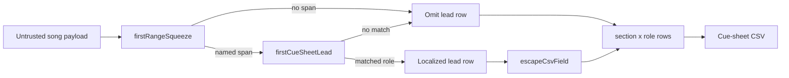

# Cue-sheet first-action lead

## Decision

The ready workspace names tonight's first playable range and offers a download of tonight's first-action cue sheet. `generateCueSheetCsv` prepends an optional lead row. `export.ts` stays locale-free; the workspace computes the localized lead through `firstCueSheetLead`. If that helper cannot match the squeeze to a concrete role on the untrusted song payload, the lead is omitted rather than invented.

## Security Notes

### Attack surface

Cue-sheet CSV is derived from untrusted analysis payloads. Section labels, groove, role names, harmony, cues, priorities, and notes can carry formula-shaped values (`=`, `+`, `-`, `@`) plus commas, quotes, and newlines.

### Trust boundary

`escapeCsvField` is the only CSV-cell sanitizer. `firstCueSheetLead` treats the song as untrusted runtime data and fails closed. Lead-row values stay literal until that sanitizer runs. Filename sanitization for the download remains `sanitizeFilename`.

### Mitigations

- Prefix formula-leading cells with a single quote before structural quoting.
- Do not invent a first-action row when the squeeze cannot be matched to a concrete role.
- Keep formula-shaped harmony literal in the lead helper so escaping stays centralized in `export.ts`.
- Do not weaken or duplicate the existing formula-injection tests.

### Test points

- `apps/desktop/src/lib/export.test.ts` proves a lead row is formula-escaped and that a missing/null lead does not add a row.
- `apps/desktop/src/features/workspace/firstCueSheetLead.test.ts` proves fail-closed matching and literal formula-shaped harmony.
- `apps/desktop/src/features/workspace/Workspace.test.tsx` proves the first-range card names the download and that the file starts with tonight's first action.

### Realistic threats

Opening the CSV in a spreadsheet can execute formula injection from model-generated harmony, cue, or notes if escaping is skipped or bypassed. A fabricated lead row would also teach the wrong first action.

### Remaining risk

Spreadsheet software may still interpret escaped cells depending on locale and import settings. NUL-byte and other formula-injection bypasses stay fail-closed in `escapeCsvField` and are not suppressed here.
