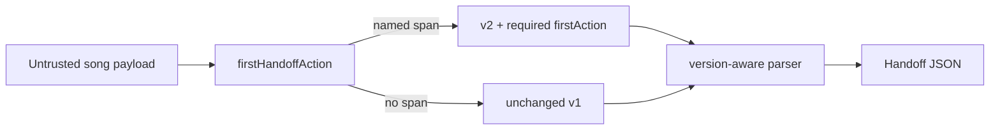

# Metadata handoff first-action lead

## Decision

The ready workspace names tonight's first playable range. The metadata handoff still dumped workspace, song, and every section×role bucket first, so a bandmate opening tonight's handoff had to hunt for that same check. When `firstHandoffAction` can name a valid span, `createMetadataHandoffArtifact` now emits a version-2 handoff with a required structured `firstAction`; when no lead can be named, it emits the unchanged version-1 shape and does not invent an action. The encoder stays locale-free and full-band, so a transient workspace role filter cannot change the shared action. Localized next-action copy remains a UI concern.

Version 1 is immutable: it has no `firstAction` key and existing strict v1 readers continue to accept v1 exports. Version 2 adds `firstAction`. The current BandScope parser accepts both v1 and v2 so legacy handoffs remain importable. Older v1-only readers are expected to reject v2 rather than silently reinterpret a schema they do not understand; compatibility is preserved by keeping v1 generation unchanged when the new field is absent, not by relabeling a changed payload as v1.

## Security Notes

### Attack surface

Handoff JSON is derived from untrusted analysis payloads. Section labels, role names, range labels, and ids can carry formula-shaped values (`=`, `+`, `-`, `@`), quotes, and control characters.

### Trust boundary

`JSON.stringify` after `parseMetadataHandoffArtifact` is the only handoff encoder. `firstHandoffAction` treats the song as untrusted runtime data and fails closed. Lead values stay literal until that encoder runs. Filename sanitization for the download remains `sanitizeFilename`. Source paths and transcription data remain excluded. This path does not write CSV and does not dereference artifact source references.

The v2 parser validates `firstAction` separately, then removes only that field and delegates every unchanged field to the v1 parser. That keeps the established v1 validation authority in force for workspace, song, sections, role buckets and source-asset references instead of maintaining two divergent validators.

### Logging and privacy

This export path does not add logging, telemetry, network transmission, or server-side retention. The generated Blob exists only in the local download flow until its object URL is revoked. The downloaded JSON can contain song titles, section labels, role names, and other user-entered rehearsal metadata already present in the handoff; those values may identify people or projects, so their exposure follows wherever the user saves or shares the downloaded file rather than a new BandScope logging channel.

### Mitigations

- Do not invent a first-action object when the helper cannot name a playable span.
- Keep the v1 schema strict; a v1 payload carrying `firstAction` is invalid.
- Require `firstAction` for v2 and reject unsupported artifact versions.
- Keep formula-shaped role names and range labels literal in the helper so encoding stays centralized in `export.ts`.
- Keep the handoff lead full-band so a transient workspace role filter cannot silently change the identity of the downloaded artifact.
- Reject extra first-action keys, blank ids, non-form section labels and non-boolean clash flags at parse time.
- Do not weaken or duplicate the existing cue-sheet formula-injection tests.

### Test points

- `packages/shared-types/test/metadata-handoff-versioning.test.ts` proves v1 remains strict, v2 requires a valid action, unsupported versions fail closed and the current parser accepts both supported versions.
- `apps/desktop/src/lib/export-versioning.test.ts` proves exports without a lead stay v1, exports with a lead become v2 and both versions feed the same local re-analysis request boundary.
- `apps/desktop/src/lib/export.test.ts` proves metadata-only exports exclude source paths/transcription and encode the lead literally after song identity.
- `apps/desktop/src/features/workspace/firstHandoffAction.test.ts` proves fail-closed matching, clash preference and literal formula-shaped role names.
- `apps/desktop/src/features/workspace/Workspace.handoffExport.test.tsx` proves selecting a UI role does not change the full-band handoff lead or body.
- `apps/desktop/src/features/workspace/Workspace.test.tsx` proves the handoff download is named as tonight's first-action handoff and that the file leads with that action.

### Realistic threats

A crafted project that puts `=CMD` in a role name could otherwise teach the wrong first action if the helper invented a span, or could confuse a downstream consumer that eval'd handoff JSON. BandScope does not eval the artifact. Recipients still pair the handoff with their own local audio; this lead does not grant filesystem authority.

A schema-version mismatch is also a data-integrity risk: shipping a changed object while continuing to label it version 1 makes strict recipients reject nominally compatible files and makes permissive recipients guess. The explicit v2 boundary removes that ambiguity.

### Remaining risk

V1-only BandScope builds cannot consume a v2 first-action handoff. That is an explicit version boundary rather than hidden incompatibility. Current builds remain backward-compatible with v1. Downstream tools that interpret JSON string values as spreadsheet formulas or scripts remain outside this encoder; cue-sheet CSV sanitization stays in `escapeCsvField` and is not reused here.
