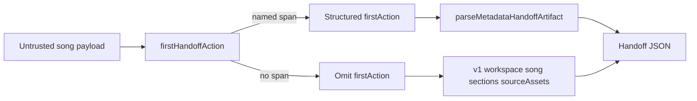

# Metadata handoff first-action lead

## Decision

The ready workspace names tonight's first playable range. The metadata handoff still dumped workspace, song, and every section×role bucket first, so a bandmate opening tonight's handoff had to hunt for that same check. `createMetadataHandoffArtifact` now prepends an optional `firstAction` object. The encoder stays locale-free; the workspace computes the structured lead through `firstHandoffAction`. If that helper cannot name a playable span on the untrusted song payload, the lead is omitted rather than invented. Because the handoff body is full-band, transient role selection in the workspace does not change the exported `firstAction`. Localized next-action copy stays in the UI; the artifact carries identity and clash evidence only.

## Security Notes

### Attack surface

Handoff JSON is derived from untrusted analysis payloads. Section labels, role names, range labels, and ids can carry formula-shaped values (`=`, `+`, `-`, `@`), quotes, and control characters.

### Trust boundary

`JSON.stringify` after `parseMetadataHandoffArtifact` is the only handoff encoder. `firstHandoffAction` treats the song as untrusted runtime data and fails closed. Lead values stay literal until that encoder runs. Filename sanitization for the download remains `sanitizeFilename`. Source paths and transcription data remain excluded. This path does not write CSV and does not dereference artifact source references.

### Logging and privacy

This export path does not add logging, telemetry, network transmission, or server-side retention. The generated Blob exists only in the local download flow until its object URL is revoked. The downloaded JSON can contain song titles, section labels, role names, and other user-entered rehearsal metadata already present in the handoff; those values may identify people or projects, so their exposure follows wherever the user saves or shares the downloaded file rather than a new BandScope logging channel.

### Mitigations

- Do not invent a first-action object when the helper cannot name a playable span.
- Keep formula-shaped role names and range labels literal in the helper so encoding stays centralized in `export.ts`.
- Omit the `firstAction` key when the lead is missing or null; do not serialize a null action as guidance.
- Keep the handoff lead full-band so a transient workspace role filter cannot silently change the identity of the downloaded artifact.
- Reject extra first-action keys, blank ids, non-form section labels, and non-boolean clash flags at parse time.
- Do not weaken or duplicate the existing cue-sheet formula-injection tests.

### Test points

- `packages/shared-types/test/index.test.ts` proves a lead object is optional, extra keys fail closed, and blank/invalid fields are rejected.
- `apps/desktop/src/lib/export.test.ts` proves a lead object is JSON-encoded literally after song identity and that a missing/null lead does not add a key.
- `apps/desktop/src/features/workspace/firstHandoffAction.test.ts` proves fail-closed matching, clash preference, and literal formula-shaped role names.
- `apps/desktop/src/features/workspace/Workspace.handoffExport.test.tsx` proves selecting a UI role does not change the full-band handoff lead or body.
- `apps/desktop/src/features/workspace/Workspace.test.tsx` proves the handoff download is named as tonight's first-action handoff and that the file leads with that action.

### Realistic threats

A crafted project that puts `=CMD` in a role name could otherwise teach the wrong first action if the helper invented a span, or could confuse a downstream consumer that eval'd handoff JSON. BandScope does not eval the artifact. Recipients still pair the handoff with their own local audio; this lead does not grant filesystem authority.

### Remaining risk

Downstream tools that interpret JSON string values as spreadsheet formulas or scripts remain outside this encoder. Cue-sheet CSV sanitization stays in `escapeCsvField` and is not reused here.
