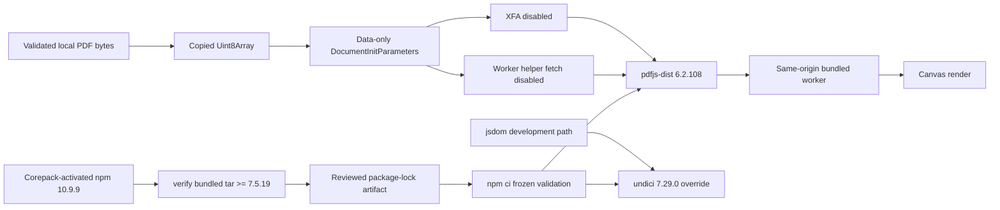

# High-security PDF and HTTP dependency baseline

## Decision

BandScope treats the PDF parser, its transitive HTTP client, and the package-manager runtime that materializes their reviewed lock as one security-release boundary:

- `pdfjs-dist` is pinned exactly to `6.2.108`;
- `undici` is pinned exactly to `7.29.0` through the root npm override; and
- npm `10.9.9` is the approved generator for reviewed root-workspace dependency updates. Primary CI activates that project-pinned npm through Node-bundled Corepack, verifies npm's own bundled `tar` is at least `7.5.19`, and only then consumes the committed lock through frozen validation rather than re-resolving it.

Repository dependency/security tooling reported the protected-base `pdfjs-dist@6.1.200` as requiring a newer floor. That finding is kept distinct from the older, GitHub-reviewed CVE-2024-4367 / GHSA-wgrm-67xf-hhpq: the 2024 advisory affected `pdfjs-dist <=4.1.392` and was fixed in `4.2.67`, so it is historical parser-risk context and is **not** evidence that `6.1.200` was affected by that CVE. BandScope pins the current `6.2.108` artifact selected by the repository security baseline and requires current-head audit/security evidence rather than misattributing a scanner result to an unrelated advisory.

PDF.js `6.2.108` no longer exposes the legacy `isEvalSupported` member in its public `DocumentInitParameters` contract, and `getDocument` no longer reads that member. BandScope therefore does not cast or pass an unknown option that would be ignored while creating false assurance. The parser boundary is reinforced by a narrow data-only call, copied caller-owned bytes, a same-origin bundled worker, explicit `enableXfa: false`, and explicit `useWorkerFetch: false`.

## Threat boundary

The score viewer accepts only bytes already copied into the app-owned workspace through the native PDF intake boundary. It does not accept a URL, credentials, custom request headers, or a remote worker. It also disables XFA rendering and PDF.js worker-side fetching of helper resources at this wrapper boundary. These controls prevent the caller from selecting an attacker-controlled document origin or worker asset and make the intended no-XML-form/no-worker-fetch policy explicit rather than relying on upstream defaults.

PDF bytes remain untrusted after the native magic-byte, size, and path checks. Parser vulnerabilities, malformed object graphs, embedded actions, metadata/XML parsing, and resource-exhaustion paths can still occur inside a syntactically valid PDF. The exact dependency lock, copied data-only input, explicit parser options, same-origin worker, and existing native intake limits therefore remain mandatory for locally selected files.

The pinned PDF.js XML parser does not expose an external-entity resolver through this wrapper: its default `onDoctype()` hook is a no-op, and `onResolveEntity()` resolves only the built-in XML entities before returning an unknown named entity literally. This source-level observation narrows what BandScope can claim; it is not a general assertion that every future PDF.js XML path is immune to entity-processing defects. Any parser upgrade must re-check the upstream implementation and repeat adversarial PDF verification.

Undici is currently a development dependency reached through jsdom, but development and CI parsers process attacker-controlled fixtures, generated HTML, and network-like request bodies. A dev-only label does not make header injection, shared-cache disclosure, retry desynchronization, or cookie-attribute injection acceptable in the trusted build boundary.

The package-manager runtime is also part of that build trust boundary. npm `10.9.8` bundled `tar 7.5.11`, which falls inside GitHub-reviewed GHSA-23hp-3jrh-7fpw / CVE-2026-59873 (`tar <=7.5.18`). npm `10.9.9` updates its bundled tar to `7.5.22`. BandScope therefore rejects the previous generator runtime rather than relying on `--ignore-scripts`: archive extraction occurs before lifecycle-script policy can make a vulnerable tar implementation safe.

## Strix finding adjudication boundary

Strix run `31871388084` on predecessor head `6f81f52c193c1e327d078eba7a2ea3bdbfbc87c2` reported a possible XXE path through `loadScorePdf`. Its attached proof-of-concept returned only a four-byte `%PDF` prefix and stated that construction of an actual PDF containing the alleged XML payload remained necessary. It did not demonstrate entity expansion, local-file disclosure, a network request, or parser output containing an external entity.

The finding was therefore not suppressed and was not treated as proven exploitation. Instead, the exact dependency source was inspected and the wrapper was hardened at the narrowest supported API boundary: XFA rendering and worker-side helper fetching are now explicitly disabled and regression-locked. A fresh exact-head Strix result remains mandatory; a predecessor report, whether pass or fail, is not transferable merge evidence.

## Lockfile provenance

The dependency manifests and complete lock artifact were originally generated and reconciled on this branch with Node `22.22.3` and the then-approved npm `10.9.8` toolchain before the frozen-validation gate was finalized. That historical generation run and artifact are provenance evidence only. The current approved generator is npm `10.9.9`; a future dependency-resolution change must be generated with that runtime and the complete resulting lock reviewed. Primary CI intentionally does not repeat mutable dependency resolution.

For every current head, primary CI instead:

1. sets up Node `22.22.3` while keeping the public `>=22.13 <23` runtime contract unchanged;
2. explicitly enables Corepack's npm shim so `packageManager: npm@10.9.9` controls the executable package manager;
3. verifies npm `10.9.9` and reads that runtime's own bundled `tar` package, rejecting anything below `7.5.19`;
4. runs `npm ci --ignore-scripts --no-audit --no-fund` in the dedicated lock-validation job;
5. rejects any `package.json` or `package-lock.json` working-tree drift; and
6. proceeds to normal repository verification only after the frozen lock is consumable by the approved runtime.

Future dependency updates must use npm `10.9.9` to generate the complete lock in a dedicated update branch, review the entire resulting manifest/lock diff, and then prove frozen consumption on the resulting exact head. No tarball URL, SRI, dependency range, `peer` classification, or workspace record may be hand-edited merely to satisfy a validator.

The lock contract requires the exact public-registry tarball and SHA-512 SRI for patched application packages and requires every existing `node_modules/@esbuild/*` location to retain the approved generator's `peer: true` classification. This distinguishes the intended security graph from unrelated Dependabot generator churn. The narrower provenance and validation contract is specified in `docs/doctoring/npm-lockfile-generator-provenance.md`.

## Verification

The merge gate includes:

- exact manifest and lock artifact tests;
- npm `10.9.9` plus bundled `tar >=7.5.19` runtime provenance before every primary CI dependency-consumption step;
- a direct PDF.js wrapper test proving copied bytes, the locally bundled worker, `enableXfa: false`, `useWorkerFetch: false`, and no URL-bearing initialization member;
- TypeScript compilation against the installed PDF.js `DocumentInitParameters` rather than an unsafe cast;
- valid and malformed local score-PDF component tests;
- desktop lint, strict typecheck, complete measured tests, and production build;
- Tauri/Rust checks and native PDF intake regressions;
- `npm audit --workspaces --audit-level=high` with no high finding;
- repository SAST, CodeQL, security scan, secret scan, SBOM, and dependency evidence;
- current-head Strix evidence rather than predecessor-head scanner output;
- current-head central coverage and automated review;
- zero unresolved actionable threads and a qualifying independent non-author approval; and
- normal branch protection without administrative bypass.

## Failure, rollback, and incident evidence

On a failed frozen-lock validation, npm runtime-provenance failure, or parser regression, preserve the exact head SHA, Node/npm/bundled-tar versions, original lock blob SHA, test output, audit report, and workflow run ID. If the incident concerns a dependency-generation change, also preserve the generated complete lock and the generation environment/configuration. Do not merge a partially updated graph and do not bypass the package-manager runtime check.

Rollback restores the previous desktop manifest, root override, complete lock, PDF loader, tests, and CHANGELOG entry together. Because the previous dependency graph or package-manager runtime may contain known security findings, rollback is an emergency availability action only and requires an explicit security exception, compensating controls, owner, expiration, and immediate replacement plan.

## References

GitHub. (2024). *PDF.js vulnerable to arbitrary JavaScript execution upon opening a malicious PDF* (GHSA-wgrm-67xf-hhpq) [Security advisory]. https://github.com/advisories/GHSA-wgrm-67xf-hhpq

GitHub. (2026). *node-tar: Decompression/parse DoS via unlimited input* (GHSA-23hp-3jrh-7fpw; CVE-2026-59873) [Security advisory]. https://github.com/advisories/GHSA-23hp-3jrh-7fpw

Mozilla. (2026). *Document initialization parameters in PDF.js 6.2.108* [Source code]. GitHub. https://github.com/mozilla/pdf.js/blob/v6.2.108/src/display/api.js

Mozilla. (2026). *PDF.js XML parser in version 6.2.108* [Source code]. GitHub. https://github.com/mozilla/pdf.js/blob/v6.2.108/src/core/xml_parser.js

Mozilla. (2026). *PDF.js 6.2.108* [Software release]. https://github.com/mozilla/pdf.js/releases/tag/v6.2.108

Node.js contributors. (2026). *Corepack* [Software documentation]. GitHub. https://github.com/nodejs/corepack

Node.js contributors. (2026). *Undici 7.29.0* [Software release]. https://github.com/nodejs/undici/releases/tag/v7.29.0

npm, Inc. (2026). *npm 10.9.9* [Software release]. GitHub. https://github.com/npm/cli/releases/tag/v10.9.9

npm, Inc. (2026). *npm ci*. npm Docs. https://docs.npmjs.com/cli/v10/commands/npm-ci/

npm, Inc. (2026). *package-lock.json*. npm Docs. https://docs.npmjs.com/cli/v10/configuring-npm/package-lock-json/
