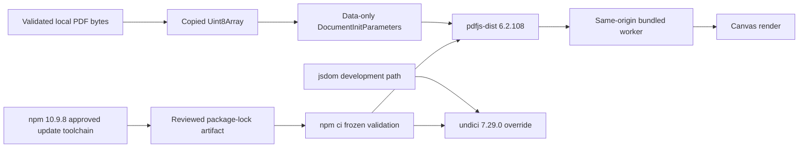

# High-security PDF and HTTP dependency baseline

## Decision

BandScope treats the PDF parser and its transitive HTTP client as one security-release boundary:

- `pdfjs-dist` is pinned exactly to `6.2.108`;
- `undici` is pinned exactly to `7.29.0` through the root npm override; and
- npm `10.9.8` is the approved generator for reviewed root-workspace dependency updates, while primary CI consumes the committed lock through frozen validation rather than re-resolving it.

PDF.js `6.2.108` no longer exposes the legacy `isEvalSupported` member in its public `DocumentInitParameters` contract, and `getDocument` no longer reads that member. BandScope therefore does not cast or pass an unknown option that would be ignored while creating false assurance. The primary remediation is the patched parser release, reinforced by a narrow data-only call, copied caller-owned bytes, and a same-origin bundled worker.

## Threat boundary

The score viewer accepts only bytes already copied into the app-owned workspace through the native PDF intake boundary. It does not accept a URL, credentials, custom request headers, or a remote worker. This prevents a PDF from selecting an attacker-controlled fetch origin or script asset.

PDF bytes remain untrusted after the native magic-byte, size, and path checks. Parser vulnerabilities, malformed object graphs, embedded actions, and resource-exhaustion paths can still occur inside a syntactically valid PDF. The patched parser, exact dependency lock, copied data-only input, same-origin worker, and existing native intake limits therefore remain mandatory for locally selected files.

Undici is currently a development dependency reached through jsdom, but development and CI parsers process attacker-controlled fixtures, generated HTML, and network-like request bodies. A dev-only label does not make header injection, shared-cache disclosure, retry desynchronization, or cookie-attribute injection acceptable in the trusted build boundary.

## Lockfile provenance

The dependency manifests and complete lock artifact were generated and reconciled on this branch with the approved Node `22.22.3` / npm `10.9.8` toolchain before the current frozen-validation gate was finalized. The historical generation run and artifact are provenance evidence only; they do **not** satisfy a later head's merge gate and primary CI intentionally does not repeat mutable dependency resolution.

For every current head, primary CI instead:

1. verifies npm `10.9.8` before dependency consumption;
2. runs `npm ci --ignore-scripts --no-audit --no-fund` in the dedicated lock-validation job;
3. rejects any `package.json` or `package-lock.json` working-tree drift; and
4. proceeds to normal repository verification only after the frozen lock is consumable by the approved toolchain.

Future dependency updates must use npm `10.9.8` to generate the complete lock in a dedicated update branch, review the entire resulting manifest/lock diff, and then prove frozen consumption on the resulting exact head. No tarball URL, SRI, dependency range, `peer` classification, or workspace record may be hand-edited merely to satisfy a validator.

The lock contract requires the exact public-registry tarball and SHA-512 SRI for both patched packages and requires every existing `node_modules/@esbuild/*` location to retain npm 10.9.8's `peer: true` classification. This distinguishes the intended security graph from unrelated Dependabot generator churn. The narrower provenance and validation contract is specified in `docs/doctoring/npm-lockfile-generator-provenance.md`.

## Verification

The merge gate includes:

- exact manifest and lock artifact tests;
- a direct PDF.js wrapper test proving copied bytes, the locally bundled worker, and an exact data-only initialization object;
- TypeScript compilation against the installed PDF.js `DocumentInitParameters` rather than an unsafe cast;
- valid and malformed local score-PDF component tests;
- desktop lint, strict typecheck, complete measured tests, and production build;
- Tauri/Rust checks and native PDF intake regressions;
- `npm audit --workspaces --audit-level=high` with no high finding;
- repository SAST, CodeQL, security scan, secret scan, SBOM, and dependency evidence;
- current-head central coverage and automated review;
- zero unresolved actionable threads and a qualifying independent non-author approval; and
- normal branch protection without administrative bypass.

## Failure, rollback, and incident evidence

On a failed frozen-lock validation or parser regression, preserve the exact head SHA, Node/npm versions, original lock blob SHA, test output, audit report, and workflow run ID. If the incident concerns a dependency-generation change, also preserve the generated complete lock and the generation environment/configuration. Do not merge a partially updated graph.

Rollback restores the previous desktop manifest, root override, complete lock, PDF loader, tests, and CHANGELOG entry together. Because the previous graph contains known high findings, rollback is an emergency availability action only and requires an explicit security exception, compensating controls, owner, expiration, and immediate replacement plan.

## References

GitHub. (2026). *PDF.js vulnerable to arbitrary JavaScript execution upon opening a malicious PDF* (GHSA-hq66-cqwq-w95j) [Security advisory]. https://github.com/advisories/GHSA-hq66-cqwq-w95j

Mozilla. (2026). *Document initialization parameters in PDF.js 6.2.108* [Source code]. GitHub. https://github.com/mozilla/pdf.js/blob/v6.2.108/src/display/api.js

Mozilla. (2026). *PDF.js 6.2.108* [Software release]. https://github.com/mozilla/pdf.js/releases/tag/v6.2.108

Node.js contributors. (2026). *Undici 7.29.0* [Software release]. https://github.com/nodejs/undici/releases/tag/v7.29.0

npm, Inc. (2026). *npm ci*. npm Docs. https://docs.npmjs.com/cli/v11/commands/npm-ci/

npm, Inc. (2026). *package-lock.json*. npm Docs. https://docs.npmjs.com/cli/v11/configuring-npm/package-lock-json/