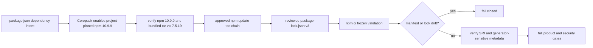

# npm lockfile generator provenance

## Decision

BandScope records npm `10.9.9` as the approved generator for root workspace dependency updates. The root manifest records that decision through `packageManager: npm@10.9.9` and `devEngines.packageManager` with `onFail: error`. npm is intentionally not repeated under runtime `engines`; the package-manager generator and the supported Node runtime are separate contracts.

The #779/jsdom 30 compatibility slice raises the supported Node 22 interval to `>=22.22.2 <23`. Primary CI continues to exercise Node `22.22.3`, while `.github/workflows/node-minimum-compatibility.yml` exercises the exact `22.22.2` lower boundary. Both lanes activate the repository-pinned npm runtime with Corepack, verify npm `10.9.9` and its bundled `tar` security floor before dependency extraction, and consume only the committed lock with frozen `npm ci`.

The canonical compatibility branch regenerated `package-lock.json` as one complete artifact with Node `22.22.2` and the approved npm `10.9.9` generator after integrating the jsdom `30.0.1` and ESLint `10.9.1` manifest intents. It did not hand-edit or partially transplant the predecessor lock. The generated graph carries the Node floor, the jsdom 30 workspace graph, both ESLint ranges, registry integrity evidence, and root `@esbuild/*` peer metadata. Merge readiness still requires frozen consumption and all fresh exact-head repository gates.

## Why npm 10.9.9 is authoritative

The prior approved npm `10.9.8` bundled `tar 7.5.11`. GitHub advisory GHSA-23hp-3jrh-7fpw / CVE-2026-59873 records `tar <=7.5.18` as affected by an unbounded decompression/parse denial-of-service vulnerability and `7.5.19` as the patched floor. npm `10.9.9` bundles `tar 7.5.22`.

Node `22.22.2` and `22.22.3` ship an older bundled npm, so merely selecting the Node patch release is not sufficient. BandScope enables the project-pinned npm shim before repository-scoped npm dependency consumption. `scripts/checks/verify_npm_runtime.mjs`, executed by that selected npm runtime, verifies npm `10.9.9` and rejects a bundled `tar` below `7.5.19`.

This is a package-manager execution boundary, not an application dependency override. BandScope does not add `tar` to the application graph or suppress the advisory.

## Why generator provenance matters

npm documents `package-lock.json` as the location-keyed description of the exact dependency tree. Package-manager versions and tree-shaping configuration can affect generated graph and metadata. Dependency changes therefore use the reviewed npm `10.9.9` toolchain and reviewers examine the complete generated lock diff together with manifest intent.

CI validation is deliberately different from generation. `npm ci` requires a lockfile, rejects manifest/lock disagreement, removes an existing `node_modules`, and never rewrites the manifest or lock. Primary CI and the exact-minimum Node lane use this immutable path; they do not run `npm install`, `npm update`, `npx`, or another mutable resolution command to make a stale lock appear green.

Every package-lock entry resolved from the public npm registry must retain Subresource Integrity evidence. The root lock also retains `peer: true` on platform-specific `node_modules/@esbuild/*` records. Loss of those markers is treated as generator drift and requires regeneration with the approved toolchain rather than manual normalization.

## Exact-minimum Node verification

jsdom `30.0.1` declares a Node floor compatible with Node `22.22.2`. BandScope intentionally stays on the Node 22 line for this migration, so the repository contract is `>=22.22.2 <23` rather than an implicit expansion to Node 24 or 26.

The dedicated minimum-runtime workflow must:

1. check out without persisted credentials;
2. install exact Node `22.22.2` with package-manager cache discovery disabled;
3. run `corepack enable npm` before repository dependency consumption;
4. verify exact npm `10.9.9` and bundled `tar >=7.5.19` through `check:npm-runtime`;
5. run frozen `npm ci --ignore-scripts --no-audit --no-fund`; and
6. run lint, strict typecheck, measured tests, production build, Storybook, and locked Tauri check/test.

The ordering is security-significant: setup-node must not invoke npm cache discovery through the Node-bundled npm before the reviewed project npm runtime is authoritative.

## Hosted build acquisition resilience

Exact npm provenance and network resilience are separate concerns. Node `22.22.3` supplies npm `10.9.8`, so a hosted build must acquire the repository-pinned npm `10.9.9` before `npm ci`; falling back to the Node-bundled npm would violate the reviewed runtime and `tar` security floor.

A macOS Intel `build-baseline` run on PR #1232 exposed the acquisition boundary: Corepack attempted to download `npm-10.9.9.tgz` from the public npm registry and the HTTPS read timed out before any repository dependency consumption or product build began. Re-running the whole job would hide the architectural weakness and waste all preceding setup work.

The canonical #896 owner therefore centralizes native-build activation in `scripts/checks/activate_pinned_npm_runtime.sh`. The helper reads the exact `packageManager` spec from `package.json`, rejects anything other than an exact npm semantic version, and performs at most three `corepack install --global` attempts for that same spec with bounded 5-second then 10-second backoff. After acquisition it enables the npm shim and executes the existing runtime audit. Exhausting the attempts fails closed; there is no `10.9.8`, `latest`, `stable`, or system-npm fallback.

This retry boundary covers only acquisition of the already-reviewed package-manager artifact. It does not retry `npm ci`, mutable resolution, tests, builds, uploads, or arbitrary failed commands, and it does not convert a reproducible integrity/version failure into success.

## Security and operational boundary

- Every primary CI job that consumes npm dependencies activates the project-pinned npm runtime and runs `check:npm-runtime` before its first `npm ci`.
- Native build-baseline jobs acquire that exact runtime through the bounded helper; transient registry reads may retry, but runtime identity and the bundled `tar` floor never relax.
- The runtime check fails closed unless npm is exactly `10.9.9` and its own bundled `tar` is at least `7.5.19`.
- CI lock validation and the exact-minimum lane must not run mutable npm resolution.
- Dependency PRs change manifest intent and the complete lock artifact produced by npm `10.9.9`; unexplained lock churn is rejected rather than hand-edited.
- Registry-resolved lock records require SRI evidence, and root `@esbuild/*` platform records retain expected peer metadata.
- Checkout credentials are not persisted in npm-consuming CI jobs.
- Install-shaping flags that affect the tree must be committed and applied consistently to generation and frozen consumption.
- The root `package-lock.json` remains the sole npm workspace lock; nested workspace locks are prohibited.

## Verification

`services/analysis-engine/tests/test_npm_toolchain_contract.py` verifies the npm generator metadata, Node/npm identity in primary CI, Corepack/runtime-audit ordering, credential-free checkouts, immutable lock validation, lockfile version 3, SRI evidence, and generator-sensitive esbuild peer metadata. It accepts either the explicit activation/audit sequence or the canonical activation helper before dependency consumption, while preserving the same runtime provenance requirement.

`services/analysis-engine/tests/test_npm_runtime_activation_resilience.py` specifically verifies that all four native build-baseline lanes use the canonical helper immediately before `npm ci`, that inline unbounded Corepack activation is absent there, and that the helper has a three-attempt bounded acquisition loop with no npm `10.9.8` or failure-masking fallback.

`services/analysis-engine/tests/test_node_runtime_contract.py` separately verifies the `>=22.22.2 <23` interval, explicit rejection of Node `22.22.1`, jsdom 30 manifest/lock alignment, the exact-minimum workflow, npm runtime verification before dependency reads, the full compatibility acceptance surface, and removal of the superseded Node floor from canonical runtime/build documentation.

The PDF.js and Undici baseline remains covered separately by `test_high_security_dependency_baseline.py` and desktop PDF-loader tests.

## Claim boundary

Passing frozen validation proves only that the committed manifest and lock can be consumed together by the reviewed toolchain and that the package-manager extraction runtime satisfies the pinned security floor. It does not prove that resolving mutable dependency ranges later will reproduce byte-identical lock metadata.

Likewise, the exact-minimum lane proves only BandScope's selected Node 22 lower boundary. It does not broaden support to other Node major lines because upstream jsdom supports them.

Bounded Corepack acquisition proves neither registry availability nor arbitrary network recovery. It only prevents a short-lived fetch interruption from forcing an immediate whole-job failure while preserving exact npm identity; three failed acquisition attempts still stop the job.

For the active compatibility branch, local generation and frozen-consumption evidence does not substitute for required exact-head CI, security, supply-chain, coverage, build, release, and independent-review gates on an unchanged head.

## Incident response and rollback

When an update produces unexpected lock churn or npm runtime provenance fails:

1. preserve the exact head SHA, npm, bundled tar and Node versions, project npm configuration, original lock blob SHA, generated lock, and relevant CI run IDs;
2. determine whether manifest intent, npm, project configuration, registry metadata, transitive resolution, or package-manager runtime changed;
3. never accept a partial/hand-edited lock or disable the runtime check;
4. regenerate the complete lock in the canonical dependency branch using npm `10.9.9`, then review the full diff before relying on it; and
5. if rollback is necessary, restore the prior manifest and complete lock together and rerun the entire exact-head gate.

For an exact-minimum runtime failure, preserve setup-node details, bundled npm identity, first npm invocation, Corepack activation, and exact workflow job log. Do not weaken `devEngines`; repair ordering so the reviewed npm runtime is authoritative before dependency consumption.

For a transient Corepack registry read failure in native builds, preserve the job log and the exact pinned package-manager spec. The bounded helper may retry only that acquisition. If all attempts fail, keep the gate failed and investigate registry/network health; do not fall back to the Node-bundled npm or manufacture a no-op commit to obtain a fresh run.

## References

GitHub. (2026). *node-tar: Decompression/parse DoS via unlimited input* (GHSA-23hp-3jrh-7fpw; CVE-2026-59873) [Security advisory]. https://github.com/advisories/GHSA-23hp-3jrh-7fpw

jsdom contributors. (2026). *jsdom 30.0.1 package manifest* [Source code]. GitHub. https://github.com/jsdom/jsdom/blob/v30.0.1/package.json

Node.js contributors. (2026). *Node.js v22.22.2 bundled npm package manifest* [Source code]. GitHub. https://github.com/nodejs/node/blob/v22.22.2/deps/npm/package.json

Node.js contributors. (2026). *Corepack* [Software documentation]. GitHub. https://github.com/nodejs/corepack

npm, Inc. (2026). *npm 10.9.9* [Software release]. GitHub. https://github.com/npm/cli/releases/tag/v10.9.9

npm, Inc. (2026). *npm ci*. npm Docs. https://docs.npmjs.com/cli/v10/commands/npm-ci/

npm, Inc. (2026). *package-lock.json*. npm Docs. https://docs.npmjs.com/cli/v10/configuring-npm/package-lock-json/

npm, Inc. (2026). *package.json*. npm Docs. https://docs.npmjs.com/cli/v10/configuring-npm/package-json/
