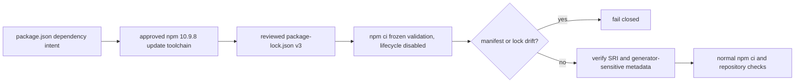

# npm lockfile generator provenance

## Decision

BandScope records npm `10.9.8` as the approved generator for root workspace dependency updates. The root manifest records that decision through:

- `packageManager: npm@10.9.8` as package-manager selection metadata; and
- `devEngines.packageManager` with `onFail: error` as npm's source-tree command gate.

The npm version is intentionally not repeated under `engines`. npm serializes `engines` into the root lock package, so adding an npm-only source-tool constraint there creates lock metadata churn unrelated to dependency resolution. `devEngines` and the explicit CI assertion enforce the approved generator while the published `engines.node` range remains the runtime compatibility contract.

Primary CI does **not** regenerate or update `package-lock.json`. It uses Node `22.22.3`, verifies npm `10.9.8`, and validates the committed lock with `npm ci --ignore-scripts --no-audit --no-fund`. The gate then rejects any manifest or lockfile working-tree change. The normal verification job performs the repository's reviewed `npm ci` installation before lint, typecheck, tests, build, and security checks.

The Node runtime support decision remains separate. This change does not raise the public `>=22.13 <23` Node range; a coordinated Node-floor migration is tracked independently.

## Why generator provenance still matters

npm documents `package-lock.json` as the location-keyed description of the exact dependency tree. Lockfile version 3 is intended for npm 9 and newer. npm also notes that package-manager versions and tree-shaping configuration can affect the generated dependency graph and metadata. Dependency updates therefore use the reviewed npm `10.9.8` toolchain, and reviewers examine the complete generated lock diff together with its manifest change.

That provenance is distinct from CI validation. `npm ci` is the immutable consumption path: it requires a lockfile, rejects manifest/lock dependency disagreement, removes an existing `node_modules`, and never writes the manifest or lock. CI relies on that frozen behavior instead of running `npm install`, `npm update`, or `npx` commands that may perform mutable resolution.

The repository additionally requires a Subresource Integrity value for every package-lock entry resolved from the public npm registry. npm documents `integrity` as the SHA-512 or SHA-1 SRI string for the artifact unpacked at that location.

The root lock also retains `peer: true` on the platform-specific `node_modules/@esbuild/*` records produced by the approved tree. Multiple dependency-update branches generated with a different serialization path were observed removing those markers even when the requested package change was unrelated to esbuild. Because frozen `npm ci` consumes rather than regenerates the lock, ordinary frozen-install validation alone cannot prove that this generator-sensitive metadata was preserved. The repository therefore treats those markers as a regression sentinel: a dependency PR that strips them must be regenerated with the approved npm toolchain rather than normalizing the unrelated churn by hand.

## Security and operational boundary

- CI lock validation must not run `npm install`, `npm update`, `npx`, or another mutable dependency-resolution command.
- Dependency PRs change manifest intent and the complete lock artifact produced by the approved npm `10.9.8` update toolchain; reviewers reject unexplained lock churn rather than hand-editing records.
- Platform-specific root `@esbuild/*` lock records must retain their expected `peer: true` metadata. Missing markers are treated as generator drift, not as an acceptable side effect of an unrelated dependency update.
- The lock-validation job disables dependency lifecycle scripts. The normal clean install retains the repository's reviewed execution behavior.
- The exact npm version check occurs before either frozen install; a different bundled or globally installed npm cannot provide acceptance evidence.
- Registry-resolved package records require SRI evidence in the committed lock.
- Install-shaping flags that affect the dependency tree, such as `legacy-peer-deps` or `install-links`, must be committed in project configuration and applied consistently to generation and `npm ci`.
- The root `package-lock.json` remains the sole npm workspace lock. Nested workspace locks are prohibited.

`packageManager` alone is not the enforcement boundary for npm because Corepack's npm shim is not enabled by default in Node distributions. Enforcement is provided by npm `devEngines`, the explicit CI version assertion, the frozen `npm ci` contract, and repository tests that prohibit mutable resolution in the lock gate.

## Verification

`services/analysis-engine/tests/test_npm_toolchain_contract.py` verifies:

1. the manifest's approved npm metadata and Node/runtime separation;
2. the exact Node/npm identity used by primary CI;
3. frozen `npm ci` lock validation with lifecycle execution disabled;
4. absence of `npm install`, `npm update`, and `npx` from the lock-validation job;
5. a clean manifest/lock working tree after validation;
6. package-lock version 3;
7. SRI evidence for every public npm-registry artifact in the root lock; and
8. preservation of `peer: true` on every root `node_modules/@esbuild/*` platform record.

The exact PDF.js and Undici baseline is covered separately by `test_high_security_dependency_baseline.py` and the desktop PDF loader tests.

A dependency update is mergeable only after the updated manifest and complete generated lock are reviewed together and the exact current head passes frozen lock validation, normal install, lint, strict typecheck, measured tests, production build, Rust/Tauri checks, security/supply-chain gates, current review, independent approval, and branch protection without bypass.

## Claim boundary

CI proves that the committed manifest and lock can be consumed as a frozen pair by the approved toolchain, that public-registry lock entries carry integrity evidence, and that the known generator-sensitive `@esbuild/*` peer markers remain present. It does **not** claim that resolving mutable manifest ranges again at a later time will reproduce byte-identical lock metadata. When a dependency update is needed, npm `10.9.8` remains the approved generator and its entire resulting lock diff is review evidence.

## Incident response and rollback

When an update produces unexpected lock churn:

1. preserve the exact head SHA, npm and Node versions, project npm configuration, original lock blob SHA, generated lock, and relevant CI run IDs;
2. determine whether manifest intent, npm, project configuration, registry metadata, or transitive dependency resolution changed;
3. never accept a partial or hand-edited lock to satisfy a validator;
4. regenerate the complete lock in a dedicated update branch using the reviewed npm version, then review the full diff before relying on it; and
5. if rollback is necessary, restore the prior manifest and complete lock together, then rerun the entire exact-head gate.

## References

npm, Inc. (2026). *npm ci*. npm Docs. https://docs.npmjs.com/cli/v11/commands/npm-ci/

npm, Inc. (2026). *package-lock.json*. npm Docs. https://docs.npmjs.com/cli/v10/configuring-npm/package-lock-json/

npm, Inc. (2026). *package.json*. npm Docs. https://docs.npmjs.com/cli/configuring-npm/package-json/

Node.js contributors. (2026). *Corepack* [Software documentation]. GitHub. https://github.com/nodejs/corepack
