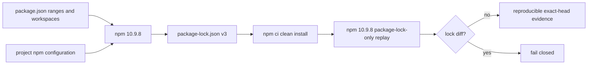

# npm lockfile generator provenance

## Decision

BandScope generates and verifies its root npm workspace lock with exactly npm `10.9.8`. The root manifest records that decision through:

- `packageManager: npm@10.9.8` as package-manager selection metadata; and
- `devEngines.packageManager` with `onFail: error` as npm's source-tree command gate.

The npm version is intentionally not repeated under `engines`. npm serializes `engines` into the root lock package, so adding an npm-only source-tool constraint there creates lock metadata churn unrelated to dependency resolution. `devEngines`, the explicit CI assertion, and the replay gate enforce the generator while the published `engines.node` range remains the runtime compatibility contract.

The primary GitHub Actions workflow uses Node `22.22.3`, verifies the bundled npm version before any installation, runs `npm ci`, then runs a package-lock-only regeneration with scripts, audit, and funding output disabled. Any `package-lock.json` diff fails the exact head.

The Node runtime support decision remains separate. This change does not raise the public `>=22.13 <23` Node range; a coordinated Node-floor migration is tracked independently.

## Why the generator is part of the lock identity

npm documents `package-lock.json` as the location-keyed description of the exact dependency tree. Lockfile version 3 is intended for npm 9 and newer. npm also notes that different package-manager versions may use different installation algorithms and metadata representations. A committed lockfile therefore is not fully reproducible unless the generator version and install-shaping flags are versioned with it.

`npm ci` is the immutable consumption path: it requires a lockfile, rejects manifest/lock dependency disagreement, removes an existing `node_modules`, and does not write the manifest or lock. It does not prove that a future dependency update will regenerate byte-identical metadata. The additional package-lock-only replay closes that gap.

## Security and operational boundary

- Dependency PRs may change only manifest ranges and the lock records produced by npm `10.9.8`.
- Reviewers must reject unrelated lock metadata that cannot be reproduced by the pinned generator.
- No lock record may be added or removed by hand to satisfy a validator.
- Install-shaping flags that change the tree, such as `legacy-peer-deps` or `install-links`, must be committed in project configuration and used identically by `npm ci` and regeneration.
- Dependency lifecycle scripts remain disabled for the reproduction pass. The normal clean install retains the repository's reviewed execution behavior.
- The exact npm version check occurs before `npm ci`; a different bundled or globally installed npm cannot generate acceptance evidence.
- The lockfile remains the sole npm workspace lock. Nested workspace locks are prohibited.

`packageManager` alone is not the enforcement boundary for npm because Corepack's npm shim is not enabled by default in Node distributions. Enforcement is provided by npm `devEngines`, the explicit CI version assertion, and the lock replay.

## Verification

`services/analysis-engine/tests/test_npm_toolchain_contract.py` verifies the manifest metadata, separation of runtime and generator constraints, exact CI Node/npm identity, replay command and flags, clean lock diff, and lockfile version 3. Repository CI then executes the replay using the hosted toolchain.

A dependency update is mergeable only after:

1. npm `10.9.8` produces the checked-in lock from the updated manifest;
2. a second package-lock-only replay is byte-clean;
3. `npm ci`, lint, strict typecheck, measured tests, production build, Rust/Tauri checks, and security/supply-chain gates succeed on the same head; and
4. current-head review, unresolved-thread, independent-approval, and branch-protection requirements succeed without bypass.

## Incident response and rollback

When replay changes the lock unexpectedly:

1. preserve the exact head SHA, npm and Node versions, command flags, original lock blob SHA, regenerated lock, and CI run ID;
2. determine whether the manifest changed, npm changed, project configuration changed, or the protected lock was generated by a different toolchain;
3. never accept a partial or hand-edited lock;
4. regenerate from a clean checkout using the reviewed npm version and run the replay twice;
5. if rollback is necessary, restore the prior manifest and complete lock together, then rerun the entire exact-head gate.

## References

npm, Inc. (2026). *npm ci*. npm Docs. https://docs.npmjs.com/cli/v11/commands/npm-ci/

npm, Inc. (2026). *npm install*. npm Docs. https://docs.npmjs.com/cli/v10/commands/npm-install/

npm, Inc. (2026). *package-lock.json*. npm Docs. https://docs.npmjs.com/cli/v11/configuring-npm/package-lock-json/

npm, Inc. (2026). *package.json*. npm Docs. https://docs.npmjs.com/cli/configuring-npm/package-json/

Node.js contributors. (2026). *Corepack* [Software documentation]. GitHub. https://github.com/nodejs/corepack
