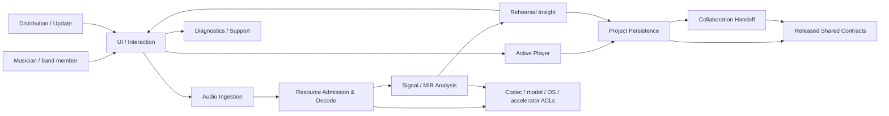
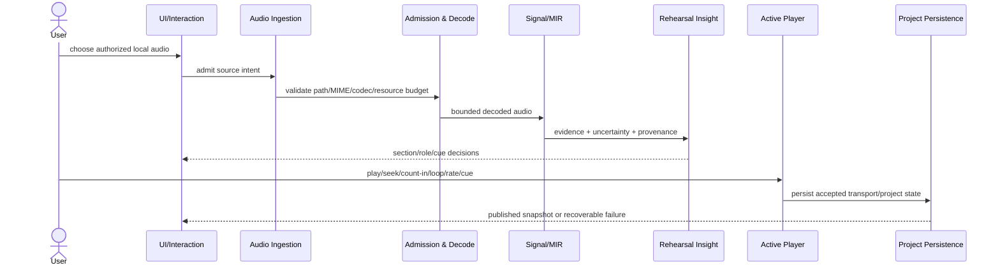
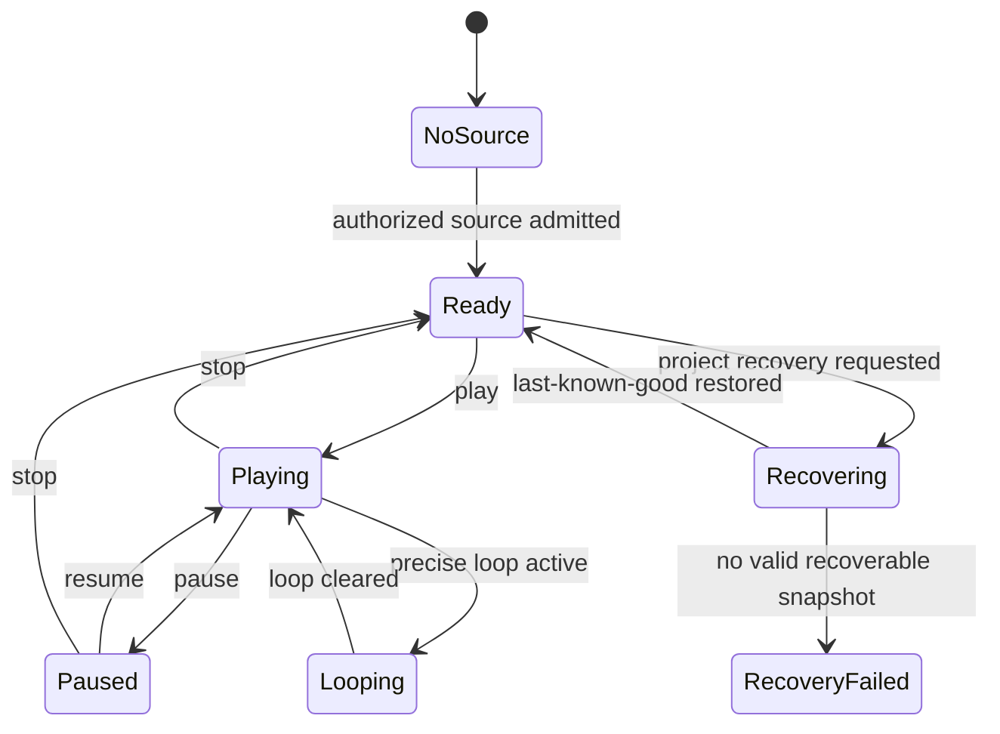

# BandScope Product-Technical Gap Baseline

Last updated: 2026-09-02
Evidence capture: fresh live GitHub state from the current delivery run unless a paragraph is explicitly marked historical
Protected product truth: `develop@749511c3ad4000090048718f685c6bee6b3d2c25`

## Purpose

This document is the canonical product/technical gap baseline for BandScope. It separates protected shipped truth from active pull-request work, research/acceptance work, superseded work, and external control-plane dependencies. A PR body, predecessor check, model review, screenshot, remembered SHA, or generated routing manifest is never shipped truth.

BandScope is a local-first rehearsal decision product. The commercial loop is complete only when a musician can admit a real local recording, obtain evidence-backed rehearsal guidance, rehearse a precise passage, save and recover the project, share a bounded handoff, diagnose failures without leaking private media, and install, update, repair, or roll back a verifiable signed build.

BandScope is not a DAW, notation editor, mandatory cloud service, or an authority that presents uncertain machine analysis as unquestionable musical truth.

## 1. Product requirements baseline (PRD)

### 1.1 Buyer jobs and outcomes

The product must let a working musician or band member:

1. select an authorized local recording and reach useful rehearsal guidance without first exporting media to a cloud service;
2. understand form, section boundaries, harmony, groove/timing, entries/dropouts, range, overlap, handoffs, setup cues, and role-specific preparation with uncertainty visible where the evidence does not justify certainty;
3. move from an insight to audible rehearsal in the same product through one transport authority supporting play/pause/seek/stop, precise section/range loop, count-in, playback rate, cue navigation, and source-backed stem controls where real stems exist;
4. correct machine evidence without erasing the original estimate, confidence, model identity, source identity, or user-confirmed provenance;
5. close and reopen work, survive interrupted writes and migrations, and recover the last known-good project without a partial write replacing it;
6. export a bounded collaboration handoff without creating a second authoritative project store;
7. inspect redacted diagnostics and a user-previewable offline support bundle without ordinary logs containing raw audio, project payloads, credentials, or absolute paths;
8. install and update a build whose version, signature, checksum, SBOM, provenance, rollout state, and rollback/repair path can be verified.

Representative user stories are intentionally end-to-end rather than one-card micro-features:

- As a player, I can open my local song, see the first high-value rehearsal action, start the relevant passage, count it in, and loop it without rebuilding transport in another tool.
- As a band member, I can see section × role guidance and distinguish machine evidence from a user-confirmed correction.
- As a returning user, I can reopen the same project after a crash or interrupted save and recover the last known-good rehearsal state, including transport/loop state where the format supports it.
- As a user of keyboard or assistive technology, I can perform the same primary rehearsal actions and obtain exact-value alternatives to visual-only maps, timelines, or waveforms.
- As a maintainer or support recipient, I can preview exactly what diagnostic evidence will leave the machine and verify that private media and credentials are excluded.
- As an installer, I can distinguish an unsigned validation artifact from a verifiable production release and can roll back a bad staged update.

### 1.2 Commercial acceptance boundaries

A buyer-visible capability is complete only when its production path, negative/error states, persistence/recovery behavior where applicable, security boundary, accessibility contract, and release evidence are all integrated on one protected identity. A static card, Storybook-only state, Figma-only mock, generated array, direct feature matrix, synthetic audio fixture, or predecessor-head check cannot substitute for the relevant production acceptance path.

The near-term product order remains: merge-train convergence; trusted distribution; active rehearsal player; crash-safe project; real-audio science/resource admission; diagnostics; activation; accessibility/design parity; 100% repository-owned production statement/branch coverage and public API documentation.

## 2. Live delivery authority

A fresh accessible-repository sweep queried all **74** repositories currently visible under `ContextualWisdomLab` individually. The sequential per-repository counts summed to **2,827 open pull requests**, and an organization-wide aggregate immediately after the sweep returned **2,834 open pull requests** with `incomplete_results=false`. The seven-request delta is retained as live movement during a non-simultaneous census rather than normalized away or treated as evidence of an omitted repository.

At that sequential organization census, `ContextualWisdomLab/bandscope` had **185 open pull requests** and **19 open issues**. A later independent BandScope-only recheck in this same delivery run returned **194 open pull requests / 19 open issues** with `incomplete_results=false` while protected `develop` remained `749511c3ad4000090048718f685c6bee6b3d2c25`. The 185 count is therefore retained only as the dated observation within the non-simultaneous organization sweep; **194 / 19 is the current BandScope queue capture for this run**. Freshly counted high-backlog peers at the earlier organization sweep were `ContextualWisdomLab/naruon` (142), `ContextualWisdomLab/OriginWeave` (141), `ContextualWisdomLab/newsdom-api` (137), `ContextualWisdomLab/pg-erd-cloud` (135), and `ContextualWisdomLab/TEPP` (131). BandScope remains the selected delivery boundary not by name alone but because it combines the largest observed queue with direct buyer-facing rehearsal responsibility and high-leverage release/security/workflow reuse boundaries.

Because PR creation and closure can occur during a sequential organization census, the organization-wide search is an aggregate capture while the per-repository sweep establishes which repositories were enumerated at that time. Volatile deltas are recorded explicitly rather than normalized away or misrepresented as a simultaneous permanent truth.

Protected `develop` currently requires these 16 contexts before normal integration: `ci / build-and-test`, `dependency-review`, `security-audit`, `sbom`, `release-preflight`, `gate / build / windows`, `gate / build / macos`, `trivy-fs`, `coverage-evidence`, `opencode-review`, `strix`, `scan-pr-queue`, `osv-scan`, `scorecard`, `Analyze (javascript-typescript)`, and `Analyze (python)`.

Operational evidence rule: queued, pending, skipped-required, cancelled, neutral, failed, absent, stale, predecessor-head, protected-base, model-only, status-only, self/author, or administrative-bypass evidence is non-passing. A head change invalidates predecessor review/check receipts. Force-push, destructive rebase, self-approval, gate weakening, fabricated evidence, and unrelated rollback are prohibited.

Merge readiness is re-evaluated per unchanged exact PR head; an organization-wide approval search is not a substitute for per-head proof.

## 3. Shipped protected truth

Only behavior reachable from protected `develop@749511c3ad4000090048718f685c6bee6b3d2c25` belongs in this section.

- BandScope is a React/Vite desktop workspace hosted by Tauri with local orchestration and a Python analysis service plus Rust/PyO3 numerical kernels.
- Typed Tauri IPC and bounded local process boundaries are the intended local execution model; ordinary rehearsal analysis does not require a public cloud service.
- Protected dependency-security repair #783 is already in `develop` ancestry. Open branches must not reframe its historical dependency findings as an unmerged product blocker or suppress them locally.
- The product already renders rehearsal-oriented section/role evidence, but protected truth does **not** yet satisfy the complete active-player, crash-recovery, real-audio acceptance, diagnostics, activation, accessibility-parity, or trusted-distribution contracts below.
- The latest GitHub Release revalidated in this run is immutable `v0.1.3`, published 2026-04-28. It is historical release evidence, not proof that the current protected head satisfies the commercial release gate.

## 4. Canonical active workstreams

Active work is not shipped truth until it is normally integrated into protected `develop` with current-head gates and qualifying independent review.

| Boundary | Canonical live owner / evidence | Current status |
|---|---|---|
| Merge-train control plane | Issue #966 with executable queue lane PR #968 | #968 remains Draft; its unique queue machinery must survive every restack and its exact current head is non-passing until hosted/current-head evidence exists |
| Canonical baseline | PR #1116, this file | Open; every source edit creates a new exact head and invalidates predecessor evidence |
| Naming-contract repair | PR #1130 | Workspace-owned `RehearsalRoleOption` now uses `roleId`/`roleName` with primary `roleOptions`; previous `roles: { id, name }[]` exists only as a deprecated compatibility input translated immediately at the component boundary; no persisted/shared wire contract changed; exact current head at this capture is `724dd0445039b6e99863b46535a8497c784699ab` |
| Repository-local Trivy PR-head contract | PR #1119 | Quoted/commented YAML activity-list normalization is repaired on exact head `eadcc9d075128846ce0bbaa40a03d09afcb5b428`; current-head workflows are queued before execution and therefore remain non-passing |
| Trusted distribution | Issue #960; active release-identity lane PR #1126 | #1126 applies semantic multiword naming across its new release-identity production and test surfaces; Windows signing, macOS signing/notarization, checksums, SBOM/provenance, signature-verified updater, staged rollout, rollback/repair, and complete version-identity parity remain incomplete as one integrated protected-head receipt |
| Active rehearsal player | Issue #961; implementation lane #971 | Real authorized local audio playback/seek/stop/loop/rate/cue transport is active work; count-in and any source-backed stem control must converge into one transport state machine |
| Crash-safe project | Issue #962; implementation lane #970 | Atomic publication, versioned format, recovery, migration, autosave, rollback/export and persisted transport state remain active work, not protected truth |
| Real-audio science | Issue #770 and active benchmark lanes | Rights-safe decoded-audio MIR acceptance, recognized metrics, uncertainty and reproducible evidence remain incomplete |
| Resource admission/decode | Issue #781 plus commercial dependency defect #1129 | No synthetic/mock success may substitute for production-path resource/cancellation evidence; the commercially supported decode path must also remove the libsndfile-backed LGPL runtime boundary with equivalent real-audio behavior and cross-platform/SBOM proof |
| Diagnostics/supportability | Issue #963 | Typed redacted crash/hang evidence and user-previewable offline support bundle remain incomplete |
| Activation | Issue #964; licensed-demo work exists in active PRs | A measured production-path first rehearsal remains incomplete |
| Accessibility/design parity | Issue #965; design/Storybook work remains active | WCAG 2.2 AA, keyboard/screen-reader parity, EN/KO expansion, exact-value alternatives and current-head UI evidence remain incomplete |
| Quality floor | PR #1057 and successors | Repository-owned production statement/branch coverage and public API documentation target remain 100%; lower configured thresholds are a gap |

The product boundary, tests, contracts, and unique behavior decide succession—not PR number or title. Duplicate closure requires a technical succession receipt naming the unique behavior/tests preserved in the successor. Checks, approvals, and model output never transfer to a changed successor head.

## 5. Merge-train and succession contract

Backlog convergence is the primary engineering risk because micro-PR fan-out creates duplicate writers, stale evidence, dependency ambiguity, competing local state, and review/check churn.

PR #968 owns the unique executable queue machinery needed by #966: bounded GitHub pagination, exact active-head capture, independent base-tip resolution, deterministic ordering, malformed/incomplete/duplicate rejection, reviewed dependency/succession metadata, network-independent validation, deterministic human projection, and symlink-safe atomic publication. It must not be discarded as stale documentation.

Independent live branch resolution in this run places #968 exactly at `docs/bandscope-product-readiness-baseline@bfdc3888de2736753ed93fcf0018459882bfa0e2` and its canonical #1116 target exactly at `docs/gap-baseline-2026-08-31@adbd9df394957ee1a2c68893b8a6025cdcf058c9`. Those identities agree with #968's current stack description; predecessor checks/reviews still do not transfer, and #968 remains Draft while its exact-head hosted evidence and reviewed disposition inventory are incomplete. PR-body prose or indexed search metadata that names a different head is stale and is not used as branch authority.

PR #1007 is the canonical first-part-handoff lane only to the extent that its live semantic diff still preserves mounted selected-role wiring and the scientific prohibition against manufacturing handoffs from heuristic fallback. Any succession decision is rechecked against the independently resolved live head rather than a remembered PR-body SHA.

Draft status is used only for a real unverified or blocked boundary and is never toggled solely to manufacture CI.

## 6. Domain model and ownership

BandScope keeps these bounded contexts distinct:

1. **Audio Ingestion** — user-selected source authority and intake intent.
2. **Resource Admission & Decode** — codec/MIME/path/resource/cancellation boundaries.
3. **Signal/MIR Analysis** — decoded-audio evidence and uncertainty.
4. **Rehearsal Insight** — section × role decisions, cues, confidence and correction provenance.
5. **Active Player** — one authoritative transport state machine for play/pause/seek/stop/loop/count-in/rate/cue navigation and source-backed stem controls.
6. **Project Persistence** — format version, atomic publication, autosave, migration, backup/recovery and portable export.
7. **Collaboration Handoff** — bounded share/export contracts, never a second project source of truth.
8. **Diagnostics/Support** — typed redacted evidence and support bundle lifecycle.
9. **Distribution/Update** — signed identity, SBOM/provenance, updater verification, rollout and rollback.
10. **UI/Interaction** — accessible, localized rendering of domain state; no duplicated transport/project stores.

Generic `utils`, `helpers`, `common`, `services`, `shared`, `core`, or `models` dumping that erases these responsibilities is a defect. Cross-context persistence and duplicated local transport stores are also defects.

### 6.1 Ubiquitous language, aggregates, invariants, and events

| Term | Meaning | Invariant / transaction boundary |
|---|---|---|
| `RehearsalProject` | durable work for one admitted rehearsal source | one published format version; a partial write never replaces the last known-good snapshot |
| `AudioSourceRef` | authorized local source identity plus bounded metadata | source authority is explicit; raw media is not copied into ordinary logs or EA truth |
| `SongSection` | stable-ID time-bounded structural region | ordered, finite range inside admitted media duration; display label is not identity |
| `RehearsalRole` | instrument, vocal function, or useful subdivision | guidance belongs to project/section and retains evidence provenance |
| `AnalysisEvidence` | versioned machine estimate | confidence/model/source provenance survives correction |
| `ManualOverride` | user-confirmed correction | original machine evidence remains auditable; confirmation is not silently reclassified as model truth |
| `RehearsalCue` | actionable entry/stop/pickup/handoff/range/setup/timing instruction | referenced section/time/role remains resolvable |
| `RehearsalTransport` | count-in/loop/playback/navigation state | one authoritative state machine; no competing mounted/local stores |
| `SupportBundle` | user-previewable redacted diagnostic export | excludes raw audio/project payloads, credentials and absolute local paths by default |
| `ReleaseIdentity` | version/artifact/signature/checksum/provenance tuple | updater accepts only policy-valid signed identity and preserves rollback target |

Candidate domain events include `AudioSourceAdmitted`, `AnalysisCompleted`, `CueConfirmed`, `SectionBoundaryCorrected`, `LoopActivated`, `ProjectSnapshotPublished`, `ProjectRecovered`, `SupportBundlePrepared`, `UpdateStaged`, and `UpdateRollbackCompleted`.

### 6.2 Context map (UML/C4-level logical view)

The diagram is logical responsibility, not a claim that each box is a separate process. Shared contracts stay small and versioned; external codec/model/platform types remain behind anti-corruption layers.

`context-graph-contracts` remains the contract-only shared kernel for canonical refs, authority/truth status, bitemporal/provenance Context Assertions, CloudEvents, schemas and conformance. `enterprise-architecture-core` remains the EA Decision Plane. While their dedicated writer is active they are read-only dependencies here; BandScope projects deployable/runtime/version/risk facts through released contracts and does not copy rehearsal audio/analysis/user truth into EA authoritative storage.

## 7. Technical design contract (TRD)

### 7.1 Production topology and ports

Protected `develop` is a local desktop architecture with these principal implementation surfaces:

- `apps/desktop`: React/Vite UI rendered inside the Tauri desktop shell;
- `apps/desktop/src-tauri`: native command/orchestration boundary and platform integration;
- `apps/desktop/core`: Rust-owned local authority/input-validation helpers where currently implemented;
- `packages/shared-types`: versioned cross-layer request/response/domain contracts;
- `services/analysis-engine`: Python orchestration/compatibility plus still-mixed analysis code during migration;
- `services/analysis-engine/rust`: `bandscope_numeric` Rust/PyO3 numerical kernels.

Typed Tauri IPC and bounded local process/stdin-stdout boundaries are the intended orchestration ports. Codec libraries, source-separation/model runtimes, filesystem/platform APIs, accelerators, update services, and external handoff contracts are adapters behind owning-context ports. Ordinary rehearsal analysis must not require an unaudited loopback/public HTTP service.

### 7.2 End-to-end rehearsal sequence

If decode, analysis, persistence, or playback fails, the error remains typed and bounded; a synthetic analysis object is not substituted as production success.

### 7.3 Transport and project state ownership

The production player owns one transport state machine. UI components, cue cards, map cursors, and persisted project data project from that authority; they do not each own independent writable transport state. Project publication is atomic and crash-safe rather than implied by the diagram's UI state.

### 7.4 Persistence and contract versioning

Project persistence uses explicit `project_format_version`, deterministic/idempotent migrations, atomic replacement only after a complete durable candidate exists, and a last-known-good backup/recovery path. Fault injection must prove that partial/truncated writes, disk-full conditions, interrupted migration, and failed replacement do not destroy the previous valid project. Portable export is versioned independently from in-memory implementation types.
