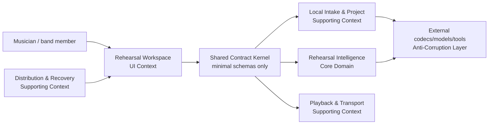
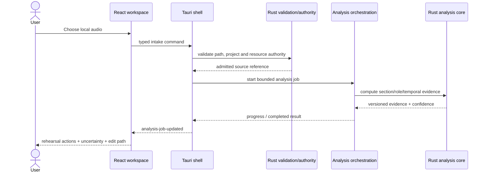
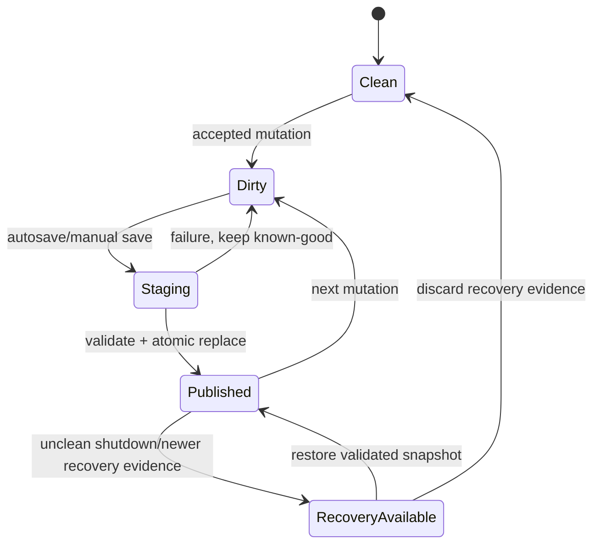

# BandScope Product-Technical Gap Baseline

Last updated: 2026-09-01
Evidence capture: 2026-09-01 10:31 KST unless a row says otherwise
Protected base: `develop@749511c3ad4000090048718f685c6bee6b3d2c25`

## 1. Purpose and product outcome

This is the engineering evidence baseline for BandScope. Customer-facing copy must continue to follow `docs/brand-story.md`: practical, rehearsal-first, non-authoritative, and explicit about uncertainty. This document is intentionally denser because its job is to connect product promises, implementation boundaries, tests, research, security controls, and the live PR queue without exposing those internals in the product UI.

BandScope is a local-first rehearsal companion for people who need to understand a song quickly and spend rehearsal time playing rather than decoding the arrangement. The buyer outcome is:

```text
install a trusted build
→ import a real song
→ get evidence-backed section/role analysis
→ see uncertainty and correct it
→ rehearse a passage with precise transport
→ save/recover the project
→ share a bounded handoff
→ update or roll back safely
```

The product is not a DAW, notation editor, mandatory cloud service, or authority that claims one analysis is unquestionably correct.

### Buyer-facing PRD

Primary users are working musicians and band hobbyists preparing after work. The core jobs are:

1. identify what each player or vocal role should prepare;
2. understand form, entry/dropout, timing, harmony, range, overlap, and setup cues by section;
3. repeat a difficult passage without rebuilding a loop in another tool;
4. correct uncertain analysis and retain provenance of the correction;
5. return later without losing accepted work;
6. install and update a build whose identity and provenance can be verified.

Representative user stories:

- As a player, I can open a local song and see the first useful rehearsal action without learning a DAW.
- As a band member, I can distinguish section-level and role-level guidance instead of receiving one flat chord track.
- As a user, I can see when BandScope is uncertain and correct the result without losing the original model provenance.
- As a player, I can select a cue or section, count in, loop it, slow it down when supported, and keep role controls accessible from keyboard and assistive technology.
- As a returning user, I can recover the last known-good project after a crash, interrupted write, schema migration, or failed update.

## 2. Current architecture and responsibility boundaries

`AGENTS.md`, `ARCHITECTURE.md`, and `docs/brand-story.md` define the shipped direction. The current repository is a local desktop system with these major layers:

- `apps/desktop`: React/Vite UI in a Tauri shell;
- `apps/desktop/src-tauri/src/main.rs`: typed native orchestration boundary;
- `apps/desktop/core`: Rust input and authority validation helpers;
- `packages/shared-types`: cross-layer contracts;
- `services/analysis-engine`: current Python orchestration and music-analysis modules;
- `services/analysis-engine/rust`: `bandscope_numeric` Rust/PyO3 numerical kernels.

The protected snapshot already uses typed Tauri IPC and stdin/stdout JSON instead of an ordinary loopback web server for local analysis. The security posture treats files, URLs, project data, model artifacts, subprocesses, exports, and logs as trust boundaries.

### 2.1 DDD context map



Core subdomain: **Rehearsal Intelligence**. Supporting subdomains: Local Intake & Project, Playback & Transport, Distribution & Recovery, and bounded Collaboration/Handoff. Generic concerns include logging, localization, accessibility primitives, and release metadata.

Shared Kernel must remain small: stable identifiers, section/role/cue/confidence/provenance contracts, and versioned interchange types. External codecs, Demucs/librosa-era dependencies, PDF tooling, and future accelerators stay behind Anti-Corruption Layers rather than leaking their types into product contracts.

### 2.2 Ubiquitous language and aggregates

| Term | Meaning | Transaction / invariant boundary |
|---|---|---|
| RehearsalProject | Durable local work for one rehearsal source | one project version; no partial publication |
| SongSection | Time-bounded structural region | valid ordered range inside admitted media duration |
| RehearsalRole | Instrument, vocal function, or role subdivision | role guidance belongs to a section/project and retains provenance |
| RehearsalCue | Actionable entry, stop, pickup, handoff, range, setup, or timing cue | time/section reference must remain resolvable |
| AnalysisEvidence | Versioned machine-produced estimate plus confidence/provenance | no silent promotion from estimate to user-confirmed truth |
| ManualOverride | User-confirmed correction | preserves original evidence and authoring provenance |
| RehearsalTransport | Playback/count-in/loop state | one authoritative state machine; no competing writers |

Candidate domain events: `AnalysisCompleted`, `CueConfirmed`, `SectionBoundaryCorrected`, `LoopActivated`, `ProjectSnapshotPublished`, `ProjectRecovered`, and `UpdateRollbackCompleted`.

## 3. Technical design contract (TRD)

### 3.1 Rust ownership of computation

Protected `develop` currently has a mixed implementation: `bandscope_numeric` owns checkerboard novelty and Viterbi decoding, while much of music DSP, feature extraction, prioritization, and analysis still executes in Python/NumPy. That is a product-technical gap under the current ecosystem directive.

Target contract:

- all repository-owned mathematical, vector, matrix, signal-processing, exploratory/data-science, ranking/weighting, and other core analysis computation is implemented in Rust;
- Python may remain an orchestration/API compatibility layer only where removal is not yet practical;
- CPU execution uses bounded multithreading without avoidable context switching;
- acceleration capabilities are explicit: CPU baseline first, then validated CUDA/OpenCL/MLX adapters where supported rather than silent fallback claims;
- Rust/Python parity tests are migration evidence, not permission to retain a permanent Python core;
- no heuristic weight or rule-of-thumb threshold is accepted without a documented measurement model, calibration dataset, or research basis.

The migration order is determined by product impact and dependency edges: temporal/beat and harmony kernels → range/pitch and role features → prioritization/weighting → source-separation integration boundaries → remaining vector/matrix utilities.

### 3.2 Real-audio measurement contract

Synthetic fixtures remain useful for unit tests but do not prove the rehearsal product. GA accuracy evidence must use licensed or redistribution-safe real audio with human-verified ground truth.

Required metrics are task-appropriate rather than collapsed into one score:

- chord/harmony: Weighted Chord Symbol Recall or the benchmark metric defined by the chosen chord corpus;
- beat/timing: listener-annotated beat-location metrics compatible with the MIREX task contract;
- source separation: SI-SDR and task-appropriate perceptual/robustness evidence;
- range/pitch/transcription: reference-note or frame/event metrics declared with the corpus;
- section/cue boundaries: time-tolerant event metrics with the tolerance derived from annotation and rehearsal error cost, not an unexplained constant.

Acceptance is pre-registered per corpus before model tuning. A candidate must meet the declared non-inferiority/superiority criterion against the approved baseline with uncertainty reported (for example, bootstrap confidence intervals across tracks). A threshold must not be invented merely to make CI green.

### 3.3 Persistence and concurrency contract

Issue #962 is the canonical owner for the versioned crash-safe project format, autosave, migration, backup, and recovery. Persistence must use one project authority, atomic publication, a known-good backup, bounded inputs, deterministic/idempotent migrations, and explicit locking or single-writer ownership. Any future relational store must use normalized schemas and durable keys; no database is introduced solely to satisfy an architectural fashion requirement.

### 3.4 Playback contract

Issue #961 is the canonical owner for active rehearsal playback: precise loops, count-in, rate control, cue navigation, role controls, restoration, and accessible interaction. Timing-sensitive transport belongs in Rust. A real-time audio callback must not perform unbounded allocation, blocking I/O, network access, or lock-heavy work.

### 3.5 Security and privacy contract

- Keep ordinary analysis local and network-independent.
- Treat selected files, metadata, URLs, project files, models, PDFs, subprocess output, and diagnostics as untrusted.
- Prefer narrow allowlisted commands/capabilities; no generic exec/read/write surface.
- Ordinary logs and support artifacts must not retain raw private audio, secrets, full local paths, or dependency-controlled exception payloads.
- Dependency/SBOM/provenance gates remain fail-closed; root-cause repair is preferred over ignore/suppression.
- Signing keys and release credentials never enter repository files or ordinary artifacts.

## 4. Product capability baseline

| Capability | Protected-snapshot status | Remaining buyer-visible gap |
|---|---|---|
| Local file intake | implemented boundary | finish resource budgets and cross-platform fault evidence |
| YouTube import | policy-constrained / partial | honest failure guidance; no DRM/login bypass |
| Section/role hierarchy | represented | prove real-audio accuracy and editing round trip |
| Harmony and chord guidance | implemented / mixed compute | calibrated evidence; Rust ownership; uncertainty quality |
| Groove/beat/timing cues | implemented / mixed compute | real-audio benchmark; Rust ownership; temporal integration |
| Range/overlap guidance | implemented | reference-audio validation and Rust migration |
| Stems/source separation | partial | platform/accelerator coverage, model artifact provenance, real-audio SI-SDR evidence |
| Confidence/provenance | represented | calibrate confidence and prove user correction round trip |
| Rehearsal action map | many open slices | consolidate repeated micro-PRs into coherent section/role UX |
| Active loop/player | incomplete | canonical Issue #961 |
| Crash-safe project/autosave | incomplete | canonical Issue #962 |
| Signed/notarized updater/rollback | partial | canonical Issue #960 |
| Redacted diagnostics/support bundle | incomplete | canonical Issue #963 |
| Licensed first-run demo | incomplete | canonical Issue #964 |
| WCAG/Figma/Storybook parity | incomplete | canonical Issue #965 |
| Merge-train/succession | incomplete | canonical Issue #966 |

## 5. Live PR queue and merge-loop evidence

The live queue is volatile and therefore is not treated as a permanent product fact. At the 2026-09-01 10:31 KST capture, GitHub reported **190 open pull requests** for `ContextualWisdomLab/bandscope`. The previous 2026-08-31 snapshot in this branch reported 185. This file records the capture time and the verification command intentionally returns the *current* value on a later rerun.

The queue is dominated by narrow `feat(workspace): name tonight's first … on the map` slices. Those changes can improve next-action copy, but backlog size itself is now a product-delivery risk: overlapping plan fields, copy keys, contracts, and workspace behavior should be consolidated into dependency-aware trains rather than allowed to grow as unbounded parallel micro-PRs.

### 5.1 Current required-check evidence, not inherited evidence

Do not state that every open PR is blocked by the same cause. Required gates change over time and must be inspected on the exact current head.

Two current examples show why:

- **PR #956** (`fix(security): redact articulation failure logs`) had a predecessor Strix failure caused by central provider/API compatibility, not by its three-file privacy repair. The central fix `ContextualWisdomLab/.github#1350` (`f655a901…`, GPT-5.4 function-tool/reasoning contract) is an ancestor of current `.github/main@1186a9f4…` (245 commits ahead at capture). The PR was advanced normally, without force push, to tree-identical exact head `e46a7aa3121c902ebcf9ea9d256a199659a482df` solely to obtain fresh current-workflow evidence; repository workflows immediately re-queued. It still must not merge without terminal current-head required checks and qualifying independent approval.
- **PR #1117** (`refactor(engine): promote temporal probe from cli hack to api integration`) was open at exact head `b98f266d2356d56be624fb617580b5252e85baaa`. At capture, all nine repository workflow runs returned success (CI, release, Security Scan, security-audit, Semgrep, Bandit, secret scan, build baseline, SBOM), while the central `opencode-review` check was still `in_progress`. Pending evidence is not success and does not transfer to a later head.

Operational invariant: central-gate faults are repaired in the owning central repository. Member repositories do not weaken required checks, self-approve, transfer predecessor evidence, or use administrative bypass to manufacture merge readiness.

### 5.2 Baseline PR ownership

Two open PRs attempted to own this same file: #1025 (older, larger initial baseline) and #1116 (newer refresh). This branch is the canonical current owner because this replacement incorporates the unique product/TRD/UML/Rust/accuracy/security/accessibility/release requirements from #1025 while correcting the stale live-state and review findings on #1116. #1025 can therefore be closed as superseded only after this head exists and its unique requirements are preserved here; closure is bookkeeping, not deletion of evidence.

## 6. Prioritized gap backlog

Priority is buyer impact × dependency leverage × risk, not PR age.

### P0 — blocks trustworthy product completion

1. **Restore sustainable exact-head merge throughput (Issue #966).**
   - Acceptance: current-head required checks are terminal-success, independent non-author approval is current, unresolved actionable threads are zero, and duplicate/superseded slices are reconciled before merge.
   - No bypass, self-approval, stale check transfer, or force push.
2. **Establish real-audio accuracy gates (Issue #770).**
   - Acceptance: licensed real-audio corpora, human ground truth, task-specific metrics, preregistered statistical acceptance criteria, and reproducible exact-head artifacts.
3. **Migrate repository-owned core computation to Rust.**
   - Acceptance: inventory of every math/DSP/vector/matrix/data-science call path; Rust ownership for each core operation; CPU multithread baseline; explicit accelerator adapters; parity and real-audio regression tests; Python orchestration contains no hidden numerical fallback accepted as production truth.
4. **Complete local resource admission and filesystem authority.**
   - Acceptance: bounded file duration/size/allocation, cancellation, path containment, model/PDF bounds, and platform fault tests across the real production path.

### P1 — closes the rehearsal loop

5. **Active rehearsal player (Issue #961).** Precise loop/count-in/role control with Rust transport and accessibility equivalence.
6. **Crash-safe project source of truth (Issue #962).** Atomic save/autosave, migration, backup, recovery, locking, and versioned fixtures.
7. **Trusted desktop distribution (Issue #960).** Windows signing, macOS signing/notarization, updater signatures, SBOM/provenance, staged rollout, and rollback evidence.
8. **Private supportability (Issue #963).** Typed diagnostics and user-previewable offline support bundle without raw song/path leakage.
9. **Licensed first-run rehearsal (Issue #964).** Demonstrate install → first useful rehearsal without developer setup.
10. **WCAG 2.2 AA + Figma/Storybook/shipped parity (Issue #965).** Keyboard, focus, target-size, alternatives for visual timelines/charts, i18n semantic parity, design-token ownership, and representative edge-case stories.

### P2 — improves scale and analytical depth after the core loop is reliable

11. Consolidate plan-field micro-PRs into coherent engine-generated role guidance with conflict/priority rules and edit provenance.
12. Replace hand-tuned/untraceable weights and priors with documented literature/calibration evidence and sensitivity tests.
13. Expand section/role/temporal modeling where multilevel or time-dependent evidence materially improves rehearsal decisions; avoid atomistic aggregation that erases section/role structure.
14. Harden model artifact provenance and accelerator reproducibility across CPU/CUDA/OpenCL/MLX-supported paths.
15. Expand collaboration only behind a clear local-first buyer outcome and stable project/handoff contracts.

## 7. Quality, test, UX, and operability baseline

### Coverage and documentation

- Python production coverage/docstring gates are already described as 100% in repository guidance.
- Protected `develop` still configures JavaScript coverage thresholds at 90% in both `apps/desktop/vite.config.ts` and `packages/shared-types/vitest.config.ts`; this is a gap against the current 100% statement/branch/edge-case target.
- The target is **100% test coverage, 100% branch/edge-case coverage, and 100% public/repository-owned API docstring/documentation coverage** for changed production surfaces. A passing threshold below that target is not equivalent evidence.

### Realistic test cases

At minimum, exercise 44.1/48/96 kHz where supported, mono/stereo, short and long recordings, pickup before bar one, odd meter, tempo change, silence near boundaries, unsupported codec, moved/replaced files, device changes, cancellation, disk full, corrupted project state, migration interruption, source-separation unavailable, and uncertainty correction round trips.

### Accessibility and UI validation

`docs/doctoring/high-security-pdf-http-baseline.md` and `docs/doctoring/npm-lockfile-generator-provenance.md` already contain Mermaid diagrams, so a repository-wide “no diagrams exist” claim is false. What remains missing is a maintained product-level DDD/context map, core sequence/state views, Storybook inventory for rehearsal-domain components, and screenshot-backed accessibility/responsive audits of shipped UI.

For visual controls, exact-value and non-drag alternatives are required when a waveform, range, timeline, or chart is interactive. UI copy should tell the musician what to do next and must not expose internal module/repository boundaries.

### Release/operability

A development artifact is not GA evidence. GA requires protected-source identity, reproducible build evidence, checksums, SPDX SBOM/provenance, supported architecture matrix, signatures, macOS notarization, verified update manifest, offline startup, and tested repair/rollback.

## 8. UML / sequence supplements

### 8.1 Import → analyze → rehearsal view



### 8.2 Project state machine



## 9. Research and standards traceability

The baseline uses standards as evaluation structures, not as decoration:

- ISO/IEC 25010:2023 supplies the current product-quality model for specifying and evaluating software quality characteristics.
- NIST SP 800-218 SSDF v1.1 supplies outcome-oriented secure-development practices, including provenance and tracked security requirements/design decisions.
- WCAG 2.2 is the current W3C Recommendation baseline used for the desktop webview UI accessibility contract.
- MIREX task definitions provide domain-relevant evaluation precedent using real audio and human/listener annotation; the 2025 beat-tracking task explicitly evaluates predicted beat locations against listener-annotated recordings.
- MIR literature remains task-specific: Foote for self-similarity novelty, Viterbi for decoding, Le Roux et al. for SI-SDR, and established chord corpora/metrics for harmony evaluation. These references do not justify unrelated hand-tuned transition priors or product weights.

### References (APA 7th)

International Organization for Standardization, & International Electrotechnical Commission. (2023). *ISO/IEC 25010:2023 Systems and software engineering—Systems and software Quality Requirements and Evaluation (SQuaRE)—Product quality model* (2nd ed.). ISO.

Foote, J. (1999). Visualizing music and audio using self-similarity. In *Proceedings of the Seventh ACM International Conference on Multimedia* (pp. 77–80). Association for Computing Machinery.

Le Roux, J., Wisdom, S., Erdogan, H., & Hershey, J. R. (2019). SDR—Half-baked or well done? In *2019 IEEE International Conference on Acoustics, Speech and Signal Processing (ICASSP)* (pp. 626–630). IEEE.

Music Information Retrieval Evaluation eXchange. (2025). *Audio beat tracking*. MIREX Wiki. https://music-ir.org/mirex/wiki/2025:Audio_Beat_Tracking

Souppaya, M., Scarfone, K., & Dodson, D. (2022). *Secure Software Development Framework (SSDF) Version 1.1: Recommendations for mitigating the risk of software vulnerabilities* (NIST Special Publication 800-218). National Institute of Standards and Technology. https://doi.org/10.6028/NIST.SP.800-218

Viterbi, A. J. (1967). Error bounds for convolutional codes and an asymptotically optimum decoding algorithm. *IEEE Transactions on Information Theory, 13*(2), 260–269.

World Wide Web Consortium. (2023). *Web Content Accessibility Guidelines (WCAG) 2.2*. https://www.w3.org/TR/WCAG22/

## 10. Re-runnable verification

Run from repository root. These commands intentionally distinguish immutable protected-source evidence from volatile live GitHub state.

```bash
# Protected source identity
git rev-parse --show-toplevel
git rev-parse develop

# Current open-PR count; snapshot in this document was 190 at 2026-09-01 10:31 KST.
gh pr list --state open --limit 500 --json number --jq 'length'

# Current head and live gate state for a PR; never reuse a predecessor result.
gh pr view 956 --json number,state,isDraft,headRefOid,baseRefOid,reviews,statusCheckRollup
gh pr view 1117 --json number,state,isDraft,headRefOid,baseRefOid,reviews,statusCheckRollup

# Confirm product-level and doctoring Mermaid inventory.
git grep -n '```mermaid' -- docs ARCHITECTURE.md

# Verify current JS threshold policy gap.
git grep -n 'lines: 90' -- apps/desktop/vite.config.ts packages/shared-types/vitest.config.ts

# Verify the two current Rust numerical entry points and locate remaining Python core modules.
git grep -n 'checkerboard_novelty\|viterbi_decode' -- services/analysis-engine/rust services/analysis-engine/src
find services/analysis-engine/src/bandscope_analysis -type f -name '*.py' -print

# Real-audio fixture inventory; absence/presence is determined by file search, not Python-file grep.
find . -type f \( -path '*/tests/*' -o -path '*/test/*' \) \
  \( -iname '*.wav' -o -iname '*.flac' -o -iname '*.mp3' \) -not -path './.git/*' -print
```

GitHub live-state claims in this document are capture-time evidence. Any merge decision must re-fetch the exact current head, required checks, review decision, unresolved threads, ancestry/dependency order, and writer state immediately before action.
