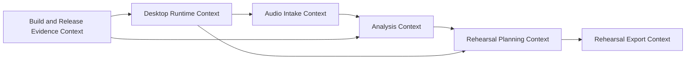
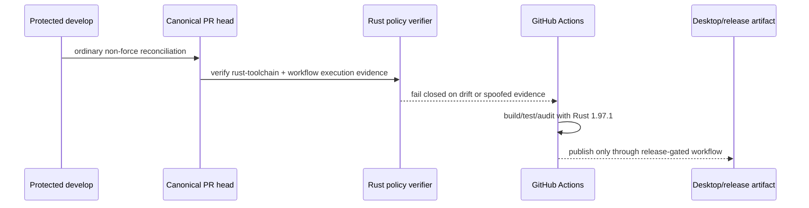

# BandScope product and technical gap baseline

Status: **Proposed / live engineering baseline**

This document records the current product/technical gap state needed to continue BandScope work without reconstructing repository intent from pull-request history alone. It is descriptive evidence, not a substitute for exact-head GitHub Checks, reviews, or protected-branch rules.

## Evidence boundary

Baseline evidence for this update was re-fetched from protected `develop@749511c3ad4000090048718f685c6bee6b3d2c25` and canonical Rust-toolchain PR #944 at parent repair head `762cdfec70df2be27f38d263bf9a4e0c6a6063c0`. The PR was reconciled by ordinary two-parent history so that this protected `develop` revision is an ancestor; no force-push or destructive rebase is part of the repair. `AGENTS.md`, `ARCHITECTURE.md`, `CHANGELOG.md`, repository workflows, the Rust doctoring record, active rulesets, and current PR evidence are the primary repository sources for this slice.

## Buyer PRD

BandScope is a local-first rehearsal-preparation product. The buyer-visible responsibility is to turn a song into actionable rehearsal guidance organized as `song -> section -> role`, with local analysis, secure desktop execution, playable-range/cue/harmony evidence, manual provenance-aware overrides, and exportable rehearsal artifacts. Current protected `develop` already names the first playable range for a rehearsal section so a player can verify instrument fit before rehearsal instead of inferring it from raw analysis output.

The current platform gap addressed by #944 is evidence reproducibility: a floating Rust compiler can change numerical/native-build, security-audit, release-preflight, and packaged-desktop evidence without a repository change. The buyer requirement is therefore that one reviewed Rust compiler revision owns all repository Rust execution surfaces and that policy tests prove the required command really executes rather than appearing only in comments, labels, unrelated jobs, or failure-masked shell text.

## TRD and runtime boundary

BandScope uses a Tauri desktop shell with a TypeScript frontend and a local Python analysis-engine process. Repository-owned native/Rust execution is pinned through root `rust-toolchain.toml` and is checked by repository policy. Node dependency consumption is independently pinned through the approved npm runtime/lock-generator contract already integrated on protected `develop`.

For #944, Rust `1.97.1` is the repository build baseline across ordinary CI, release preflight, dependency audit, Tauri validation, and Windows/macOS amd64/arm64 packaging. The policy verifier rejects floating selectors and evidence borrowed from other jobs/workflows or non-executing YAML. Required commands may use normal arguments such as `--locked`, explicit targets, and `--manifest-path`, but shell control flow must not mask their exit status.

## DDD context map

### Ubiquitous language

- **Song**: the rehearsal source aggregate root presented to the player.
- **Section**: a bounded musical span inside a song.
- **Role**: the rehearsal responsibility/part evaluated inside a section.
- **Playable range**: validated pitch-span evidence used to tell a player whether a section fits their instrument/part.
- **Rehearsal roadmap**: player-facing sequence of section/role guidance.
- **Build evidence**: exact-revision CI/release/security result proving the product was built and tested under the reviewed toolchain.
- **Rust toolchain baseline**: the single reviewed Rust compiler revision required by repository-owned Rust jobs.

### Aggregates, entities, value objects, services, repositories, events, invariants

The primary rehearsal aggregate is Song with Section children and role-specific analysis/rehearsal evidence. Validated playable ranges are value-like evidence: malformed, non-pitch, or inverted spans fail closed before player-facing guidance. Analysis orchestration is a domain/application service behind the desktop IPC boundary. Local project persistence remains local-first and provenance-aware; this Rust-toolchain slice does not change persistence format, SQL schema, or cross-service data ownership.

Relevant invariants for the current repair are: every repository-owned Rust build/audit/release job uses the reviewed toolchain; no floating `stable` selector may silently become authoritative build evidence; each Rust-owning job executes its own required command; and a required command's failure cannot be hidden by shell chaining/pipelines/background control flow.

## UML / execution view

## ERD / persistence assessment

No database schema change is part of #944. The repair changes repository build/release policy, workflow execution, tests, doctoring, and the toolchain manifest only. Therefore there is no migration, FK/index/constraint/sequence/view change, ORM remap, UPSERT change, partition change, lock/read-write-topology change, or rollback data transform to validate in this slice. Any future persistence change must add its ERD and migration/rollback evidence here before merge.

## Organization naming-contract status

The touched #944 surfaces use semantically specific owned names such as `rust_toolchain`, `toolchain_channel`, build/release job names, and dedicated policy-verifier names. External GitHub Actions and tool/vendor contract keys remain unchanged at their required boundary. This slice did not identify a safe organization-owned generic one-word identifier in the touched canonical Rust-policy surface that warranted an additional rename; naming work must continue only where bounded-context ownership and consumer propagation are clear.

## Current gap and action ledger

| Gap / blocker | Owner | Action | Current status |
| --- | --- | --- | --- |
| Floating or inconsistently selected Rust compiler can invalidate reproducible native/security/release evidence | `ContextualWisdomLab/bandscope` #944 | Pin Rust 1.97.1 across all Rust-owning jobs and verify executable evidence | Repaired on canonical Draft PR; fresh exact-head verification required |
| Seven supply-chain policy tests encoded obsolete `cargo +stable audit` despite the intended 1.97.1 contract | `ContextualWisdomLab/bandscope` #944 | Update only stale fixture/assertion commands while preserving intentional floating-selector rejection tests | Repaired at `ba4e7c1508261f7478e16810f67e1b0b44768a8b`; temporary self-fix workflow/script removed |
| PR #944 had fallen behind protected `develop`, overlapping npm/runtime/workflow improvements and buyer-visible first-playable-range work | `ContextualWisdomLab/bandscope` #944 | Re-fetch both heads, reconcile overlapping files by intent, append ordinary two-parent commit | Repaired at `762cdfec70df2be27f38d263bf9a4e0c6a6063c0`; compare was 76 ahead / 0 behind before this documentation commit |
| JavaScript dependency/security baseline | `ContextualWisdomLab/bandscope` #783 | Land canonical npm/PDF.js/Nanoid/Undici and lock-generator protections | Merged as `7ad56cf0065d068ec6463d92726de4855a6e201d`; inherited by current protected base |
| Independent review and required workflows | protected repository/organization rulesets | Obtain fresh exact-head terminal-success checks and qualifying non-author last-push approval; resolve all review threads | Open merge gate; no bypass permitted |

## Security, test, and operability baseline

Protected default-branch rules require a pull request, at least one approving review, stale-review dismissal on push, last-push approval, review-thread resolution, and organization-required workflows. Organization central workflows include OpenCode review, merge scheduling, security scan, Strix, Semgrep, Noema review, CodeQL, Scorecard, and OSV scanning. Non-fast-forward updates and branch deletion are prohibited by active rulesets.

Repository verification for #944 includes frozen npm lock validation, frontend/Python/native checks, Rust policy tests, build matrices, release preflight, dependency audits, security/SAST/SBOM/supply-chain coverage, and central required workflows. Only results attached to the unchanged current head count as merge evidence. A queued, failed, cancelled, skipped-required, predecessor-head, base-only, self-approved, or administratively bypassed result is non-passing.

## UX, Storybook, Figma, screenshot and i18n evidence

This Rust-toolchain repair does not modify user-interface components, design tokens, translations, or interaction states. It therefore does not manufacture Storybook/Figma/screenshot evidence for unchanged UI. Buyer-visible first-playable-range behavior is inherited from protected `develop`; its UI regression evidence remains owned by the merged product change that introduced it. Future UI changes must record normal/loading/empty/error/permission/responsive/interaction states and locale evidence for ko/en/ja/zh/vi/es/de/fr in the owning product PR.

## Research / standards traceability

No new scientific or psychometric claim is introduced by this toolchain-policy slice. Evidence authority is repository-executable: exact compiler selection, workflow execution semantics, tests, checks, and protected rulesets. Scientific/music-analysis validation remains owned by the corresponding BandScope analysis/product changes and must not be inferred from this build-policy PR. When external standards or peer-reviewed claims materially change a decision, the owning doctoring/ADR must add APA 7th references and bind them to the exact module/API/experiment affected.

## Next merge conditions

#944 remains Draft until its newest exact head has all applicable live checks terminal-success, valid review findings and threads resolved, and a qualifying independent non-author approval current for the last push. Immediately before ordinary merge, re-fetch protected `develop`, the PR head, rulesets, reviews, threads, and required checks; if either head moved, reconcile again by intent rather than force-pushing or transferring predecessor evidence.
