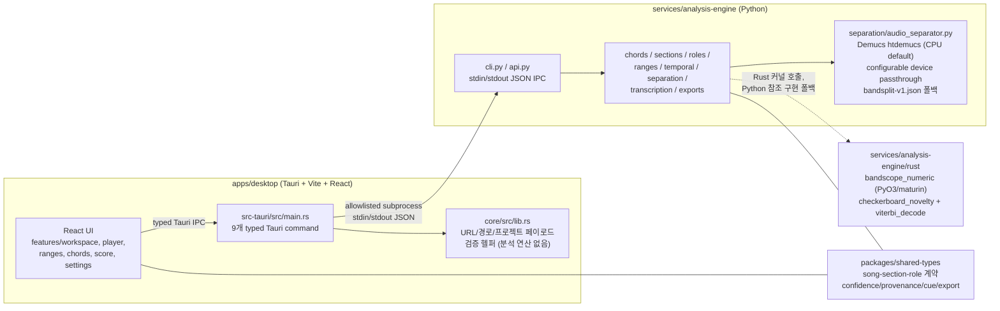
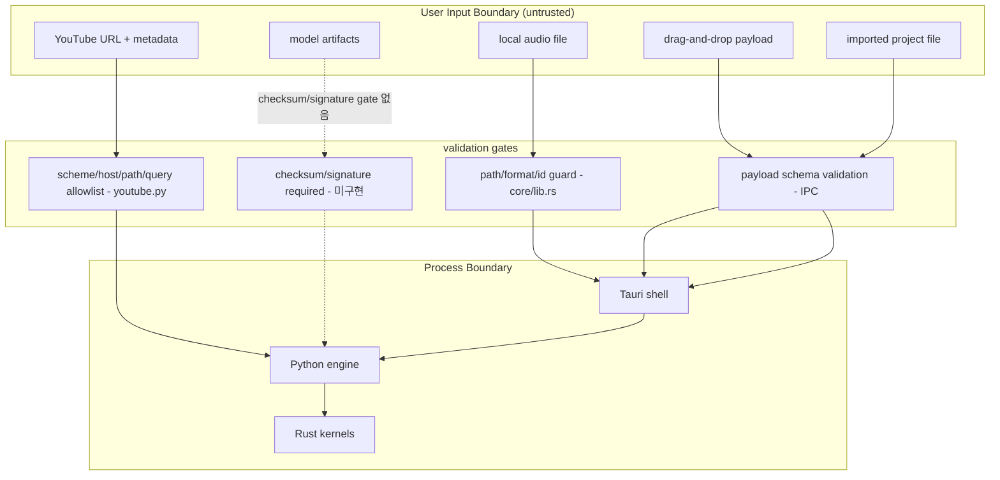

# BandScope Product-Technical Gap Baseline

Last updated: 2026-08-28
Base revision: `develop@749511c3ad4000090048718f685c6bee6b3d2c25` (feat(workspace): name tonight's first playable range on the map, #957)

## 1. 목적과 범위 (Purpose & Scope)

이 문서는 ADR/설계 문서(`ARCHITECTURE.md`, `docs/plans/*`), 브랜드 소스(`docs/brand-story.md`), 보안 소스(`docs/security/app-security.md`), 그리고 현재 저장소 상태(코드, 열린 PR 약 130건, 열린 이슈)를 대조하여 다음을 한 곳에 모은 baseline이다.

- 기능 명세(functional spec)와 PRD/TRD로 승격되지 않은 요구사항의 공백
- 구현된 코드와 문서가 선언하는 제품 범위 사이의 기술 Gap
- 누락된 UML/다이어그램 산출물
- 구매자가 체감하는 제품 Gap 우선순위 Backlog

범위에는 현재 열려 있는 PR 세트를 명시적으로 포함한다. 특히 `feat(workspace): name tonight's first X on the map` 시리즈는 아직 merge되지 않았으므로, 이 문서에서는 해당 시리즈가 착지했을 때 남는 Gap까지 함께 기술한다.

검증 원칙: 본 문서의 코드 관련 주장은 전부 실제 repo에 대해 `grep`/`glob`/파일 read로 확인했다. 확인 방법은 9장에 재실행 가능한 명령으로 남긴다.

## 2. 현행 제품 명세 스냅샷 (Current Product Specification Snapshot)

`ARCHITECTURE.md`와 `docs/brand-story.md` 기준, BandScope는 오늘날 다음을 지향한다.

- 퇴근 후 합주 준비자를 위한 local-first 데스크톱 앱(Tauri + Vite + React)
- 곡 보기(song view): 섹션별·연주 역할별 추정 화성, 폼(form)/그루브(groove) 큐, 스템(stems), 연주 가능 음역(playable ranges), 단순화 가이드(simplification), 전조/카포/튜닝/셋업 큐, 파트 겹침(part-overlap) 경고, 가시적 신뢰도(confidence), 리허설 우선순위
- 분석 대상 모델은 곡 전체 코드 트랙이 아니라 `song -> section -> role` 계층이며, role은 악기/보컬 기능/손(hand) 단위까지 확장될 수 있다
- 자동 분석 결과는 편집 가능하고, model-generated vs user-confirmed provenance를 유지해야 한다

아키텍처 개요:



핵심 구조적 사실(코드 확인 완료):

- 로컬 오케스트레이션은 loopback HTTP가 아닌 typed Tauri IPC + stdin/stdout JSON 서브프로세스 방식이다 (`ARCHITECTURE.md`, `apps/desktop/src-tauri/src/main.rs`)
- `apps/desktop/core`(Rust)는 분석 연산이 아니라 입력 검증(YouTube URL, project payload, score PDF source, 경로 가드) 담당이다 (`apps/desktop/core/src/lib.rs`)
- 무거운 수치 커널 중 checkerboard novelty와 Viterbi 디코딩만 `bandscope_numeric`(Rust/PyO3)으로 포팅되어 있고, 나머지는 Python/NumPy 참조 구현이며 `tests/test_numeric_parity.py`로 f64 parity를 잠근다 (`_native.py`)
- 스템 분리는 Demucs `htdemucs`를 기본 `AudioSeparationConfig.device="cpu"`로 실행한다. `_apply_model`은 구성된 `device`를 Demucs `apply_model(..., device=...)`에 전달하므로 비-CPU 장치 경로 자체는 존재하지만, BandScope가 CUDA/MPS를 독립적으로 admission·parity·performance·release gate한 증거는 아직 없다 (`separation/audio_separator.py`)
- 주파수 컷오프만 정의한 `bandsplit-v1.json` 휴리스틱 밴드스플릿 manifest가 별도로 존재한다 (`separation/model_weights/bandsplit-v1.json`)
- 협업 타입(assignments/comments/approvals)은 `packages/shared-types`에 정의만 되어 있고 UI 참조가 전혀 없다 (grep 확인)

## 3. 기능 명세 및 요구사항 도출 (Functional Spec Derivation)

제품 능력 -> 구현 위치 -> 성숙도 매핑. 성숙도: 구현됨 / 부분구현 / 미구현.

| 제품 능력 | 구현 위치 | 성숙도 |
|---|---|---|
| 로컬 오디오 임포트(Rust 검증 + app-owned 루트) | `apps/desktop/src-tauri/src/main.rs`, `apps/desktop/core/src/lib.rs` | 구현됨 |
| YouTube 임포트(정책 제약, 실패 폴백) | `services/analysis-engine/src/bandscope_analysis/youtube.py` | 부분구현 (DRM/로그인 우회 없음, 실패 시 안내 카드는 PR 진행 중) |
| 스템 분리 | `separation/audio_separator.py` (htdemucs; CPU default), `bandsplit-v1.json` | 부분구현 (플랫폼 게이트, x86 macOS 미지원; configurable device passthrough는 있으나 비-CPU 가속은 아직 BandScope release-qualified가 아님) |
| 섹션 세그먼테이션(checkerboard novelty) | `sections/segmenter.py` + `bandscope_numeric::checkerboard_novelty` | 구현됨 |
| 섹션별 화성(HMM + Viterbi) | `chords/chord_recognizer.py`, `chords/section_harmony.py` | 구현됨 (hand-tuned prior 수준, 4장 참조) |
| 화성 기능 라벨/설명 | `chords/function_analyzer.py`, `RehearsalRole.harmonicExplanation?` | 부분구현 |
| 역할(role) 추출 및 역할별 조율 | `roles/extractor.py`, `roles/tuning.py` | 부분구현 (주파수 컷오프 휴리스틱 기반) |
| 음역/가압(range pressure) | `ranges/analyzer.py`, `ranges/pressure.py`, `ranges/pitch_tracker.py` | 구현됨 |
| 파트 겹침 경고 | `roles/overlap.py`, `RehearsalRole.overlapWarnings` | 구현됨 |
| 단순화 가이드 | `roles/priority.py` 연계, `RehearsalRole.simplification` 필드 | 구현됨 (문자열 필드 중심) |
| 전조/카포/튜닝 큐 | `chords/transposition.py`, `chords/capo.py`, `roles/tuning.py` | 구현됨 (계산), 워크스페이스 노출은 PR 진행 중 |
| 그루브/타이밍/히트 큐 | `temporal/groove.py`, `temporal/hits.py`, `temporal/stability.py` | 구현됨 |
| 진입/이탈/카운트/가사 큐 앵커 | `sections/anchors.py`, `CueAnchorKind = lyric\|count\|transition` | 부분구현 |
| 신뢰도 표시(section/role 수준) | `ConfidenceMarker(low/medium/high)` + `features/workspace/ConfidenceBadge.tsx` | 구현됨 |
| 리허설 우선순위 | `roles/priority.py`, `RehearsalPriority`, `PracticeProgress.tsx` | 구현됨 (규칙 기반 휴리스틱) |
| 수동 수정 + provenance | `ManualOverride[]`, `ProvenanceSource = model\|user` | 구현됨 |
| 내보내기(cue-sheet CSV, chart JSON) | `exports/chart.py`, `src/lib/export.ts` (filename sanitize, CSV escape) | 구현됨 |
| 악보(score) 보기 | `features/score/ScoreView.tsx`, `ScoreViewer.tsx`, `pdfjs.ts` | 부분구현 (PDF 뷰잉; PDF 바이트 검증은 PR 진행 중, 자동 채보 없음) |
| 루프 재생/역할별 재생 제어 | `features/player/index.tsx` | 미구현 (loop 미탐지, PR #903/#971 진행 중) |
| 협업(assignment/comment/approval) UI | `packages/shared-types` 타입만 존재 | 미구현 (UI 참조 0건; PR 시리즈가 첫 화면 진행 중) |
| pad/solo/riff/hook/fill/voicing/articulation/dynamics/tuning/capo/vamp 등 plan 필드 | 없음 (shared-types에 미존재) | 미구현 (PR 시리즈가 추가 예정) |
| 라이선싱/데모곡 first-run | 없음 | 미구현 (PR #1009, Issue #964; diagnostics/privacy boundary는 Issue #963) |
| 자동 저장/crash-safe 프로젝트 포맷 | 없음 | 미구현 (Issue #962) |
| 서명/공증 배포+롤백 증적 | `.github/workflows/release.yml` 존재 | 부분구현 (Issue #960) |

## 4. 현재 열린 PR 기반 Gap 분석 (Open-PR Gap Analysis)

현재 open PR은 130건이다(2026-08-28 REST inventory 기준). 대부분은 동일 패턴의 시리즈다.

### 4.1 2026-08-28 exact-head 운영 snapshot

아래 표는 protected base `develop@749511c3ad4000090048718f685c6bee6b3d2c25`에 대해 GitHub REST API로 다시 읽은 current head와 그 head의 Checks/review 상태다. 이전 SHA의 Checks는 현재 증적으로 재사용하지 않았다.

| PR | current head | current 상태와 traceability |
|---|---|---|
| #1045 | `6c4edebe44740d753b7a0d287273e01b9faddfb3` | navigation-failure disarm fix 포함; 29 hosted Checks success, Rust check 진행 중, `opencode-review` failure; qualifying independent approval 없음 |
| #1046 | `008248327f2f3e3636d9d234221810f3db56829f` | current head에서 source local proof 통과; 30 hosted Checks success, `opencode-review`는 current-head verdict 없음으로 failure, Strix는 tool-description 1024자 제한 후 provider unavailable로 failure; qualifying independent approval 없음 |
| #1033 | `046db562497a8104fa525f56a6437eb13fbf4760` | source/coverage/security/build/release 및 `opencode-review`/`strix` terminal success; reviews는 COMMENTED뿐이며 qualifying approval 없음 |
| #1034 | `98a99e1bff4b63f5294d8c9a5cbdaf312b235403` | source/coverage/security/build/release terminal success; `opencode-review` success; qualifying independent approval 없음 |
| #1041 | `164995d3a3c056bdbb4fc293226d0c31c062104e` | ScoreView/ScoreViewer tooltip 변경 current head; coverage/build/security Checks 일부 queued/in-progress; qualifying approval 없음 |
| #910 | `b6bcecb8649796dc13a54c39d70ca05977b0ac4c` | source/coverage/security/build/release terminal success이나 current `opencode-review` failure; current-head qualifying approval 없음 |
| #943 | `ff5e47d5cff84194e457c05e4bfbe26a30ea69a8` | first-intro player/workspace current head; Proxy metadata fail-closed fix 포함; hosted Checks queued/in-progress; qualifying approval 없음 |
| #947 | `38ed1c8f4dc5f020db43536596aa401c454db55c` | first-verse workspace/player current head; CHANGELOG heading spacing fix 포함; hosted Checks queued/in-progress; qualifying approval 없음 |
| #955 | `4058e5094bff94f9ed2df0f635313ff244f225a6` | first-pre-chorus workspace/player current head; CHANGELOG heading spacing fix 포함; hosted Checks queued/in-progress; qualifying approval 없음 |
| #859 | `0de77e21b6d20d7b21cf44c71a95d8d8c759cf63` | security-baseline 회귀를 제거하고 GrooveMap 최적화·회귀 테스트만 남긴 current head; hosted Checks queued/in-progress, qualifying approval 없음 |
| #866 | `c2cc5bbeda6628fa9999401d6b0d228cb9b6bb9c` | stale base `acdbea63`, Draft + CONFLICTING; `opencode-review` failure; canonical audio policy owner이며 merge 대상 아님 |
| #1025 | `d06d4c18a7569dcf202c959d4597414ae8b07047` | 이 문서 PR의 current head; docs snapshot 갱신 후 hosted Checks는 queued/in-progress; qualifying approval 없음 |

이 snapshot에서 위 PR 중 병합된 것은 없다. `mergeable=true`는 protected review/required-check 완료를 뜻하지 않으며, 승인·current-head review·필수 gate가 모두 충족되지 않은 PR은 병합하지 않았다. admin/self-approval, force-push, protected gate bypass도 사용하지 않았다.

#### Security Notes

- 이 변경은 runtime code, 파일/URL intake, subprocess, IPC, 모델, 로그, export 동작을 변경하지 않고 현재 상태와 traceability만 갱신한다.
- 근거는 각 PR의 API current head SHA와 동일 SHA의 check-runs/reviews이며, stale/cancelled predecessor run은 성공 증적에서 제외한다.
- 명령 출력과 문서에는 secret 값이나 raw audio/사용자 경로를 기록하지 않는다.

시리즈 패턴: `feat(workspace): name tonight's first X on the map` — 워크스페이스 맵에 "오늘 밤 첫 X" next-action 카피를 올리고, Open 클릭 시 해당 섹션으로 이동. 각 PR은 role-owned plan 필드(예: `padPlan`)를 shared contract에 추가하고, own data-property descriptor 검증(Proxy `get` trap 방어), 한국어 조사 안전 카피(`패드`, `뱀프` 등), reduced-motion 처리, 그리고 강한 merge-gate 조항을 포함한다.

capability cluster 분류와 착지 후 남는 Gap:

| Cluster | 해당 PR (예시) | 착지가 의미하는 것 | 착지 후 남는 Gap |
|---|---|---|---|
| A. 역할별 연주 plan 필드 (pad/solo/riff/hook/fill/voicing/articulation/dynamics/tuning/capo/vamp) | #1020, #1013~#1018, #1021, #1024 | RehearsalRole 계약 확장과 첫 plan 노출. 데이터 생성기(engine)가 실제로 이 plan을 산출하는지와는 별개 | plan 값을 만들어내는 엔진 로직, plan 간 충돌/우선순위 정책, plan 편집 UX |
| B. 폼/섹션 네이밍 (intro/verse/pre-chorus/chorus/bridge/outro/tag/pickup/stop/handoff/entrance/dropout/lyric cue/transition/transition-cue/count) | #943, #947, #955, #939, #946, #986, #989, #916, #934, #937, #912, #914, #913, #994, #993, #995 | SECTION_FORM_LABELS와 CueAnchorKind가 이미 계약에 있으므로 주로 UI 노출 완성 | 앵커 정확도(가사/카운트 정렬), 사용자 직접 앵커 편집 |
| C. 화성 설명/확정/귀확인 (harmonic function/explanation/confirmed chord/ear check/setup note/transposition/part handoff/playable range/overlap/groove/simpler take/tempo-starting chord setup) | #1005, #1003, #1002, #1001, #1004, #1006, #1007, #957, #992, #991, #990, #987 | brand-story의 "추정 + 귀로 확인" 프레임을 UI 언어로 구체화 | confidence 산출 근거의 정량화, confirmed override의 재분석 반영(round trip, Issue #739) |
| D. 협업 최소면 (assignment/comment/approval/blocked/pending/open comment/export-priority actions/ready board) | #996, #997, #998, #1000, #900, #901 | shared-types의 collaboration 타입에 처음으로 UI가 붙음 | 동기화(syncMode local_only/planned_cloud), crash-safe 프로젝트 포맷(Issue #962), 권한 모델 |
| E. First-run/activation/실패 복구 (first-run card/license demo song/local intake 실패/import 실패/analysis 실패/save 실패/help) | #974, #1009, #981, #982, #976, #984, #972, #898 | 빈 상태/오류 상태의 next-action 카피 완성 | 라이선싱 백엔드, 데모곡 번들 정책, 오프라인 활성화 |
| F. 보안/신뢰경계 (log redaction x4, quick-xml RustSec, filesystem authority, canonical audio policy, CSV NUL/전각 우회 차단, credential drop, PDF bound reads, npm baseline) | #956, #951, #950, #949, #948, #858, #985/#781, #941, #894, #865, #783 | app-security.md 규칙의 코드 반영 마무리 | Issue #852(경계 재구축), #542(예외 추적), 모델 artifact checksum/signature 파이프라인 |
| G. 성능 (Bolt 시리즈: 관측 확률 벡터화, GrooveMap maxTime O(1), chart dedupe O(N), chord change count O(1), checkerboard/HMM 벡터화) | #999, #859, #849, #834, #746, #732 | 핫패스 최적화. Rust 커널 포팅과 같은 방향의 Python 측 보완 | Demucs 가속 admission/parity/performance qualification, 대용량 파일 스트리밍, UI 가상화 |
| H. 접근성/디자인 시스템 (tooltip aria-disabled, icon tooltip, Storybook tokens, Figma drift check) | #833, #731, #897, #969 | WCAG 대응 시작점 | Issue #965(Figma/Storybook/shipped UI 정합 + WCAG 2.2 AA gate) 전체 |
| I. 테스트 현실성 (decoded WAV acceptance, known-take chord recovery, real YouTube known-stem benchmark, branch coverage) | #892, #891, #828, #861 | synthetic fixture에서 실오디오 기반 acceptance로 이동 시작 | Issue #770(실오디오 MIR accuracy benchmark) 체계화, RMSE/SI-SDR 임계값 정책 |
| J. 의존성/빌드 위생 (react, storybook, base-ui, lucide, sonner, codeql-action, setup-uv, uv group, numba, uuid, time, rust pinning, node floor, orphaned Actions identity) | #920, #942, #922, #921, #926, #927, #924, #931, #936, #919, #918, #754, #944, #896, #895 | 공급망/런타임 최신화 유지 | Dependabot train 정리(Issue #966), jsdom 30 전환 완료 |

시리즈 전체에 대한 종합 판단: 이 시리즈는 "계약(contract) 필드 추가 + 첫 노출" 단계다. 착지해도 (1) plan 값의 생성 로직, (2) plan들 사이 우선순위/중복 정책, (3) 재분석 시 override 보존 round-trip, (4) 협업 영속화는 여전히 Gap으로 남는다. 또한 130건이 develop 기준으로부터 장기간 분기되어 있어 rebase 비용과 exact-head CI 증적 요구(PR 본문 명시)로 인한 merge train 정체가 자체적으로 기술 위험이다(Issue #966).

## 5. 기술 Gap 목록 (Technical Gaps)

문서 vs 코드 대조로 확인한 구체적 Gap.

(a) **Rust compute layer 활용 범위** — 분석 핫패스 중 checkerboard novelty와 Viterbi decode만 Rust(`bandscope_numeric`)에 있다. 스템 분리(Demucs)는 Python/torch이며 `AudioSeparationConfig.device` 기본값은 `cpu`다. `_apply_model`은 구성된 device를 `demucs.apply.apply_model(..., device=...)`에 그대로 전달하므로 비-CPU 장치 경로는 존재한다. 다만 BandScope의 현재 protected/release evidence에는 CUDA/MPS 경로의 장치 admission, CPU 대비 수치 parity, 성능 기준, 플랫폼별 release qualification이 없다. 따라서 Gap은 "GPU 경로 부재"가 아니라 **가속 경로의 검증·지원 계약 부재**다. transcription은 에너지 마스크 휴리스틱(`transcription/api.py`)으로 ML 모델이 아니다. 데스크톱 단일 곡 처리 기준 CPU로도 실용적일 수 있으나, 긴 곡/다중 분석에서 병목이며 `docs/plans/2026-04-25-v2-transcription.md`가 v2 계획으로 존재한다.

(b) **다층/계층·시간 모델링** — `song -> section -> role` 계약과 sections/roles/temporal 모듈은 존재하지만, role-level harmony는 `bandsplit-v1.json`의 고정 주파수 컷오프 휴리스틱에 의존한다. 학습된 multilevel 모델(예: role-conditioned chord/voicing 모델)과 section 경계의 temporal 일관성 학습은 없다. `docs/plans/2026-03-28-ml-engine-integration.md`가 관련 계획 문서다.

(c) **임의 가중치 vs 문헌 기반 값** — `chord_recognizer._build_transition_matrix()`는 `self_prob=0.8`, `related_prob=0.03`, uniform baseline `0.01/n` 등 hand-set 상수를 쓴다("Encodes musical priors" 주석). 방향성(fifth/fourth/relative/parallel)은 음악 이론에 근거하지만 수치는 문헌 교정(calibration)되어 있지 않다. `roles/priority.py`는 숫자 가중치 없는 if-then 규칙이다. PR #732(relative-key prior correction)처럼 사후 수정이 발생해왔다. 교정 방향은 주석 코퍼스(예: Burgoyne et al., 2011의 McGill Billboard)에서 전이 행렬을 최대우도로 추정하고, 관련 HMM/화음인식 문헌(Logan & Chu, 2000; Pauwels & Peeters, 2013; Boulanger-Lewandowski et al., 2013)은 모델링 맥락으로만 사용하며 현재 transition 수치의 parameter source로 간주하지 않는 것이다. tonal pitch space 거리 기반 스무딩(Harte, 2010) 등 대안과 현재 hand-set 값의 코드 복원 RMSE/accuracy 차이를 정량 비교한 뒤, 우세한 값을 상수가 아닌 데이터 산출물로 고정한다.

(d) **테스트 현실성** — `test_numeric_parity.py`(Rust-Python parity), `test_api.py` 등은 합성 입력 기반이다. 현재 PR checkout의 Git tree 및 9장 `find` 검증 기준 test 경로에 `.wav`/`.mp3` 실오디오 fixture가 없다. 실오디오 acceptance는 PR #892(decoded WAV C major), #891(known take verse/chorus recovery)이 열려 있고, 실 YouTube known-stem benchmark는 draft PR #828 + Issue #770 상태다. RMSE/SI-SDR 스타일 정량 임계값 acceptance gate는 아직 없다.

(e) **커버리지/docstring 100%** — Python은 `--cov-fail-under=100` + Ruff D100-D107 docstring 100%가 gate로 작동한다(AGENTS.md, roadmap-completion 문서). JS workspace의 **2026-08-25 snapshot 실측**은 desktop(469 stmts/357 branches/105 funcs)과 shared-types(717 stmts/643 branches/59 funcs) 모두 statements/branches/functions/lines 100%였다. 이 수치는 현재 영구 gate를 뜻하지 않는다. gate threshold(`vite.config.ts`, `vitest.config.ts`)는 90으로 Python보다 낮아, 리그레션 시 90~99% 구간이 무단 통과될 수 있다. Gate 상향은 Backlog #10.

(f) **보안 체크리스트 잔여 항목** — 구현된 것: allowlisted stdin/stdout subprocess, Tauri CSP, path guards(#727 착지), CSV escape/sanitize, shell=False. 열린 것: canonical audio resource budget(#985 draft, Issue #781), filesystem path containment 재구축(Issue #852, #858 진행), native PDF read bounding(#865, #750), quick-xml RustSec 예외(#948, Issue #542), npm/PDF.js/nanoid/undici baseline(#783). 모델 artifact(Demucs checkpoint) checksum/signature 검증 파이프라인은 문서(app-security.md "Models") 요구 대비 미구현.

(g) **운영 관측(2026-08-25 strix 공급자 장애)** — 중앙 Strix 게이트가 NVIDIA NIM 소진 시 최종 폴백 `openai-direct/gpt-5.4`를 NIM 엣지 API base로 라우팅해 `404 page not found`로 실패 닫기(fail-closed)하여 전 조직 PR 큐가 정체했다. 근본 원인 수정은 ContextualWisdomLab/.github#1324(openai-direct 폴백 전용 API base 라우팅 + 회귀 계약 테스트)로 추적했고, bandscope 의존성 CVE(pdfjs-dist CVE-2026-16633 등)는 canonical owner #783으로 일원화했다. 운영 교훈: required 스캐너의 공급자 장애는 repo 단위 우회가 아니라 중앙 게이트 계약 수정으로만 풀어야 한다.

(h) **i18n/현지화** — `src/i18n` + `locales/en`, `locales/ko` 존재, 하드코딩 한국어 문자열 미탐지(workspace tsx grep 0건), interpolation hardening PR #744 진행. en/ko 2개 언어뿐이며, PR 시리즈가 추가할 다수의 카피 키가 locales에 아직 없다.

(i) **접근성** — 2026-08-25 snapshot에서 workspace 컴포넌트의 `aria-`가 포함된 matching line은 52개였다. 이는 고유 attribute token 수가 아니다. WCAG 2.2 AA gate는 Issue #965로 열려 있고, Figma/Storybook/shipped UI 정합 점검도 미완이다. tooltip/a11y PR(#833, #731)이 진행 중.

(j) **Design token/Storybook** — shadcn/ui 프리미티브 중 stories는 button/checkbox/dialog 3개뿐이고, rehearsal 도메인 컴포넌트(GrooveMap, SectionRoadmap, RoleSwitcher 등) stories는 없다. Storybook token PR #897이 진행 중.

(k) **패키징/릴리스 준비** — `CHANGELOG.md`, `VERSION`, `release.yml`, `build-baseline.yml` 존재. Windows/macOS amd64+arm64 build gate가 protected branch 요건이다(ARCHITECTURE.md). 남는 Gap: 서명/공증/자동 업데이트 롤백 증적(Issue #960), crash-safe project format/autosave/migration(Issue #962), redacted diagnostics/support bundle(Issue #963).

## 6. UML 보완점

Protected base `develop@749511c3ad4000090048718f685c6bee6b3d2c25`의 `docs/`와 `ARCHITECTURE.md`에는 Mermaid `sequenceDiagram`/`classDiagram`/`flowchart`가 없다. 이 PR이 아래 다이어그램을 처음 추가하므로 현재 PR checkout 자체를 검색하면 이 파일이 매치되는 것이 정상이다.

### 6.1 import -> analyze -> workspace render happy path

```mermaid
sequenceDiagram
    actor U as User
    participant UI as React UI
    participant T as Tauri shell (main.rs)
    participant C as core/lib.rs (validation)
    participant P as Python engine (cli/api)
    participant N as bandscope_numeric (Rust)
    U->>UI: select local audio file
    UI->>T: invoke intake command
    T->>C: validate path/format/project id
    C-->>T: validated reference (no copy)
    T->>P: spawn allowlisted subprocess (stdin/stdout JSON)
    P->>P: separate stems (Demucs; CPU default) / segment / chords
    P->>N: checkerboard_novelty, viterbi_decode
    N-->>P: kernels result (parity-guaranteed)
    P-->>T: RehearsalSong JSON (schema-validated)
    T-->>UI: analysis-job-updated
    UI->>UI: render Workspace/GrooveMap/Roles
```

### 6.2 untrusted-input trust boundaries



### 6.3 완전히 누락된 UML 산출물

- 프로젝트 save/load/migration 흐름(crash-safe 포맷 설계 선행 다이어그램)
- manual override <-> 재분석 round-trip(provenance 보존) 시퀀스
- export(cue-sheet/chart) 파이프라인과 sanitize 지점 다이어그램
- state machine: analysis job(`queued`/`running`/`succeeded`/`failed`) 상태 전이
- class diagram: shared-types 도메인(song/section/role/confidence/provenance) 정식 클래스 뷰

## 7. 우선순위가 매겨진 Gap Backlog (Prioritized Gap Backlog)

구매자 체감 순서 기준. 각 항목에 acceptance criteria를 둔다.

### P0

1. **실오디오 정확도 acceptance gate (Issue #770, PR #828/#891/#892 수렴)**
   - Why: brand-story의 Accuracy principle("easy to use does not mean accuracy can be loose")은 정량 근거 없이는 신뢰할 수 없다.
   - Acceptance: 실오디오 fixture(최소 3곡, known stems)에 대해 chord recognition 정확도와 stem SI-SDR 임계값이 CI gate로 실행되고, 실패 시 merge가 차단된다.
2. **canonical audio resource budget 착지 (PR #985/#866, Issue #781)**
   - Why: 대용량/악성 파일로 인한 메모리 폭주는 첫 사용 경험을 깬다. 보안 gate이자 안정성 gate다.
   - Acceptance: 파일 크기/길이 상한이 intake에서 강제되고, 초과 입력은 안전 실패 카피로 거부된다. quickcheck 통과.
3. **merge train 정리 (Issue #966)**
   - Why: 130개 open PR의 exact-head CI 요구는 모든 후속 기능을 정체시킨다.
   - Acceptance: dependency-aware train 정의 후 open PR이 cluster A-J 단위로 수렴하고, 중복 PR이 canonical PR로 link된다.
4. **filesystem path containment 재구축 (Issue #852, PR #858)**
   - Why: 로컬 데스크톱 앱의 최상위 신뢰경계. 우회 시 임의 파일 접근으로 이어진다.
   - Acceptance: 모든 파일 접근이 authority 객체로 바인딩되고 traversal 테스트가 gate에 포함된다.

### P1

5. **plan 필드 시리즈의 엔진 생성 로직 + 우선순위 정책 (Cluster A/C 착지 후속)**
   - Acceptance: 각 plan(padPlan 등)이 engine이 실제 산출하는 값과 UI 노출로 연결되고, 다중 plan 충돌 시 표시 우선순위가 문서화되며, override 시 provenance가 보존된다.
6. **루프 재생/역할별 재생 제어 (Issue #961, PR #903/#971)**
   - Acceptance: 임의 섹션을 role 필터와 함께 loop 재생할 수 있고, reduced-motion/키보드 조작이 동작한다.
7. **crash-safe project format + autosave (Issue #962)**
   - Acceptance: 버전 필드를 가진 프로젝트 포맷, 저장 실패 시 known-good 보존(PRx #970 방향), migration 테스트.
8. **Demucs 플랫폼 커버리지 + 모델 artifact 검증**
   - Acceptance: x86 macOS 폴백 경로가 명시되고(현재 demucs 미설치 시 불가), CPU-default 경로와 선택 가능한 비-CPU device 경로의 admission/parity/performance 지원 범위가 명문화·검증되며, 모델 checkpoint checksum 검증이 intake pipeline에 있다.
9. **WCAG 2.2 AA gate (Issue #965) + rehearsal 컴포넌트 Storybook tokens (PR #897)**
   - Acceptance: axe 기반 자동 점검이 CI에 있고, GrooveMap/SectionRoadmap/RoleSwitcher stories가 token 기반으로 존재한다.
10. **JS coverage 90% -> 100% 상향 또는 Python과 동일한 기준 명문화**
    - Acceptance: vite.config/vitest thresholds 상향 또는 "Python 100%, JS 90%" 정책이 acceptance-criteria.md에 명시된다.

### P2

11. **HMM transition prior 문헌 교정 (5장 (c))**
    - Acceptance: transition 행렬 상수의 출처(문헌 or 교정 데이터)가 주석/ADR로 기록되고, sensitivity test가 존재한다.
12. **v2 transcription (docs/plans/2026-04-25-v2-transcription.md) 착지**
    - Acceptance: 에너지 휴리스틱 대체 모델이 parity/perf gate를 통과한다.
13. **협업 동기화(local_only -> planned_cloud) 설계 문서화**
    - Acceptance: syncMode 전환 시 데이터 흐름/권한 모델이 TRD로 문서화된다(네트워크 정책 준수).
14. **i18n 확장 전략(en/ko 외) 및 PR 시리즈 카피 키 일괄 정리**
    - Acceptance: 신규 카피가 locales에 key로 존재하고 particle-safe 한국어 규칙이 lint/check로 검증된다.
15. **redacted diagnostics/support bundle (Issue #963, PR #967)**
    - Acceptance: 로그에 raw audio/full URL 미포함이 자동 점검으로 확인된다.

## 8. APA 7th 참고문헌 (References)

본 문서에서 실제 인용한 개념(MIR novelty kernel, chord-recognition 연구 맥락, Viterbi 디코딩, 소스 분리 평가, librosa, 접근성 표준)에 한정한다.

2026-08-28 최신성 점검: WCAG 2.2는 현재 W3C Recommendation이며 2025년에 ISO/IEC 40500:2025로 승인되었다. 보안 개발 수명주기에는 NIST SSDF 1.1을 기준으로 삼고, MIR acceptance 설계에는 ISMIR 2024의 구조 분석·notewise source-separation 평가·다중 stem 연구를 보조 근거로 반영한다. 이 문헌은 기존 휴리스틱을 자동으로 정답으로 취급하지 않으며, 실제 오디오 benchmark와 provenance·재현성 증적을 요구하는 근거로만 사용한다.

Boulanger-Lewandowski, N., Bengio, Y., & Vincent, P. (2013). Audio chord recognition with recurrent neural networks. In Proceedings of the 14th International Society for Music Information Retrieval Conference (ISMIR 2013) (pp. 335–340). ISMIR.

Burgoyne, J. A., Wild, J., & Fujinaga, I. (2011). An expert ground truth set for audio chord recognition and music analysis. In Proceedings of the 12th International Society for Music Information Retrieval Conference (ISMIR 2011) (pp. 633–638). ISMIR.

Défossez, A., Usunier, N., Bottou, L., & Bach, F. (2019). Music source separation in the waveform domain. arXiv. https://arxiv.org/abs/1911.13254

Harte, C. (2010). Towards automatic extraction of harmony information from music signals (Doctoral dissertation, Queen Mary University of London).

Logan, B., & Chu, S. (2000). Music summary using hidden Markov models. In IEEE International Conference on Acoustics, Speech, and Signal Processing (ICASSP 2000) (Vol. 6, pp. 3673–3676). IEEE.

Pauwels, J., & Peeters, G. (2013). Combining harmony-based and melody-based chroma features for chord recognition. In Proceedings of the 14th International Society for Music Information Retrieval Conference (ISMIR 2013) (pp. 597–602). ISMIR.

Foote, J. (1999). Visualizing music and audio using self-similarity. In Proceedings of the Seventh ACM International Conference on Multimedia (Multimedia '99) (pp. 77–80). ACM.

Le Roux, J., Wisdom, S., Erdogan, H., & Hershey, J. R. (2019). SDR – half-baked or well done? In IEEE International Conference on Acoustics, Speech and Signal Processing (ICASSP 2019) (pp. 626–630). IEEE.

McFee, B., Raffel, C., Liang, D., Ellis, D. P. W., McVicar, M., Battenberg, E., & Nieto, O. (2015). librosa: Audio and music signal analysis in Python. In Proceedings of the 14th Python in Science Conference (SciPy 2015) (pp. 18–24).

Müller, M. (2015). Fundamentals of music processing: Audio, analysis, algorithms, applications. Springer.

Viterbi, A. J. (1967). Error bounds for convolutional codes and an asymptotically optimum decoding algorithm. IEEE Transactions on Information Theory, 13(2), 260–269.

Chen, T.-P., & Yoshii, K. (2024). Learning multifaceted self-similarity over time and frequency for music structure analysis. In Proceedings of the 25th International Society for Music Information Retrieval Conference (pp. 189–197). ISMIR. https://doi.org/10.5281/zenodo.14877309

International Organization for Standardization. (2025). Information technology—W3C Web Content Accessibility Guidelines 2.2 (ISO/IEC 40500:2025). https://www.w3.org/press-releases/2025/wcag22-iso-pas/

Özer, Y., Berendes, H.-U., Arifi-Müller, V., Stöter, F.-R., & Müller, M. (2024). Notewise evaluation for music source separation: A case study for separated piano tracks. In Proceedings of the 25th International Society for Music Information Retrieval Conference (pp. 248–255). ISMIR. https://www.audiolabs-erlangen.de/resources/MIR/2024-ISMIR-PianoSepEval

Souppaya, M., Scarfone, K., & Dodson, D. (2022). Secure software development framework (SSDF) version 1.1: Recommendations for mitigating the risk of software vulnerabilities (NIST Special Publication 800-218). National Institute of Standards and Technology. https://doi.org/10.6028/NIST.SP.800-218

Watcharasupat, K. N., & Lerch, A. (2024). A stem-agnostic single-decoder system for music source separation beyond four stems. In Proceedings of the 25th International Society for Music Information Retrieval Conference (pp. 1051–1059). ISMIR. https://arxiv.org/abs/2406.18747

World Wide Web Consortium. (2024). Web Content Accessibility Guidelines (WCAG) 2.2. https://www.w3.org/TR/2024/REC-WCAG22-20241212/

참고: 위 항목 중 DOI가 확실치 않은 항목은 DOI 없이 plain APA로 기술했다(조작 금지 원칙). 코드 내 개념 대응: Foote(1999)=checkerboard novelty, Viterbi(1967)=Viterbi 디코딩 알고리즘, Boulanger-Lewandowski et al.(2013)=오디오 화음 인식 연구 맥락(현재 hand-set transition prior 수치의 근거는 아님), Défossez et al.(2019)=Demucs htdemucs, Le Roux et al.(2019)=SI-SDR(audio_separator.py 주석 언급), Müller(2015)/McFee et al.(2015)=섹션/코드/음역 분석 기반 라이브러리. 현재 transition prior 수치의 문헌·교정 데이터 근거가 없는 점은 5장 (c) 및 P2-11의 미해결 Gap으로 유지한다.

## 9. 검증 방법 (Verification Method)

각 절의 근거와 재실행 명령. 아래 명령은 저장소 루트에서 실행한다.

- Repo root: `git rev-parse --show-toplevel` -> `<repo-root>`
- 문서 소스 read: `ARCHITECTURE.md`, `AGENTS.md`, `docs/brand-story.md`, `docs/security/app-security.md`, `docs/workflow/one-day-delivery-plan.md`, `docs/engineering/acceptance-criteria.md`, `docs/plans/2026-03-27-bandscope-roadmap-completion.md`
- Open PR inventory:
  ```bash
  mkdir -p /tmp/opencode
  gh api --paginate 'repos/ContextualWisdomLab/bandscope/pulls?state=open&per_page=100' \
    --jq '.[].number' | wc -l   # 130
  gh pr view 1021 --json title,body       # 시리즈 패턴 샘플
  ```
- Open issues: `gh issue list --state open --limit 50 --json number,title --jq '.[]|"\(.number)\t\(.title)"'`
- 코드 검증 grep/glob (요지):
  - `grep -rn "padPlan\|PadPlan" apps/desktop/src packages/shared-types/src` -> 0건(시리즈 미착지 확인)
  - `find services/analysis-engine -name "*.py"` -> 모듈 목록(chords/sections/roles/ranges/temporal/separation/transcription/youtube/exports)
  - `find . -type f \( -path '*/tests/*' -o -path '*/test/*' \) \( -iname '*.wav' -o -iname '*.mp3' \) -not -path './.git/*'` -> 0건(현재 PR checkout에서 test 실오디오 fixture 부재 확인)
  - `sed -n '70,110p' services/analysis-engine/src/bandscope_analysis/chords/chord_recognizer.py` -> hand-set transition prior 확인
  - `sed -n '1,40p' services/analysis-engine/src/bandscope_analysis/_native.py` -> bandscope_numeric 커널/parity 확인
  - `ls services/analysis-engine/rust && grep -n "maturin" services/analysis-engine/rust/pyproject.toml` -> Rust 커널 위치 확인
  - `head -30 services/analysis-engine/src/bandscope_analysis/separation/model_weights/bandsplit-v1.json` -> 휴리스틱 manifest 확인
  - `grep -rn "aria-" apps/desktop/src/features/workspace/*.tsx | wc -l` -> 52 matching lines (2026-08-25 snapshot; 고유 aria-* attribute token 수가 아님)
  - `grep -rln "RehearsalAssignment\|RehearsalCollaboration" apps/desktop/src` -> 0건(UI 미구현 확인)
  - `grep -rn "loop" apps/desktop/src/features/player/index.tsx` -> 0건(loop 미구현 확인)
  - `ls CHANGELOG.md VERSION .github/workflows` -> 릴리스 자산 확인
  - `grep -n thresholds apps/desktop/vite.config.ts packages/shared-types/vitest.config.ts` -> JS 90% 확인
  - `grep -rn "cov-fail-under" AGENTS.md docs` -> Python 100% gate 확인
  - Protected-base Mermaid 존재 여부: `git grep -n -E 'sequenceDiagram|classDiagram|flowchart' 749511c3ad4000090048718f685c6bee6b3d2c25 -- docs ARCHITECTURE.md || true` -> 0건(6장 전제 확인)
