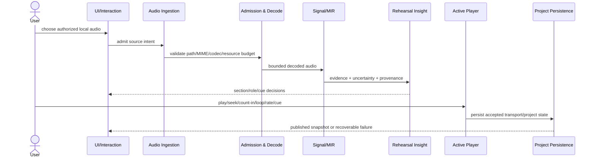
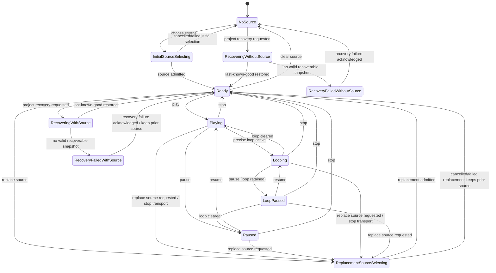
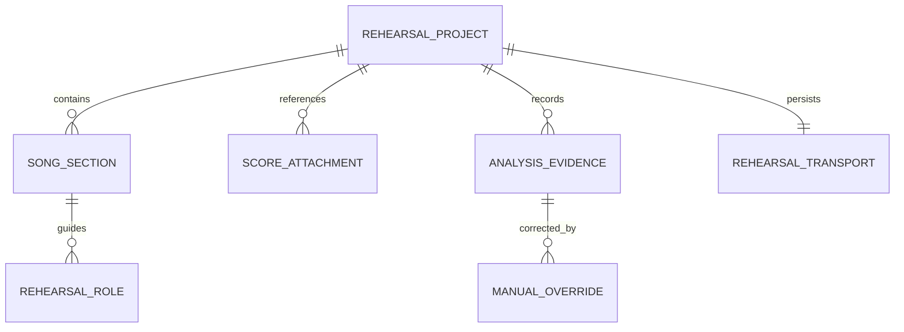

# BandScope Product-Technical Gap Baseline

Last updated: 2026-09-05
Evidence capture: live GitHub state is dated at observation; protected refs are revalidated when identified as current
Protected product truth: `develop@314ddeae7b775a4957594b599358c8255617eb2e`

## Purpose

This document is the canonical live product/technical gap synthesis for BandScope. It is governed by `AGENTS.md`, `ARCHITECTURE.md`, the security/repository/engineering sources they reference, and `docs/brand-story.md`; if this synthesis conflicts with those owning sources, the owning source wins and this baseline must be repaired. Mechanical enforcement remains in the repository's tests, root verification scripts, workflows, and protected-branch rules rather than in prose alone.

It separates protected shipped truth from active pull-request work, research/acceptance work, superseded work, and external control-plane dependencies. A PR body, predecessor check, model review, screenshot, remembered SHA, or generated routing manifest is never shipped truth.

BandScope is a local-first rehearsal decision product. The commercial loop is complete only when a musician can admit a real local recording, obtain evidence-backed rehearsal guidance, rehearse a precise passage, save and recover the project, share a bounded handoff, diagnose failures without leaking private media, and install, update, repair, or roll back a verifiable signed build.

BandScope is not a DAW, notation editor, mandatory cloud service, or an authority that presents uncertain machine analysis as unquestionable musical truth.

## 1. Product requirements baseline (PRD)

### 1.1 Buyer jobs and outcomes

The product must let a working musician or band member:

1. select an authorized local recording and reach useful rehearsal guidance without first exporting media to a cloud service;
2. understand form, section boundaries, harmony, groove/timing, entries/dropouts, range, overlap, handoffs, setup cues, and role-specific preparation with uncertainty visible where the evidence does not justify certainty;
3. move from an insight to audible rehearsal in the same product through one transport authority supporting play/pause/seek/stop, precise section/range loop, count-in, playback rate, cue navigation, and source-backed stem controls where real stems exist;
4. correct machine evidence without erasing the original estimate, confidence, model identity, source identity, or user-confirmed provenance;
5. close and reopen work, survive interrupted writes and migrations, and recover the last known-good project without a partial write replacing it;
6. export a bounded collaboration handoff without creating a second authoritative project store;
7. inspect redacted diagnostics and a user-previewable offline support bundle without ordinary logs containing raw audio, project payloads, credentials, or absolute paths;
8. install and update a build whose version, signature, checksum, SBOM, provenance, rollout state, and rollback/repair path can be verified.

Representative user stories are intentionally end-to-end rather than one-card micro-features:

- As a player, I can open my local song, see the first high-value rehearsal action, start the relevant passage, count it in, and loop it without rebuilding transport in another tool.
- As a band member, I can see section × role guidance and distinguish machine evidence from a user-confirmed correction.
- As a returning user, I can reopen the same project after a crash or interrupted save and recover the last known-good rehearsal state, including transport/loop state where the format supports it.
- As a user of keyboard or assistive technology, I can perform the same primary rehearsal actions and obtain exact-value alternatives to visual-only maps, timelines, or waveforms.
- As a maintainer or support recipient, I can preview exactly what diagnostic evidence will leave the machine and verify that private media and credentials are excluded.
- As an installer, I can distinguish an unsigned validation artifact from a verifiable production release and can roll back a bad staged update.

### 1.2 Commercial acceptance boundaries

A buyer-visible capability is complete only when its production path, negative/error states, persistence/recovery behavior where applicable, security boundary, accessibility contract, and release evidence are all integrated on one protected identity. A static card, Storybook-only state, Figma-only mock, generated array, direct feature matrix, synthetic audio fixture, or predecessor-head check cannot substitute for the relevant production acceptance path.

The near-term product order remains: merge-train convergence; trusted distribution; active rehearsal player; crash-safe project; real-audio science/resource admission; diagnostics; activation; accessibility/design parity; 100% repository-owned production statement/branch coverage and public API documentation.

## 2. Live delivery authority

A complete accessible-repository sweep begun at **2026-09-02 21:56 KST** queried all **74** repositories visible under `ContextualWisdomLab` at that observation individually. The sequential per-repository counts summed to **2,940 open pull requests**. A subsequent organization-wide aggregate returned **2,941 open pull requests** with `incomplete_results=false`. The one-PR difference is a non-atomic observation, not attribution to a particular repository: PR creation and closure can occur during or after the sequential sweep, so this census remains dated evidence rather than permanent product truth.

At this census `ContextualWisdomLab/bandscope` had **194 open pull requests** and the same capture's issue search returned **19 open issues**, so it remained the selected delivery boundary at that observation. High-backlog peers observed in that capture were `ContextualWisdomLab/naruon` (148), `ContextualWisdomLab/OriginWeave` (142), `ContextualWisdomLab/newsdom-api` (139), `ContextualWisdomLab/pg-erd-cloud` (138), `ContextualWisdomLab/TEPP` (130), `ContextualWisdomLab/.github` (128), `ContextualWisdomLab/html4tree` (127), `ContextualWisdomLab/Orgmetra` (117), and `ContextualWisdomLab/LineageWeave` (113). BandScope is selected not by name alone but because it combines a large observed queue with direct buyer-facing rehearsal responsibility and high-leverage release/security/workflow reuse boundaries.

The exact 74-repository set for this same capture is enumerated verbatim in `docs/doctoring/product-gap-baseline-2026-09-01.md`; capitalization there is the GitHub repository identity and is not normalized. Because PR creation and closure can occur during a sequential organization census, later counts are historical observations unless a new complete sweep is performed.

A protected-branch read on **2026-09-05** confirms `develop@314ddeae7b775a4957594b599358c8255617eb2e` is protected with exactly these 14 required contexts after protected PR #1165 consolidated repository-local security backstops: `ci / build-and-test`, `dependency-review`, `sbom`, `gate / build / windows`, `gate / build / macos`, `trivy-fs`, `coverage-evidence`, `opencode-review`, `strix`, `scan-pr-queue`, `osv-scan`, `scorecard`, `Analyze (javascript-typescript)`, and `Analyze (python)`. `security-audit` and `release-preflight` are no longer protected required-context names at this capture; their underlying security/release obligations remain product/release acceptance requirements where applicable. Merge decisions still re-fetch protection because this is capture-time evidence.

Operational evidence rule: queued, pending, skipped-required, cancelled, neutral, failed, absent, stale, predecessor-head, protected-base, model-only, status-only, self/author, or administrative-bypass evidence is non-passing. A head change prevents predecessor review/check receipts from transferring to the successor head; the original historical evidence remains preserved. Force-push, destructive rebase, self-approval, gate weakening, fabricated evidence, and unrelated rollback are prohibited.

Merge readiness is re-evaluated per unchanged exact PR head; an organization-wide approval search is not a substitute for per-head proof.

## 3. Shipped protected truth

Only behavior reachable from protected `develop@314ddeae7b775a4957594b599358c8255617eb2e` belongs in this section.

- BandScope is a React/Vite desktop workspace hosted by Tauri with local orchestration and a Python analysis service plus Rust/PyO3 numerical kernels.
- Typed Tauri IPC and bounded local process boundaries are the intended local execution model; ordinary rehearsal analysis does not require a public cloud service.
- Protected dependency-security repair #783 is already in `develop` ancestry. Open branches must not reframe its historical dependency findings as an unmerged product blocker or suppress them locally.
- Protected dependency update #1027 advances the independently built Tauri lockfile to `uuid 1.25.0`; branches that predate it must adopt the protected lockfile result rather than overwrite it accidentally while restacking unrelated work.
- Protected workflow consolidation #1165 removes duplicate repository PR scans and keeps bounded trusted-branch backstops while central required workflows own their PR evidence; product lanes must adopt that control-plane result rather than recreate removed Bandit/CodeQL/Trivy/secret-scan writers locally.
- The product already renders rehearsal-oriented section/role evidence, but protected truth does **not** yet satisfy the complete active-player, crash-recovery, real-audio acceptance, diagnostics, activation, accessibility-parity, or trusted-distribution contracts below.
- The latest immutable GitHub Release revalidated on **2026-09-05** remains `v0.1.3`, published 2026-04-28. It is historical release evidence, not proof that the current protected head satisfies the commercial release gate.

## 4. Canonical active workstreams

Active work is not shipped truth until it is normally integrated into protected `develop` with current-head gates and qualifying independent review.

| Boundary | Canonical live owner / evidence | Current status |
|---|---|---|
| Merge-train control plane | Issue #966 with executable queue lane PR #968 | #968 remains Draft; its unique queue machinery must survive every restack and its exact current head is non-passing until hosted/current-head evidence exists |
| Canonical baseline | PR #1116, this file | Draft; this branch must contain current protected `develop` ancestry and obtain fresh exact-head evidence after every baseline repair before integration |
| Workspace role naming | PR #1130 | The **active owner branch** uses `RehearsalRoleOption.roleId`/`roleName` with primary `roleOptions`; the previous `{ id, name }[]` projection exists only as a deprecated component compatibility input there. Protected `develop` is not claimed to contain this projection before integration |
| Score attachment naming | PR #1092 | Persisted project-format `scoreAttachments` retains compatibility keys `id`/`fileName`, while `trustedScoreAttachment` translates them immediately to workspace-owned `scoreId`/`scoreFileName`; recorded exact-head evidence is historical until re-fetched; no database or persisted-wire migration is introduced |
| Repository-local Trivy PR-head contract | PR #1119 | Quoted/commented YAML activity-list normalization is repaired on its canonical branch; current-head workflows remain non-passing until fresh terminal evidence exists |
| Trusted distribution | Issue #960; active release-identity lane PR #1126 | Semantic release-identity naming is active work; Windows signing, macOS signing/notarization, checksums, SBOM/provenance, signature-verified updater, staged rollout, rollback/repair, and complete version-identity parity remain incomplete as one integrated protected-head receipt |
| Active rehearsal player | Issue #961; canonical transport #971 with source-to-audible stack #1159 → #1160 | #971 `09bedd835475015379716292e63e6be376fceec9` owns one playback authority/state machine and removes the stale Tauri `http-range` lock orphan; #1159 `c27f3781ddcbcc013dce07a26c0baf6080e4b2ac` preserves the 10-file real PCM16 publication/path-free-reference delta on that current ancestry; #1160 `b41fdb4f6ef5606f91cb39daa211dea62160ab32` preserves strict process/file admission, atomic authority binding, renderer-safe availability/session admission, source-switch continuity, and target-authority/sequence-bound rejection of superseded media receipts. All remain Draft/unshipped. The next buyer gap is the mounted opaque-handle `Full mix | Vocals | Bass | Drums | Other instruments` selector and one stale-safe media-switch transaction, plus persistence/reload, eight-locale interaction/a11y and rights-cleared audible macOS/Windows evidence |
| Crash-safe project | Issue #962; implementation lane #970 | Atomic publication, explicit format versioning, recovery, migration, autosave, rollback/export and persisted transport state remain active work, not protected truth |
| Real-audio science | Issue #770 and active benchmark lanes | Rights-safe decoded-audio MIR acceptance, recognized metrics, uncertainty and reproducible evidence remain incomplete |
| Resource admission/decode | Issue #781 plus commercial dependency defect #1129 | No synthetic/mock success may substitute for production-path resource/cancellation evidence; the commercially supported decode path must remove the libsndfile-backed LGPL runtime boundary with equivalent real-audio behavior and cross-platform/SBOM proof |
| Diagnostics/supportability | Issue #963 | Typed redacted crash/hang evidence and user-previewable offline support bundle remain incomplete |
| Activation | Issue #964 | A measured production-path first rehearsal remains incomplete |
| Accessibility/design parity | Issue #965 | WCAG 2.2 AA, keyboard/screen-reader parity, KO/EN/JA/ZH/VI/ES/DE/FR expansion, exact-value alternatives and current-head UI evidence remain incomplete |
| Quality floor | PR #1057 and successors | Repository-owned production statement/branch coverage and public API documentation target remain 100%; lower configured thresholds are a gap |

The product boundary, tests, contracts, and unique behavior decide succession—not PR number or title. Duplicate closure requires a technical succession receipt naming the unique behavior/tests preserved in the successor. Checks, approvals, and model output never transfer to a changed successor head.

## 5. Merge-train and succession contract

Backlog convergence is the primary engineering risk because micro-PR fan-out creates duplicate writers, stale evidence, dependency ambiguity, competing local state, and review/check churn.

PR #968 owns the unique executable queue machinery needed by #966: bounded GitHub pagination, exact active-head capture, independent base-tip resolution, deterministic ordering, malformed/incomplete/duplicate rejection, symlink-safe atomic publication, reviewed dependency/succession metadata, network-independent validation, deterministic human projection/parity, and exact-head artifact preservation. It must not be discarded as stale documentation.

The canonical baseline branch must contain protected `develop@314ddeae7b775a4957594b599358c8255617eb2e` in its ancestry through an ordinary non-force reconciliation. PR #968 targets this baseline branch rather than protected `develop` directly. Every #1116 branch advance therefore changes #968's target tip: #968 must be re-resolved against that new base and obtain fresh exact-head checks/reviews before readiness, while preserving its unique queue-control source through ordinary non-force reconciliation. Historical #1116/#968 SHAs remain audit evidence only and are not described as current identities after either branch advances.

A previously recorded #1117 snapshot was `refactor/temporal-features-api@b98f266d2356d56be624fb617580b5252e85baaa` with then-base `develop@749511c3ad4000090048718f685c6bee6b3d2c25`. Its visible review threads were independently resolved in that historical capture; that evidence belongs to #1117 and never substitutes for #1116 or #968 evidence. #1117 does not own `docs/product-technical-gap-baseline.md`, and the current protected product tip is now `develop@314ddeae7b775a4957594b599358c8255617eb2e`; any #1117 merge decision must re-fetch its live head/base and evidence rather than reuse this snapshot.

PR #1007 is the canonical first-part-handoff lane only to the extent that its live semantic diff still preserves mounted selected-role wiring and the scientific prohibition against manufacturing handoffs from heuristic fallback. Any succession decision is rechecked against the independently resolved live head rather than a remembered PR-body SHA.

Draft status is used only for a real unverified or blocked boundary and is never toggled solely to manufacture CI.

## 6. Domain model and ownership

For a musician, these boundaries serve one simple flow: pick a song, understand what matters tonight, rehearse it, save it safely, and share only what was intended. The technical split below exists so those actions do not fight over authority or expose private media.

BandScope keeps these bounded contexts distinct:

1. **Audio Ingestion** — user-selected source authority and intake intent.
2. **Resource Admission & Decode** — codec/MIME/path/resource/cancellation boundaries.
3. **Signal/MIR Analysis** — decoded-audio evidence and uncertainty.
4. **Rehearsal Insight** — section × role decisions, cues, confidence and correction provenance.
5. **Active Player** — one authoritative transport state machine for play/pause/seek/stop/loop/count-in/rate/cue navigation and source-backed stem controls.
6. **Project Persistence** — format version, atomic publication, autosave, migration, backup/recovery and portable export.
7. **Collaboration Handoff** — bounded share/export contracts, never a second project source of truth.
8. **Diagnostics/Support** — typed redacted evidence and support bundle lifecycle.
9. **Distribution/Update** — signed identity, SBOM/provenance, updater verification, rollout and rollback.
10. **UI/Interaction** — accessible, localized rendering of domain state; no duplicated transport/project stores.

Generic `utils`, `helpers`, `common`, `services`, `shared`, `core`, or `models` dumping that erases these responsibilities is a defect. Cross-context persistence and duplicated local transport stores are also defects.

### 6.1 Ubiquitous language, aggregates, invariants, and events

| Term | Meaning | Invariant / transaction boundary |
|---|---|---|
| `RehearsalProject` | durable work for one admitted rehearsal source | one published format version; a partial write never replaces the last known-good snapshot |
| `AudioSourceRef` | authorized local source identity plus bounded metadata | source authority is explicit; raw media is not copied into ordinary logs or EA truth |
| `SongSection` | stable-ID time-bounded structural region | ordered, finite range inside admitted media duration; display label is not identity |
| `RehearsalRole` | instrument, vocal function, or useful subdivision | guidance belongs to project/section and retains evidence provenance |
| `AnalysisEvidence` | versioned machine estimate | confidence/model/source provenance survives correction |
| `ManualOverride` | user-confirmed correction | original machine evidence remains auditable; confirmation is not silently reclassified as model truth |
| `RehearsalCue` | actionable entry/stop/pickup/handoff/range/setup/timing instruction | referenced section/time/role remains resolvable |
| `RehearsalTransport` | count-in/loop/playback/navigation state | one authoritative state machine; no competing mounted/local stores |
| `SupportBundle` | user-previewable redacted diagnostic export | excludes raw audio/project payloads, credentials and absolute local paths by default |
| `ReleaseIdentity` | version/artifact/signature/checksum/provenance tuple | updater accepts only policy-valid signed identity and preserves rollback target |

Candidate domain events include `AudioSourceAdmitted`, `AnalysisCompleted`, `CueConfirmed`, `SectionBoundaryCorrected`, `LoopActivated`, `ProjectSnapshotPublished`, `ProjectRecovered`, `SupportBundlePrepared`, `UpdateStaged`, and `UpdateRollbackCompleted`.

### 6.2 Context map

The diagram is logical responsibility, not a claim that each box is a separate process. Shared contracts stay small and versioned; external codec/model/platform types remain behind anti-corruption layers.

`context-graph-contracts` remains the contract-only shared kernel for canonical refs, authority/truth status, bitemporal/provenance Context Assertions, CloudEvents, schemas and conformance. `enterprise-architecture-core` remains the EA Decision Plane. BandScope projects deployable/runtime/version/risk facts through released contracts and does not copy rehearsal audio/analysis/user truth into EA authoritative storage.

## 7. Technical design contract (TRD)

The technical design has one rehearsal-facing goal: every click should keep the musician on the same trusted song and project while the app does the complicated validation and analysis out of sight.

### 7.1 Production topology and ports

Protected `develop` is a local desktop architecture with these principal implementation surfaces:

- `apps/desktop`: React/Vite UI rendered inside the Tauri desktop shell;
- `apps/desktop/src-tauri`: native command/orchestration boundary and platform integration;
- `apps/desktop/core`: Rust-owned local authority/input-validation helpers where currently implemented;
- `packages/shared-types`: versioned cross-layer request/response/domain contracts;
- `services/analysis-engine`: Python orchestration/compatibility plus still-mixed analysis code during migration;
- `services/analysis-engine/rust`: `bandscope_numeric` Rust/PyO3 numerical kernels.

Typed allowlisted Tauri IPC and bounded local process/stdin-stdout boundaries are the intended orchestration ports. If an owning adapter requires loopback transport it is limited to `127.0.0.1`; public HTTP and other network-dependent paths are not ordinary local-analysis authority. Codec libraries, source-separation/model runtimes, filesystem/platform APIs, accelerators, update services, and external handoff contracts are adapters behind owning-context ports.

### 7.2 End-to-end rehearsal sequence

If decode, analysis, persistence, or playback fails, the error remains typed and bounded; a synthetic analysis object is not substituted as production success.

### 7.3 Transport, source replacement, and project state ownership

The production player owns one transport state machine. Loop activation never removes pause or stop authority: active-loop playback may pause with the loop retained, resume into that loop, clear the loop into ordinary playback/paused state, or stop directly. Initial admission and replacement use distinct selection-intent states so cancellation has one unambiguous outcome: a cancelled or failed initial selection returns to no source, while a cancelled or failed replacement returns to the prior admitted source. Source replacement is transactional: a pending replacement must not erase the prior admitted source; conflicting source/import/analysis actions remain unavailable until selection resolves. Recovery likewise preserves its origin: acknowledging a failed recovery requested from `NoSource` returns to `NoSource`, while a failed recovery requested from `Ready` returns to `Ready` with the prior admitted source unchanged. Either state can explicitly request recovery again, and failure never manufactures a successful recovered state. UI components, cue cards, map cursors, and persisted project data project from the owning authority rather than creating competing writable state. Project publication **must become** atomic and crash-safe; that is a target persistence contract, not a shipped guarantee, and this state diagram does not prove it.

### 7.4 Persistence and contract versioning

Protected `.bscope` documentation currently validates loaded JSON against the `RehearsalSong` contract and states that a format-version field **may be introduced** when future structural changes require one; it does not yet establish `project_format_version` as shipped persisted behavior. The target persistence contract therefore requires introducing explicit `project_format_version` before a breaking structural migration, plus deterministic/idempotent migration, atomic replacement only after a complete durable candidate exists, and a last-known-good backup/recovery path. Fault injection must prove that partial/truncated writes, disk-full conditions, interrupted migration, and failed replacement do not destroy the previous valid project. Portable export is versioned independently from in-memory implementation types.

Tauri IPC, shared types, project files, handoff schemas, updater manifests, and externally released event/contracts are versioned boundaries. A rename or ownership cleanup is never permission for an in-place breaking wire-format change.

### 7.5 Identifier-policy migration boundary

The organization naming policy applies prospectively to new or materially changed **organization-owned internal identifiers**. Casing follows the host language/framework. Semantic multiword names such as `section_id`, `sectionId`, `SectionId`, `firstGrooveChange`, and `SectionRoadmap` are valid. Generic single-word organization-owned names such as bare `id`, `name`, `status`, `data`, `value`, `type`, `key`, `item`, `record`, `result`, `config`, `event`, `user`, or `role` are defects when a bounded-context name is available.

When an existing bare field is already part of a persisted or cross-boundary contract, a semantic rename follows the owning contract's compatibility mechanism:

- project files: first introduce an explicit format-version field (target name `project_format_version`) through the canonical persistence evolution path, then introduce any renamed persisted field behind that versioned migration; readers accept supported prior representations, migration is deterministic/idempotent, and writers emit one canonical current representation after migration;
- Tauri IPC/shared API: use an additive/versioned request or response contract or a bounded compatibility alias; do not remove the previous key until supported callers have migrated and contract tests prove interoperability;
- database-owned schemas: use explicit schema migration with backward-compatible read/write sequencing, foreign-key/index/constraint/ORM/query updates, rollback evidence, normalized ownership, UPSERT-path validation, and locking/hot-partition review rather than an uncoordinated column rename;
- released handoff/events/context contracts: retain mandated released spelling until the owning contract publishes a compatible version; anti-corruption layers translate at the boundary;
- external/vendor fields: preserve external spelling exactly and map into semantically owned internal names after admission.

Every compatibility-changing rename requires fixtures from the previous supported version, round-trip/no-data-loss tests, deterministic repeated migration, rollback/recovery evidence where persistence is involved, and removal criteria for any temporary alias. There is never dual writable truth after migration.

Current examples demonstrate the intended direction without breaking compatibility. PR #1130's active owner branch makes `roleId`, `roleName`, and `roleOptions` the switcher-owned vocabulary while accepting the old component projection only at one deprecated adapter input; protected `develop` is not claimed to contain that projection before normal integration. PR #1092 keeps the established persisted score attachment keys `id` and `fileName` unchanged but makes `trustedScoreAttachment` an explicit anti-corruption boundary that validates those keys and returns `scoreId` and `scoreFileName` for workspace logic. Its focused RED contract was commit `35dc521f03711d749771751ecf39b904f193057d`; the production semantic translation was commit `8cd6756ef242d99fc323181b21b58f96fe24c731`; subsequent documentation commits aligned `ARCHITECTURE.md`, `AGENTS.md`, `CHANGELOG.md`, and `CLAUDE.md` with the same live-workspace/fallback invariant. No database object or persisted project wire key changed in that repair.

### 7.6 Rust compute ownership

Protected code is still mixed: selected numerical kernels are Rust/PyO3 while material analysis orchestration and some arithmetic remain Python/NumPy. The target architecture is Rust-first for repository-owned DSP, mathematical, vector, linear/matrix, data-science/ranking, and token-size core arithmetic.

Python is bounded orchestration/compatibility/fixture/reporting during migration. CPU reference behavior should be deterministic `f64` where scientifically appropriate, with bounded multithreading and unnecessary context switching removed. CUDA/OpenCL/MLX paths require real backend execution, parity and resource evidence where configured. A hidden Python numerical fallback is not the target architecture.

Migration order follows buyer impact and dependency leverage: temporal/beat and harmony; range/pitch/role features; prioritization/weighting; source-separation integration; then remaining repository-owned vector/matrix utilities. Rust↔Python parity is migration evidence, not justification for permanent duplicated production arithmetic.

## 8. Persistence ERD and database discipline

BandScope's current durable project authority is file/project-format based rather than an organization-owned relational production schema. No database DDL changed in the #1092 naming repair. If relational persistence is introduced, database objects must use specific multiword snake_case names, be normalized to at least 3NF where relevant, and preserve one authoritative write path.

Any future SQL migration must verify foreign keys, indexes, constraints, sequences, ORM/query mappings, UPSERT semantics, hot-partition risk, lock duration, read/write separation, backward compatibility, rollback and recovery before it is considered complete.

## 9. Real-audio scientific acceptance

Synthetic arrays, mocked UI journeys, direct feature matrices, source-text assertions, or generated audio may support unit tests but cannot prove product accuracy.

Commercial acceptance requires rights-safe real audio to pass the production intake → decode → analysis → UI path with exact fixture, annotation, integrity and license provenance. Metrics remain task-specific: chord/harmony evaluation uses a recognized chord metric such as benchmark-defined weighted chord recall; beat/timing uses recognized event metrics; separation uses SI-SDR plus task-appropriate robustness/perceptual evidence; range/pitch/transcription uses declared note/frame/event metrics; section/cue boundaries use tolerances derived from annotation uncertainty and rehearsal cost rather than an invented constant.

Acceptance criteria are preregistered before tuning and report uncertainty across tracks. Candidate-vs-baseline comparisons disclose sample count, aggregation, confidence interval or other justified uncertainty method, exclusions, and missing-data handling. Configured GPU lanes must actually execute and report parity/peak-resource evidence; unsupported hardware is not converted into a passing claim.

## 10. Security and privacy baseline

Local files, URLs, MIME/codec claims, decoder outputs, model artifacts, project files, updater manifests, subprocess output and support exports are untrusted.

Owning contexts must fail closed on path/symlink/reparse traversal, oversized/decompression/resource exhaustion, unsafe subprocess authority, credential/secret propagation and prompt-injection crossings. Valid source-backed GHAS/CodeQL/Semgrep/Strix/AppGuardrail findings are deduplicated by root cause and repaired in the canonical product lane. Scanner/control-plane defects remain with their owning repository; BandScope does not blanket-mask findings or weaken gates.

Ordinary logs/support bundles must not contain raw audio/project payloads, credentials or absolute local paths. Authorization is purpose-bound and least-privilege with field minimization, retention and access/export audit where relevant.

### Security Notes

- **IPC/network boundary:** ordinary local analysis uses allowlisted Tauri IPC, bounded stdin/stdout, or an explicitly required loopback adapter limited to `127.0.0.1`. Public HTTP and other network-dependent paths are not local-analysis authority.
- **Input admission:** project/media/codec/model/update/subprocess inputs are untrusted and require strict schema/type/size/path validation before domain use.
- **Subprocess authority:** use argument arrays with non-shell execution (`shell=False`-equivalent); do not interpolate untrusted input into shell commands.
- **Privacy:** diagnostics and support exports redact credentials, raw audio/project payloads and absolute local paths by default, with user-previewable bounded export.
- **Artifact trust:** installers/updaters require owning-boundary signature, checksum, SBOM and provenance verification; staged rollout and rollback evidence remain part of release acceptance.
- **Verification status:** queued, pending, neutral, skipped-required, cancelled, stale, predecessor or inaccessible-protection evidence is non-passing and cannot be promoted into security assurance.

The most recently recorded central control-plane head in this document is `ContextualWisdomLab/.github@f610598c585d8dfdabe6fd82204173e23ad09841`; it is historical evidence until that owner is freshly revalidated. Issue `.github#712` remains the recorded organization-wide Actions queue-health/runner-admission causal owner. The associated historical cross-repository evidence showed jobs waiting before checkout with no runner assignment across both `ubuntu-latest` and explicit `ubuntu-24.04`, including an unchanged Wardnet head that previously completed successfully on the same label. That evidence falsified a simple leaf runner-label defect for that observation but did not identify whether the remaining owner cause was hosted-runner capacity, organization concurrency/admission policy, billing/quota, or provider scheduling. Earlier protected `.github#1658`, `.github#1656`, `.github#1665`, `.github#1645`, and subsequent scheduler fixes reduce avoidable load/review-routing/cancellation ambiguity but do not convert a queued current-head check into success.

A prior #1092 exact-head capture on `8099e3b2525723474aca09db4d669167035263b3` observed 27 check runs, with required/security lanes such as `dependency-review`, `scorecard`, and `trivy-fs` still queued at that capture. It is historical evidence and must be re-fetched before any #1092 merge decision. A skipped manual-evidence helper is not a substitute for required evidence. No predecessor-head success is transferred.

## 11. UI/UX evidence gate

The canonical Figma identity must be rediscovered from current protected BandScope docs/source before a material UI merge; the latest baseline reference is `zthWmqfNKUgJBECvv002Qk`, treated as a resolved design authority rather than a permanent remembered constant.

Storybook is the executable component/state inventory, Figma is the reviewed interaction/visual specification, and the shipped Tauri application is the final acceptance target. Material UI work must verify real pointer/touch/keyboard interaction, section/time-axis identity, playback cursor, persistence/reload, stale-response races, loading/partial/error/unsupported-codec/missing-stem states, responsive window sizes, visible focus, reduced motion, non-color-only status, screen-reader names/states, KO/EN/JA/ZH/VI/ES/DE/FR expansion and exact-value/list/table alternatives for graph/timeline/waveform content.

For the #1092 ready-workspace slice, product guidance now states the actual accessibility/authority condition consistently: the map names a score to open only when attachment metadata is validated and a live Score workspace is available; reopened metadata-only projects or untrusted score metadata fall back to adding a score or checking the range by ear. A screenshot from a predecessor head, a Storybook-only state, or a Figma-only mock is not shipped UI evidence.

## 12. Quality and operability floor

Repository-owned production statement coverage, branch/edge-case coverage, and public/repository-owned API documentation target **100%**. A lower configured JavaScript/Python threshold is a gap rather than equivalent evidence; denominator reduction, skip/xfail, generated-code relabeling, or source-text assertions cannot manufacture compliance.

Production-path tests include supported sample rates/channels, short/long recordings, pickup before bar one, odd meter and tempo changes where supported, silence near boundaries, unsupported codecs, moved/replaced files, cancellation, memory/CPU bounds, disk-full/partial-write recovery, corrupted project state, stale async response, missing stems, device changes, keyboard/screen-reader operation, locale expansion, updater rollback, and redacted support export. Applicable scenarios are proven at the owning boundary rather than all forced into one test layer.

For behavior- or contract-affecting renames, focused regressions must fail on old/new mismatches before production repair whenever practical, then prove serialization/deserialization, adapter compatibility, persistence behavior, migrations and rollback where applicable. Valid tests are never weakened, skipped, xfailed, suppressed, or quote-obfuscated to obtain green.

## 13. Release gate

A release may be created only from one exact integrated protected head where all applicable CI/security/SAST/dependency/coverage/documentation/real-audio/build/package gates, Windows signing, macOS signing/notarization, checksums, SBOM/provenance, reproducibility, independent review, project migration/recovery, accessibility/supportability, updater rollback and operability evidence are terminal-success on that same identity.

Unsigned validation artifacts are not releases. Queued evidence, stale Figma versions and mock-only audio journeys cannot establish release readiness. Merge requires all live required checks terminal-success, zero valid unresolved review findings/threads, a qualifying independent non-author approval current for the last push, and ordinary branch protection without bypass.

## 14. Traceability

Primary normative/research anchors for this baseline include:

- World Wide Web Consortium. (2023). *Web Content Accessibility Guidelines (WCAG) 2.2*. https://www.w3.org/TR/WCAG22/
- National Institute of Standards and Technology. (2022). *Secure Software Development Framework (SSDF) Version 1.1 (NIST SP 800-218)*. https://csrc.nist.gov/pubs/sp/800/218/final
- Music Information Retrieval Evaluation eXchange. (n.d.). *MIREX*. https://www.music-ir.org/mirex/
- Raffel, C., McFee, B., Humphrey, E. J., Salamon, J., Nieto, O., Liang, D., Ellis, D. P. W., & Raffel, C. C. (2014). mir_eval: A transparent implementation of common MIR metrics. *Proceedings of the 15th International Society for Music Information Retrieval Conference*, 367–372.

Repository ADRs, PRD/TRD, architecture/context-map documents, security/threat-model material, test strategy, operability/recovery guidance, UI/Storybook inventory and doctoring traceability must remain code-current. Active PRs, planned work and research results are never promoted into the shipped section before protected integration.