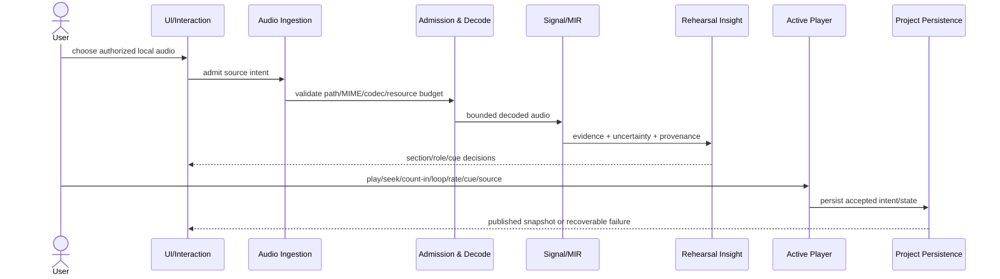
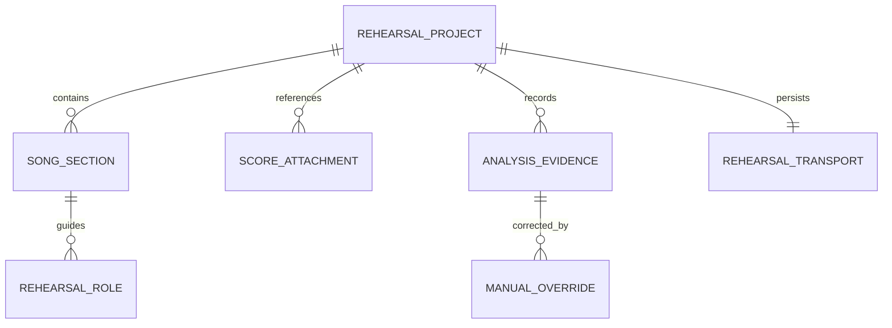

# BandScope Product-Technical Gap Baseline

Last updated: 2026-09-07
Evidence capture: live GitHub state is dated at observation; protected refs are revalidated before merge/release claims
Protected product truth: `develop@314ddeae7b775a4957594b599358c8255617eb2e`

## Purpose

This document is the canonical live product/technical gap synthesis for BandScope. `AGENTS.md`, `CLAUDE.md`, `ARCHITECTURE.md`, owning ADR/PRD/TRD/security/test/release documents, protected source, and live GitHub state remain the detailed authorities. If this synthesis conflicts with an owning source, the owning source wins and this file must be repaired.

BandScope is a local-first rehearsal decision product. Commercial completion means a musician can admit an authorized real recording, obtain reproducible evidence-backed rehearsal guidance, move directly into audible rehearsal, preserve and recover the project without silent data loss, hand off only bounded intended data, diagnose failures without leaking private media, and install/update/rollback a verifiable signed build.

BandScope is not a DAW, notation editor, mandatory cloud service, or an authority that presents uncertain machine analysis as unquestionable musical truth.

## 1. Product requirements baseline (PRD)

### 1.1 Buyer jobs and outcomes

The product must let a working musician or band member:

1. select an authorized local recording and reach useful rehearsal guidance without first exporting media to a cloud service;
2. understand form, section boundaries, harmony, groove/timing, entries/dropouts, range, overlap, handoffs, setup cues, and role-specific preparation with uncertainty visible where evidence does not justify certainty;
3. move from an insight to audible rehearsal through one transport authority supporting play/pause/seek/stop, section/range loop, count-in, playback rate, cue navigation, and source-backed stem controls where admitted stems actually exist;
4. correct machine evidence without erasing the original estimate, confidence, model identity, source identity, or user-confirmed provenance;
5. close and reopen work, survive interrupted writes and migrations, and recover the last known-good project without a partial write replacing it;
6. export a bounded collaboration handoff without creating a second authoritative project store;
7. inspect redacted diagnostics and a user-previewable offline support bundle without ordinary logs containing raw audio, project payloads, credentials, or absolute paths;
8. install and update a build whose version, signature, checksum, SBOM, provenance, rollout state, model/dependency inventory, and rollback/repair path can be verified.

Representative end-to-end stories remain deliberately broader than micro-features:

- As a player, I can open my local song, see the first high-value rehearsal action, start the relevant passage, count it in, and loop it without rebuilding transport elsewhere.
- As a returning user, I can reopen the same project after a crash or interrupted save and recover the last known-good rehearsal state and durable source intent without silently manufacturing new source authority.
- As a user of keyboard or assistive technology, I can perform the same primary rehearsal actions and obtain exact-value alternatives to visual-only maps, timelines, or waveforms.
- As an installer, I can distinguish an unsigned validation artifact from a verifiable production release and roll back a bad staged update without app/model/dependency identity drifting silently.

### 1.2 Commercial acceptance boundary

A buyer-visible capability is complete only when its production path, negative/error states, persistence/recovery behavior where applicable, security boundary, accessibility contract, real-audio/scientific evidence where applicable, and release evidence are integrated on one protected identity. Storybook/Figma-only states, generated arrays, synthetic audio, direct feature matrices, predecessor-head checks, model reviews, or screenshots cannot substitute for the relevant production acceptance path.

Near-term order remains: merge-train convergence; trusted distribution; active rehearsal player; crash-safe project; real-audio science/resource admission; diagnostics; activation; accessibility/design parity; 100% repository-owned production statement/branch/edge coverage and public API documentation.

## 2. Live delivery authority

A complete accessible-repository census begun 2026-09-02 21:56 KST observed 74 `ContextualWisdomLab` repositories. Sequential counts summed to 2,940 open pull requests and the subsequent organization aggregate returned 2,941 with `incomplete_results=false`; the one-PR difference is non-atomic observation, not attribution. BandScope had 194 open PRs and 19 open issues in that dated capture. Later counts are not inferred from it.

The current protected BandScope product source is `develop@314ddeae7b775a4957594b599358c8255617eb2e`. The recorded protection contract contains 14 required contexts, including retired producer names `Analyze (javascript-typescript)` and `Analyze (python)`. Issue #1172 owns migration to the central producer names `CodeQL compatibility analysis (javascript-typescript)` and `CodeQL compatibility analysis (python)`. Restoring a duplicate repository scanner or weakening/removing CodeQL coverage is not an acceptable workaround.

Operational evidence rule: queued, pending, skipped-required, cancelled, neutral, failed, absent, stale, predecessor-head, protected-base, model-only, status-only, self/author, or administrative-bypass evidence is non-passing. A head change invalidates predecessor review/check receipts for readiness. Force-push, destructive rebase, self-approval, gate weakening, fabricated evidence, and unrelated rollback are prohibited.

## 3. Shipped protected truth

Only behavior reachable from protected `develop@314ddeae7b775a4957594b599358c8255617eb2e` is shipped truth.

- BandScope is a React/Vite desktop workspace hosted by Tauri with local orchestration, a Python analysis service, and Rust/PyO3 numerical/native kernels.
- Typed Tauri IPC and bounded local process/stdin-stdout boundaries are the intended local execution model; ordinary rehearsal analysis does not require a public cloud service.
- Protected workflow consolidation #1165 removes duplicate repository PR scanners while central required workflows own PR evidence. Product branches must adopt that result rather than recreate removed security writers locally.
- Protected truth still does not satisfy the complete active-player, crash-recovery, rights-cleared real-audio, diagnostics, activation, accessibility-parity, or trusted-distribution contracts below.
- The latest immutable public GitHub release revalidated in the current delivery lineage remains `v0.1.3`, published 2026-04-28 UTC. It is historical release evidence, not proof that the current protected head is commercially release-ready.

## 4. Canonical active workstreams

Active work is Draft/unshipped until normally integrated into protected `develop` with current-head gates and qualifying independent review.

| Boundary | Canonical live owner / evidence | Current status |
|---|---|---|
| Merge-train control plane | Issue #966; queue lane PR #968 | #968 is Draft on #1116 and owns exactly 22 queue-control workflow/ADR/reference/manifest/script/test files. Its exact head is intentionally not embedded here: every #1116 source movement deterministically creates the next ordinary #968 descendant, so live PR state is the exact-head authority. Every adoption must preserve those 22 files and a non-divergent baseline blob. |
| Canonical baseline | PR #1116, this file | Draft. This source is the single writer for `docs/product-technical-gap-baseline.md`; active PR behavior is described as Draft evidence, never promoted into shipped truth. |
| Trusted distribution | Issue #960; release-identity lane #1126; dependency/model blockers #1129/#1180/#1181 | Windows signing, macOS signing/notarization, checksums, SBOM/provenance, signature-verified updater, staged rollout, rollback/repair, `libsndfile` removal, and a commercially admissible immutable separation model are not yet one integrated protected-head receipt. |
| Active rehearsal player | Issue #961; #971 with source stack #1159 → #1160 | #1160 `332240dbba957602f217dc6e4e6a82a59d4d39b2` remains Draft and has not yet adopted current #970. Native stem admission/playback/source switching exists on that branch, but persisted source intent must be reconciled with fresh Full mix/current-stem audible authority after reopen. Missing preferred stems must fail closed to Full mix. |
| Crash-safe project | Issue #962; PR #970 | #970 exact Draft head `767b87e3e2fec3116ec274c22db6995cbb2defc2` has ordinarily adopted Resource Admission #866 `841e1c9b7329dba6d0ff16daecc009a2c3face0c`. It implements v3 Save/load, path-free source evidence, restart exact-content re-admission, analysis-time source revalidation and snapshot-bound decode, local model admission, and mounted Open→Save preservation of native project selection plus `selectedPlaybackSource`. Autosave/global recovery UX, broader fault injection, descriptor-bound higher-parent authority, and Active Player audible-authority reconstruction remain open. |
| Real-audio science | Issue #770 and active benchmark lanes | Rights-cleared decoded-audio MIR acceptance, recognized task metrics, uncertainty and reproducibility remain incomplete. Synthetic/generated audio remains unit-test evidence only. |
| Resource admission/decode | Issue #781; PR #866; commercial dependency defect #1129 | #866 exact `841e1c9b7329dba6d0ff16daecc009a2c3face0c` owns app-owned audio materialization/publication and `LocalAudioPublicationIdentity`. #970 consumes it through typed persistence/re-admission ACLs. #1129 still owns removal of the `soundfile`/`libsndfile` LGPL runtime path with equivalent supported-platform real-audio/SBOM evidence. |
| Commercial separation model | Issue #1180; rights blocker #1181 | #970's local Demucs compatibility admission is technical Draft evidence only. Distribution still requires an immutable commercially admissible exact artifact with full provenance/size/digest-or-signature, safer or justified serialization, release inventory, updater/rollback behavior, and rights-cleared Windows/macOS real-audio evidence. #1181 independently blocks upstream pretrained weights absent explicit commercial-use/redistribution rights. |
| Diagnostics/supportability | Issue #963 | Typed redacted crash/hang evidence and a user-previewable offline support bundle remain incomplete. |
| Activation | Issue #964 | A measured production-path first rehearsal remains incomplete. |
| Accessibility/design parity | Issue #965 and active component/player lanes | WCAG 2.2 AA, keyboard/screen-reader parity, KO/EN/JA/ZH/VI/ES/DE/FR expansion, CJK/text expansion/font fallback, exact-value alternatives, and current-head material-UI evidence remain incomplete. |
| Quality floor | PR #1057 and successors | Repository-owned production Docstring/rustdoc, Test, and Edge Case Coverage targets remain 100%; denominator reduction, skip/xfail, generated-code relabeling, or source-text-only success cannot manufacture compliance. |

The product boundary, tests, contracts, and unique behavior decide succession, not PR number or title. Duplicate closure requires a technical succession receipt naming the unique behavior/tests preserved in the successor. Checks, approvals, and model output do not transfer to a changed successor head.

## 5. Merge-train and succession contract

Backlog convergence is an engineering risk because micro-PR fan-out creates duplicate writers, stale evidence, dependency ambiguity, competing local state, and review/check churn.

PR #968 owns the executable #966 queue machinery: bounded GitHub pagination, exact active-head capture, independent base-tip resolution, deterministic ordering, malformed/incomplete/duplicate rejection, symlink-safe atomic publication, dependency/succession metadata, network-independent validation, deterministic human projection/parity, and exact-head artifact preservation. It must not be discarded as stale documentation.

The canonical baseline branch must remain an ordinary descendant of current protected `develop`. PR #968 targets #1116 rather than protected `develop` directly. Every #1116 advance therefore changes #968's target tip and requires another ordinary non-force descendant on #968 that preserves its queue-owned files. The baseline deliberately avoids embedding the descendant #968 SHA because doing so would make the source self-invalidating at the moment the required adoption commit is created. The PR's live exact head and a fresh compare to #1116 are the authoritative reconciliation evidence. Historical SHAs remain audit evidence only.

Review/check waiting is lane-local rather than a global blocker: while one head waits for hosted evidence, other independent canonical work may proceed. Failed checks are RCA/fix/rerun work, not justification to weaken gates.

## 6. Domain model and ownership

For the musician the flow is simple: pick a song, understand what matters tonight, rehearse it, save it safely, and share only what was intended. The technical split exists so those actions do not fight over authority or expose private media.

BandScope bounded contexts remain:

1. **Audio Ingestion** — user-selected source authority and intake intent.
2. **Resource Admission & Decode** — codec/MIME/path/resource/cancellation boundaries and admitted bytes.
3. **Signal/MIR Analysis** — decoded-audio evidence, model identity, uncertainty, reproducibility.
4. **Rehearsal Insight** — section × role decisions, cues, confidence and correction provenance.
5. **Active Player** — one authoritative transport state machine and fresh audible source/stem authority.
6. **Project Persistence** — versioned project format, atomic publication, migration, backup/recovery and portable export.
7. **Collaboration Handoff** — bounded share/export contracts, never a second project source of truth.
8. **Diagnostics/Support** — typed redacted evidence and support-bundle lifecycle.
9. **Distribution/Update** — signed identity, SBOM/provenance, model/dependency inventory, updater verification, rollout and rollback.
10. **UI/Interaction** — accessible localized rendering of domain state; no duplicated transport/project stores.

Generic `utils`, `helpers`, `common`, `services`, `shared`, `core`, or `models` dumping that erases responsibility is a defect. Cross-context SQL, mutable sibling PR dependencies, source copying from canonical sibling owners, or parallel writable project/transport truth is prohibited. Released/versioned contracts and narrow anti-corruption layers are the integration mechanism.

### 6.1 Ubiquitous language and invariants

| Term | Meaning | Invariant / transaction boundary |
|---|---|---|
| `RehearsalProject` | durable work for one admitted rehearsal source | one published format version; a partial write never silently replaces last known-good truth |
| `LocalAudioPublicationIdentity` | path-free native receipt for app-owned admitted audio | project id, fixed artifact name, extension, exact byte count and SHA-256 remain validated; renderer does not mint it |
| `ProjectSourceReference` | durable Project Persistence projection of admitted source identity | evidence only, not a filesystem capability; restart must re-admit current bytes before runtime authority returns |
| `AnalysisEvidence` | versioned machine estimate | confidence/model/source provenance survives correction |
| `ManualOverride` | user-confirmed correction | original machine evidence remains auditable |
| `RehearsalTransport` | count-in/loop/playback/navigation state | one authoritative state machine; no competing mounted/local stores |
| `SelectedPlaybackSource` | durable `full_mix | vocals | bass | drums | other` intent | never itself grants audible authority; current media must be freshly admitted after reopen |
| `PlaybackAuthority` | revocable runtime authority over an admitted audible source | stale/replaced/missing media cannot retain authority merely because prior analysis or persistence succeeded |
| `ReleaseIdentity` | app/model/artifact/signature/checksum/provenance tuple | updater accepts only policy-valid signed compatible identity and preserves rollback target |

Candidate domain events include `AudioSourceAdmitted`, `AnalysisCompleted`, `CueConfirmed`, `SectionBoundaryCorrected`, `LoopActivated`, `ProjectSnapshotPublished`, `ProjectRecovered`, `PlaybackSourceReadmitted`, `SupportBundlePrepared`, `UpdateStaged`, and `UpdateRollbackCompleted`.

### 6.2 Context map

`context-graph-contracts` remains the contract-only shared kernel for canonical refs, authority/truth status, bitemporal/provenance Context Assertions, CloudEvents, schemas and conformance. `enterprise-architecture-core` remains the EA Decision Plane. BandScope does not copy rehearsal audio/analysis/user truth into sibling authoritative storage.

## 7. Technical design contract (TRD)

### 7.1 Production topology and ports

Principal surfaces are:

- `apps/desktop`: React/Vite UI inside Tauri;
- `apps/desktop/src-tauri`: native command/orchestration and platform boundary;
- `apps/desktop/core`: Rust-owned local authority/input-validation helpers where implemented;
- `packages/shared-types`: versioned cross-layer request/response/domain contracts;
- `services/analysis-engine`: Python orchestration/compatibility during Rust-first migration;
- `services/analysis-engine/rust`: Rust/PyO3 numerical kernels.

Typed allowlisted Tauri IPC and bounded local process/stdin-stdout are the normal orchestration ports. Public HTTP is not ordinary local-analysis authority. Codec/model/platform/accelerator/update services remain behind owning-context ports.

### 7.2 End-to-end rehearsal sequence

Decode, analysis, persistence, and playback failures remain typed and bounded. Production never substitutes a synthetic analysis object or stale playback source as success.

### 7.3 Project Persistence / Resource Admission truth

Current Draft #970 has ordinarily adopted #866 rather than duplicating its audio-publication policy.

`#866@841e1c9b7329dba6d0ff16daecc009a2c3face0c` owns selected-local-audio copy/admission/publication. It stages selected bytes, synchronizes and publishes the app-owned `source.<extension>`, reopens the published object, verifies exact size + SHA-256 receipt equality, then creates a path-free `LocalAudioPublicationIdentity`. Native state retains that verified identity keyed by BandScope project id.

`#970@767b87e3e2fec3116ec274c22db6995cbb2defc2` consumes that identity. Draft `projectFormatVersion: 3` stores `song`, `preferences.selectedPlaybackSource`, and optional path-free `sourceReference = projectId + artifactName + extension + fileSizeBytes + contentSha256`. Legacy/v1/v2 input is migrated deterministically and never invents missing source evidence. Renderer-authored path, artifact name, byte count, digest, or `sourceReference` is rejected; the renderer may return only an already-minted project selector and durable playback-source intent to native Save.

On restart, production `load_project` resolves only an existing app-local aggregate, opens the fixed source through the canonical native opener, re-verifies exact bounded bytes, and restores native publication/bootstrap state only after that reverse admission succeeds. A persisted source reference is evidence, not authority.

Before `start_analysis_job` queue admission, retained publication identity is revalidated again. The child process receives exact admitted byte count and SHA-256 through its bounded process contract. The analysis process copies the opened source into a private spooled snapshot, verifies exact size and SHA-256, and decodes that same snapshot. The earlier admitted-audio pathname replacement gap between verification and analysis decode is therefore closed for this Draft path.

Mounted Open→Save previously dropped the reopened source selector and reset non-default `selectedPlaybackSource`. RED `9ceeb2faa73317e591a1741a0d246b82f9311423` and fix `9a9151d1a5420c83218ac220d29cb144c9e3b45d` make `App` retain the validated path-free project selector plus versioned playback intent and return them through native-authoritative Save. It still cannot mint source evidence.

Residual persistence work includes global/startup recovery policy, autosave/backup rotation and Restore/Compare/Discard UX, broader power-loss/disk-full/interrupted-migration fault injection, application downgrade/rollback policy, and descriptor-bound protection against concurrent replacement of higher parent directories.

### 7.4 Active Player authority

Project Persistence and analysis authority do not imply audible authority. On reopen, persisted `selectedPlaybackSource` is intent only. #1160 must ordinarily adopt current #970/#866 ancestry, remove its private duplicate SHA-256 implementation in favor of the canonical desktop-core reader, re-admit current Full mix and current stem artifacts, and only then mint fresh `PlaybackAuthority`. If the preferred persisted stem no longer exists or fails admission, the product falls back to Full mix without preserving stale prior authority.

The material UI must prove source selection, play/pause/seek/stop/loop/count-in/rate/cue navigation, source replacement, stale async/media events, persistence/reload, and exact accessible alternatives with actual admitted media.

### 7.5 Signal/MIR model admission and distribution boundary

#970's Draft compatibility path for Demucs local model loading is not release provenance. It rejects missing/non-regular/symlinked/empty/oversized/checksum-mismatched cache objects before resolution, materializes only the preflight descriptor size into a private temporary `LocalRepo`, rejects early EOF or any extra post-`fstat` byte, and resolves locally so mutation/deletion of the original cache pathname cannot change bytes for that load or reactivate `RemoteRepo`.

The 128 MiB model ceiling and Demucs eight-hex filename checksum remain compatibility/integrity controls only. They are not exact release size, full digest/signature, provenance, or rights evidence. Upstream native Demucs checkpoint loading uses PyTorch serialization with class/constructor metadata, so it remains a trusted code-bearing deserialization boundary.

Issue #1180 therefore owns an immutable commercially admissible model artifact: exact identity/version/size/full digest or signed manifest, provenance/NOTICE/SBOM inventory, supported-platform placement, local-only loading, explicit serialization choice/removal condition, updater compatibility/rollback, and rights-cleared real-audio acceptance. #1181 separately owns the commercial-use/redistribution rights prerequisite for upstream pretrained weights; mirrors, conversions, or renamed files do not create rights.

### 7.6 Rust compute ownership

Repository-owned DSP, mathematical, vector/matrix, ranking/data-science and performance/security hot paths are Rust-first. Python remains bounded orchestration/compatibility/fixture/reporting only where no practical Rust replacement exists and must have documented rationale/removal conditions. Deterministic CPU reference behavior comes first; configured CPU multithreading/MLX/CUDA/OpenCL paths require actual backend execution, parity and resource evidence. Hidden Python numerical fallback is not the target architecture.

## 8. Persistence ERD and database discipline

Current durable project authority is file/project-format based; BandScope does not currently require a separate organization-owned relational authoritative store.

If relational persistence is introduced, objects use specific multiword snake_case names, normalize to at least 3NF where relevant, and retain one authoritative write path. Any SQL migration must verify foreign keys, indexes, constraints, sequences, ORM/query mappings, UPSERT/idempotency semantics, hot-partition risk, lock duration, read/write separation, backward compatibility, rollback and recovery. Cross-service SQL remains prohibited.

## 9. Real-audio scientific acceptance

Synthetic arrays, generated/mock audio, mocked UI journeys, direct feature matrices, or source-text assertions may support unit tests but cannot prove product accuracy.

Commercial scientific acceptance requires rights-cleared real audio through production intake → decode → analysis → UI/playback with exact fixture identity, annotation, integrity and license provenance. Metrics remain task-specific: chord/harmony uses a recognized chord metric such as benchmark-defined weighted chord recall; beat/timing uses recognized event metrics; separation uses SI-SDR plus task-appropriate perceptual/robustness evidence; range/pitch/transcription uses declared note/frame/event metrics; section/cue boundaries use tolerances tied to annotation uncertainty and rehearsal cost rather than an invented constant.

Acceptance criteria are preregistered before tuning and report uncertainty across tracks. Candidate-vs-baseline comparisons disclose sample count, aggregation, confidence interval or another justified uncertainty method, exclusions, and missing-data handling. Configured accelerator lanes must actually execute and report parity/peak-resource evidence.

## 10. Security and privacy baseline

Local files, URLs, MIME/codec claims, decoder outputs, model artifacts, project files, updater manifests, subprocess output, and support exports are untrusted.

Owning contexts fail closed on traversal/symlink/reparse substitution, oversized/decompression/resource exhaustion, stale descriptor/path races, unsafe subprocess authority, credential/secret propagation, and prompt-injection crossings where an LLM boundary exists. Valid GHAS/CodeQL/Semgrep/Strix/AppGuardrail findings are deduplicated by root cause and repaired in the canonical lane. Scanner/control-plane defects remain with their owning repository; BandScope does not blanket-mask findings or weaken gates.

Ordinary logs/support bundles exclude raw audio/project payloads, credentials and absolute local paths. Authorization is purpose-bound and least-privilege with field minimization, retention and access/export audit where relevant.

### Security Notes

#### Attack surface

Audio/model/project acquisition, filesystem lookup/publication/recovery, decoder/model loading, IPC/subprocess boundaries, playback media authority, diagnostics export, installer/updater and rollback.

#### Trust boundary

Audio Ingestion owns user source intent; Resource Admission owns admitted app-local bytes; Project Persistence stores only versioned path-free evidence; Signal/MIR consumes admitted snapshots; Active Player separately owns fresh audible authority; Distribution owns remotely acquired/shipped artifact provenance. No lower layer may treat a persisted string, renderer payload, previous analysis result, or mutable sibling branch as authority.

#### Mitigations

Strict type/schema/size/path validation, regular/no-link or descriptor-bound acquisition where implemented, exact byte receipts, private immutable-for-use snapshots, no-shell subprocess invocation, local-only model resolution, redacted diagnostics, signed release/update manifests, exact model/dependency inventory, fail-closed stale-source handling, and ordinary protected-branch gates.

#### Realistic threats

A moved/replaced local source or model is consumed after validation; an interrupted save publishes candidate bytes without recoverable ordering; a persisted source preference is mistaken for current playback authority; a malformed/corrupt/oversized artifact reaches decoder/deserializer; an implicit network model fetch occurs; release rights are inferred from code licensing; a stale updater/model combination changes rehearsal output; logs expose private local state.

#### Safe failure

Invalid/stale/missing authority is rejected with bounded buyer-facing diagnostics. The product does not manufacture synthetic analysis, reuse stale audible authority, silently downgrade to an unverified model/provider, or weaken required checks to make a run pass.

#### Test points

Moved/replaced/truncated/growing audio and model files; symlink/reparse and linked-parent cases; exact-size/hash mismatch; disk-full/interrupted publication/recovery; process-restart source re-admission; stale preferred stem fallback; malformed IPC/project data; corrupt/object-graph model artifacts where applicable; updater interruption/rollback; redacted support bundles; supported-platform real-audio execution.

#### Remaining risk

Higher-parent directory authority is not yet descriptor-bound against every concurrent replacement. Commercial model/dependency rights and release provenance remain unresolved. Active Player still needs fresh audible Full mix/stem authority on current #970 ancestry. Global autosave/recovery UX and broad fault injection remain incomplete.

## 11. UI/UX evidence gate

Figma is the reviewed interaction/visual specification, Storybook the executable component/state inventory, and the shipped Tauri application the final acceptance target. The canonical Figma identity must be rediscovered from current protected docs/source before a material UI merge rather than treated as a permanent remembered constant.

Material UI work must verify actual pointer/touch/keyboard interaction, section/time-axis identity, playback cursor, persistence/reload, stale-response/media races, normal/loading/empty/error/permission/unsupported-codec/missing-stem states, responsive window sizes, visible focus, reduced motion, non-color-only status, screen-reader names/states, KO/EN/JA/ZH/VI/ES/DE/FR expansion, CJK/text expansion/font fallback, and exact-value/list/table alternatives for graph/timeline/waveform content.

Current #970 preserves reopened project id and `selectedPlaybackSource` through mounted Open→Save, but that does not prove Active Player delivery. #1160 must still compose persisted intent with fresh native audible availability on the current Project Persistence/Resource Admission ancestry. Wider locale/accessibility/browser/screen-reader and rights-cleared desktop audible evidence remain open.

Anti-Slop is a delivery filter rather than a replacement visual style: components, copy, cards, decoration and motion must exist for actual rehearsal tasks/information hierarchy, not template completion. Displayed controls must work; generic marketing copy, decorative fake interactions, unverifiable metrics, and repetitive AI-default visual treatments do not pass material UI acceptance.

**UI Delivery Gate: FAIL** until the material rehearsal player has current-head browser/Tauri evidence for real admitted audio, persistence/reload, stale authority, responsive states, keyboard/touch/pointer/screen-reader parity and required locales.

## 12. Quality and operability floor

Repository-owned production Docstring/rustdoc, Test, and Edge Case Coverage targets are each 100%. Lower configured thresholds are gaps, not equivalent evidence. Denominator reduction, skip/xfail, source-text matching, generated-code relabeling, mocked production success, or shrinking performance samples cannot manufacture compliance.

Production-path tests include supported sample rates/channels, short/long recordings, pickup before bar one, odd meter/tempo change where supported, silence near boundaries, unsupported codecs, moved/replaced files, cancellation, memory/CPU/disk bounds, corrupted project state, stale async/media responses, missing stems, device changes, keyboard/screen-reader operation, locale expansion, updater rollback and redacted support export.

Applicable buyer-facing web/API paths target measured p95 ≤20 ms where that budget is meaningful. Measurements exclude unrealistic warm-cache-only claims and are profiled before optimization. JS bundle/heap/DOM/hydration/main-thread/GC and native/process cleanup remain part of operability review.

## 13. Release gate

A release may be created only from one exact integrated protected head where all applicable CI/security/SAST/dependency/coverage/documentation/real-audio/build/package gates, Windows signing, macOS signing/notarization, checksums, SBOM/provenance, reproducibility, independent review, project migration/recovery, accessibility/supportability, updater rollback, model/dependency rights and operability evidence are terminal-success on that same identity.

Unsigned validation artifacts are not releases. Queued evidence, stale Figma states, mock-only audio journeys, predecessor check receipts, developer model caches, scientific-use-only pretrained weights, or package-name-only dependency substitutions cannot establish release readiness.

Commercial blockers currently include #1129 (`libsndfile` LGPL runtime path) and #1181 (upstream pretrained Demucs weight rights); #1180 owns the resulting immutable commercially admissible model artifact contract. No immutable release beyond historical `v0.1.3` is claimed by current Draft work.

## 14. Traceability

Primary normative/research anchors include:

- World Wide Web Consortium. (2023). *Web Content Accessibility Guidelines (WCAG) 2.2*. https://www.w3.org/TR/WCAG22/
- National Institute of Standards and Technology. (2022). *Secure Software Development Framework (SSDF) Version 1.1 (NIST SP 800-218)*. https://csrc.nist.gov/pubs/sp/800/218/final
- National Institute of Standards and Technology. (2015). *Secure Hash Standard (SHS) (FIPS PUB 180-4)*. https://doi.org/10.6028/NIST.FIPS.180-4
- Music Information Retrieval Evaluation eXchange. (n.d.). *MIREX*. https://www.music-ir.org/mirex/
- Raffel, C., McFee, B., Humphrey, E. J., Salamon, J., Nieto, O., Liang, D., Ellis, D. P. W., & Raffel, C. C. (2014). mir_eval: A transparent implementation of common MIR metrics. *Proceedings of the 15th International Society for Music Information Retrieval Conference*, 367–372.
- Défossez, A., Usunier, N., Bottou, L., & Bach, F. (2021). Music source separation in the waveform domain. *Transactions of the International Society for Music Information Retrieval, 4*(1), 197–208. https://doi.org/10.5334/tismir.76
- Rouard, S., Massa, F., & Défossez, A. (2023). Hybrid transformers for music source separation. *Proceedings of the IEEE International Conference on Acoustics, Speech and Signal Processing (ICASSP)*. https://doi.org/10.1109/ICASSP49357.2023.10097003

Repository ADRs, PRD/TRD, architecture/context-map documents, security/threat-model material, test strategy, operability/recovery guidance, UI/Storybook inventory, doctoring traceability and release documentation must remain code-current. Active PRs, planned work and research results are never promoted into shipped truth before protected integration.
