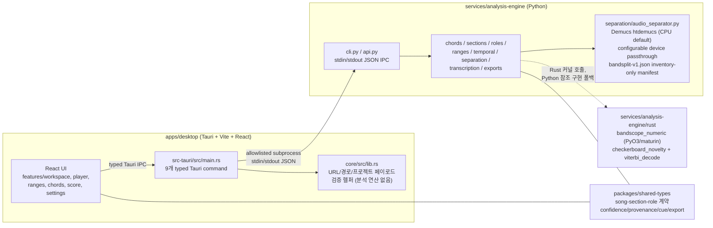
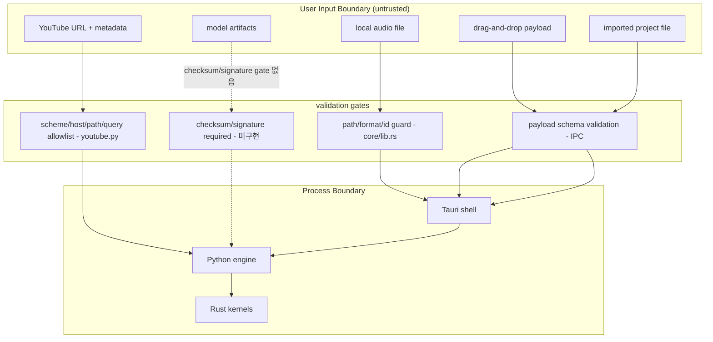

# BandScope Product-Technical Gap Baseline

Last updated: 2026-08-30
Base revision: `develop@749511c3ad4000090048718f685c6bee6b3d2c25` (feat(workspace): name tonight's first playable range on the map, #957)

## 1. 목적과 범위 (Purpose & Scope)

이 문서는 ADR/설계 문서(`ARCHITECTURE.md`, `docs/plans/*`), 브랜드 소스(`docs/brand-story.md`), 보안 소스(`docs/security/app-security.md`), 그리고 현재 저장소 상태(코드, 열린 PR 136건, 열린 이슈)를 대조하여 다음을 한 곳에 모은 baseline이다.

- 기능 명세(functional spec)와 PRD/TRD로 승격되지 않은 요구사항의 공백
- 구현된 코드와 문서가 선언하는 제품 범위 사이의 기술 Gap
- 누락된 UML/다이어그램 산출물
- 구매자가 체감하는 제품 Gap 우선순위 Backlog

범위에는 현재 열려 있는 PR 세트를 명시적으로 포함한다. 특히 `feat(workspace): name tonight's first X on the map` 시리즈는 아직 merge되지 않았으므로, 이 문서에서는 해당 시리즈가 착지했을 때 남는 Gap까지 함께 기술한다.

검증 원칙: 본 문서의 코드 관련 주장은 전부 실제 repo에 대해 `grep`/`glob`/파일 read로 확인했다. 확인 방법은 9장에 재실행 가능한 명령으로 남긴다.

## 2. 현행 제품 명세 스냅샷 (Current Product Specification Snapshot)

`ARCHITECTURE.md`와 `docs/brand-story.md` 기준, BandScope는 오늘날 다음을 지향한다.

- 퇴근 후 합주 준비자를 위한 local-first 데스크톱 앱(Tauri + Vite + React)
- 곡 보기(song view): 섹션별·연주 역할별 추정 화성, 폼(form)/그루브(groove) 큐, 스템(stems), 연주 가능 음역(playable ranges), 단순화 가이드(simplification), 전조/카포/튜닝/셋업 큐, 파트 겹침(part-overlap) 경고, 가시적 신뢰도(confidence), 리허설 우선순위
- 분석 대상 모델은 곡 전체 코드 트랙이 아니라 `song -> section -> role` 계층이며, role은 악기/보컬 기능/손(hand) 단위까지 확장될 수 있다
- 자동 분석 결과는 편집 가능하고, model-generated vs user-confirmed provenance를 유지해야 한다

아키텍처 개요:



핵심 구조적 사실(코드 확인 완료):

- 로컬 오케스트레이션은 loopback HTTP가 아닌 typed Tauri IPC + stdin/stdout JSON 서브프로세스 방식이다 (`ARCHITECTURE.md`, `apps/desktop/src-tauri/src/main.rs`)
- `apps/desktop/core`(Rust)는 분석 연산이 아니라 입력 검증(YouTube URL, project payload, score PDF source, 경로 가드) 담당이다 (`apps/desktop/core/src/lib.rs`)
- 무거운 수치 커널 중 checkerboard novelty와 Viterbi 디코딩만 `bandscope_numeric`(Rust/PyO3)으로 포팅되어 있고, 나머지는 Python/NumPy 참조 구현이며 `tests/test_numeric_parity.py`로 f64 parity를 잠근다 (`_native.py`)
- 스템 분리는 Demucs `htdemucs`를 기본 `AudioSeparationConfig.device="cpu"`로 실행한다. `_apply_model`은 구성된 `device`를 Demucs `apply_model(..., device=...)`에 전달하므로 비-CPU 장치 경로 자체는 존재하지만, BandScope가 CUDA/MPS를 독립적으로 admission·parity·performance·release gate한 증거는 아직 없다 (`separation/audio_separator.py`)
- 주파수 컷오프만 정의한 `bandsplit-v1.json` 휴리스틱 밴드스플릿 manifest가 별도로 존재하지만, 현재 코드에서 이를 읽는 runtime consumer는 확인되지 않는다 (`separation/model_weights/bandsplit-v1.json`; supplemental inventory only)
- 협업 타입(assignments/comments/approvals)은 `packages/shared-types`에 정의만 되어 있고 UI 참조가 전혀 없다 (grep 확인)

## 3. 기능 명세 및 요구사항 도출 (Functional Spec Derivation)

제품 능력 -> 구현 위치 -> 성숙도 매핑. 성숙도: 구현됨 / 부분구현 / 미구현.

| 제품 능력 | 구현 위치 | 성숙도 |
|---|---|---|
| 로컬 오디오 임포트(Rust 검증 + app-owned 루트) | `apps/desktop/src-tauri/src/main.rs`, `apps/desktop/core/src/lib.rs` | 구현됨 |
| YouTube 임포트(정책 제약, 실패 폴백) | `services/analysis-engine/src/bandscope_analysis/youtube.py` | 부분구현 (DRM/로그인 우회 없음, 실패 시 안내 카드는 PR 진행 중) |
| 스템 분리 | `separation/audio_separator.py` (htdemucs; CPU default) | 부분구현 (플랫폼 게이트, x86 macOS 미지원; configurable device passthrough는 있으나 비-CPU 가속은 아직 BandScope release-qualified가 아님) |
| 섹션 세그먼테이션(checkerboard novelty) | `sections/segmenter.py` + `bandscope_numeric::checkerboard_novelty` | 구현됨 |
| 섹션별 화성(HMM + Viterbi) | `chords/chord_recognizer.py`, `chords/section_harmony.py` | 구현됨 (hand-tuned prior 수준, 4장 참조) |
| 화성 기능 라벨/설명 | `chords/function_analyzer.py`, `RehearsalRole.harmonicExplanation?` | 부분구현 |
| 역할(role) 추출 및 역할별 조율 | `roles/extractor.py`, `roles/tuning.py` | 부분구현 (주파수 컷오프 휴리스틱 기반) |
| 음역/가압(range pressure) | `ranges/analyzer.py`, `ranges/pressure.py`, `ranges/pitch_tracker.py` | 구현됨 |
| 파트 겹침 경고 | `roles/overlap.py`, `RehearsalRole.overlapWarnings` | 구현됨 |
| 단순화 가이드 | `roles/priority.py` 연계, `RehearsalRole.simplification` 필드 | 구현됨 (문자열 필드 중심) |
| 전조/카포/튜닝 큐 | `chords/transposition.py`, `chords/capo.py`, `roles/tuning.py` | 구현됨 (계산), 워크스페이스 노출은 PR 진행 중 |
| 그루브/타이밍/히트/tempo-stability 큐 | `temporal/groove.py`, `temporal/hits.py`, `temporal/stability.py`, PR #1059 | 구현됨 (tempo-stability 노출은 #1059 open stacked PR) |
| 진입/이탈/카운트/가사 큐 앵커 | `sections/anchors.py`, `CueAnchorKind = lyric\|count\|transition` | 부분구현 |
| 신뢰도 표시(section/role 수준) | `ConfidenceMarker(low/medium/high)` + `features/workspace/ConfidenceBadge.tsx` | 구현됨 |
| 리허설 우선순위 | `roles/priority.py`, `RehearsalPriority`, `PracticeProgress.tsx` | 구현됨 (규칙 기반 휴리스틱) |
| 수동 수정 + provenance | `ManualOverride[]`, `ProvenanceSource = model\|user` | 구현됨 |
| 내보내기(cue-sheet CSV, chart JSON) | `exports/chart.py`, `src/lib/export.ts` (filename sanitize, CSV escape) | 구현됨 |
| 악보(score) 보기 | `features/score/ScoreView.tsx`, `ScoreViewer.tsx`, `pdfjs.ts` | 부분구현 (PDF 뷰잉; PDF 바이트 검증은 PR 진행 중, 자동 채보 없음) |
| 루프 재생/역할별 재생 제어 | `features/workspace/RehearsalPlayer.tsx` | 부분구현 (PR #1062에서 선택 섹션의 실제 오디오 loop 재생, PR #1063에서 bounded playback-rate, PR #1066에서 선택 역할별 section picker, PR #1068에서 선택 cue의 수치 start/end 수동 보정, PR #1069에서 bounded seek, PR #1071에서 안전한 transport 단축키를 연결했으나 role-specific stem playback과 protected merge는 미완료) |
| 협업(assignment/comment/approval) UI | `packages/shared-types` 타입만 존재 | 미구현 (UI 참조 0건; PR 시리즈가 첫 화면 진행 중) |
| pad/solo/riff/hook/fill/voicing/articulation/dynamics/tuning/capo/vamp 등 plan 필드 | 없음 (shared-types에 미존재) | 미구현 (PR 시리즈가 추가 예정) |
| 라이선싱/데모곡 first-run | 없음 | 미구현 (PR #1009, Issue #964; diagnostics/privacy boundary는 Issue #963) |
| 자동 저장/crash-safe 프로젝트 포맷 | 없음 | 미구현 (Issue #962) |
| 서명/공증 배포+롤백 증적 | `.github/workflows/release.yml` 존재 | 부분구현 (Issue #960) |

## 4. 현재 열린 PR 기반 Gap 분석 (Open-PR Gap Analysis)

현재 open PR은 136건이다(2026-08-29 Asia/Seoul 기준 REST inventory). 아래 표는 그중 대표적인 PR을 뽑은 snapshot이며, 대부분은 동일 패턴의 시리즈다.

### 4.1 2026-08-29 exact-head 운영 snapshot

아래 표는 protected base `develop@749511c3ad4000090048718f685c6bee6b3d2c25`에 대해 GitHub REST API로 다시 읽은 대표 PR의 current head와 그 head의 Checks/review 상태다. Capture 시각은 `2026-08-29T08:11:32Z` (`2026-08-29 17:11:32 Asia/Seoul`)이며, 이후 재실행 결과는 이 snapshot의 증적으로 재사용하지 않는다. 아래 재실행 명령은 capture 시각의 open PR 전체에 대해 각 current head, 동일 SHA의 check-runs, reviews, protected base를 JSON으로 묶는다. 이전 SHA의 Checks는 현재 증적으로 재사용하지 않았다.

| PR | current head | current 상태와 traceability |
|---|---|---|
| #1053 | `720c823bea91689c69c26877f20b4acd9feedf83` | Settings에서 분석 전/후의 audio next action과 Ranges 이동을 buyer-visible하게 연결; required `opencode-review` failure, `MERGEABLE/BLOCKED`, `REVIEW_REQUIRED`, qualifying independent approval 없음 |
| #1052 | `b737906aba0b95251109e53434dd8860ff6664fd` | Ranges/Player의 buyer-visible 노출, canonical first-range callout 단일화, active-role 연동, 첫 playable span 보존, 단수형 카피·다중 구간 selector·runtime object guard 보강; required `opencode-review`·`strix` failure, `MERGEABLE/BLOCKED`, `REVIEW_REQUIRED`, qualifying independent approval 없음 |
| #1051 | `d3622b6a21ddf8ab58aa17bb565e803bf5c257ce` | WCAG 2.2 키보드 skip navigation과 focusable main landmark 최소 기준; required `opencode-review` failure, `MERGEABLE/BLOCKED`, `REVIEW_REQUIRED`, qualifying independent approval 없음 |
| #1049 | `7795ff40a308cae392ce9804e624d64695a49d12` | fermata plan의 첫 섹션 next action을 추가하는 Draft PR; required `opencode-review`·`strix` failure, `DRAFT/MERGEABLE/BLOCKED`, `REVIEW_REQUIRED`, qualifying independent approval 없음 |
| #1048 | `8f8b2da7815741f4af96c70510951d01a4d302fc` | accelerando plan copy/provenance 양방향 검증과 beat-grid 경계 계약을 보강; required `opencode-review`·`strix` failure, `MERGEABLE/BLOCKED`, `REVIEW_REQUIRED`, qualifying independent approval 없음 |
| #1047 | `f2879edf8fae3dc9058ebdbc042c4f79bc243006` | ritardando plan 누락 JSDoc·copy/provenance 양방향 검증과 `ritardando.py` mypy 타입 계약을 보강; required `opencode-review`·`strix` failure, `MERGEABLE/BLOCKED`, `REVIEW_REQUIRED`, qualifying independent approval 없음 |
| #1046 | `c13314677adb0d1ae60a7d2786e858fa6b0f9306` | fade-plan copy/provenance 양방향 검증과 외부 song 교체 identity reset을 보강; required `opencode-review`·`strix` failure, `MERGEABLE/BLOCKED`, `REVIEW_REQUIRED`, qualifying independent approval 없음 |
| #1045 | `0b03fb7b20473b808fce06a4c6a178de46f2e778` | swell-plan copy/provenance 양방향 검증과 feature-cache schema 분리를 보강; required `opencode-review`·`strix` failure, `MERGEABLE/BLOCKED`, `REVIEW_REQUIRED`, qualifying independent approval 없음 |
| #1033 | `046db562497a8104fa525f56a6437eb13fbf4760` | Python 보안 lock baseline; required Checks pass; `REVIEW_REQUIRED/BLOCKED`, qualifying independent approval 없음 |
| #1040 | `693732df2b9790c2f3292b23b15b01d2e6ca822a` | drop-plan copy/provenance 양방향 검증을 shared-types와 native parser에 보강; required `opencode-review` failure, `MERGEABLE/BLOCKED`, `REVIEW_REQUIRED`, qualifying independent approval 없음 |
| #1034 | `98a99e1bff4b63f5294d8c9a5cbdaf312b235403` | customer-facing copy, safe error localization, valid/invalid YouTube guidance를 정리; required checks pass, `MERGEABLE/BLOCKED`, `REVIEW_REQUIRED`, qualifying independent approval 없음 |
| #1025 | `70c8003b162f794ef37f9d104a210e8a92fd35e1` | 이 문서 PR의 current head; protected base는 `749511c3ad4000090048718f685c6bee6b3d2c25`, required `opencode-review` failure, `MERGEABLE/BLOCKED`, `REVIEW_REQUIRED`, qualifying independent approval 없음 |
| #970 | `abb39bf7bd4f9ee6fc88bdd8db80d9a4a8113545` | atomic project publication과 bounded load 보강, hard-link 불가 첫 저장 fail-closed; required `opencode-review`·`strix` failure, `MERGEABLE/BLOCKED`, qualifying independent approval 없음 |
| #858 | `f1f5e877f07aa7486cd343ddfe8aa45a9d628bbd` | analysis/cache/temp/project path authority와 redacted logging test 계약 보강; required `opencode-review` failure, `DRAFT/MERGEABLE/BLOCKED`, unresolved thread 0, qualifying independent approval 없음 |
| #985 | `33d14e44bf7f41dda51b0ee246f7caae088101b9` | canonical audio resource ceiling을 desktop local/YouTube handoff와 Python defense-in-depth에 연결; required `opencode-review`·`strix` failure, `DRAFT/MERGEABLE/BLOCKED`, `REVIEW_REQUIRED`, qualifying independent approval 없음 |
| #892 | `fa2abea4f0063db55490b6f392d28315a975cf59` | decoded WAV C-major acceptance와 silent aliased fixture fail-closed 보강; required `opencode-review`·`strix` failure, `DRAFT/MERGEABLE/BLOCKED`, `REVIEW_REQUIRED`, qualifying independent approval 없음 |
| #891 | `9220af2921438cb51a290ab4e4314e2fd321671d` | known-take verse/chorus chord recovery acceptance; required checks pass, `DRAFT/MERGEABLE/BLOCKED`, `REVIEW_REQUIRED`, qualifying independent approval 없음 |
| #866 | `505a595d481f8ba03abd8d13e7c17202918c833f` | canonical local-audio resource policy; required `opencode-review`·`strix` failure, `DRAFT/MERGEABLE/BLOCKED`, `CHANGES_REQUESTED`, qualifying independent approval 없음 |

### 4.2 2026-08-30 tempo-stability current-head snapshot

PR #1059 (`feat(tempo): surface tempo movement rehearsal cues`)의 현재 증거는 head `3d2aaa27804bd6113e8e9aee8aff611976698b40`, base `fix/temporal-log-privacy@b11b1e0c1756921c64524d691fb4fac440abc65b`이다. 이 PR은 #1055에 stacked되어 있으며 `OPEN`, `MERGEABLE`, `CLEAN`이지만 formal `reviewDecision`이 없고 qualifying independent approval도 없다. 동일 head의 Devin Review와 CodeRabbit status는 성공으로 보였고, CodeRabbit은 non-default base라 review를 건너뛴 상태이며, review thread unresolved count는 0이다. 따라서 이는 구현/리뷰 증거이지 보호 브랜치 병합 증거가 아니다. 다음 push 뒤에는 반드시 head, 동일 SHA Checks, reviews, threads를 다시 조회한다.

구현 범위는 shared contract의 `TempoStability`/`TempoChange`, API의 validated tempo mapping과 local-only orchestration, Workspace의 en/ko rehearsal copy, chart JSON export, 그리고 final analysis cache v2와 reusable stem-feature cache v1의 독립 namespace다. PR branch에서 생성한 임시 click-track WAV를 실제 `TemporalAnalyzer`와 `analyze_tempo_stability`에 통과시킨 별도 probe는 `120.2 BPM`, `15 beats`, `steady`, `0 tempo changes`를 반환했다. 이 파일은 source tree나 CI fixture가 아니므로 P0 실오디오 정확도 acceptance를 대체하지 않는다.

검증 증적은 pinned npm shim을 사용한 `./scripts/harness/quickcheck.sh` 성공이며, Python `684 passed, 24 skipped`, Python coverage `100.00%`, desktop `218` tests와 configured coverage `100%`, shared-types `21` tests, typecheck/mypy/Ruff/Bandit/security/supply-chain/GitHub bootstrap checks 및 Vite build 성공을 포함한다. 이 결과는 위 exact head에서 실행한 local evidence로만 취급한다.

#### Security Notes

- tempo 분석은 기존 validated local-audio 경계 안에 있으며 새 network, URL, subprocess, WebView, IPC 경계를 추가하지 않는다.
- cache/export payload에는 raw `audio_path`와 `beat_times`를 넣지 않고, shared/API 계약은 finite·positive tempo만 허용한다.
- final result cache는 schema v2로 pre-feature 결과를 재사용하지 않으며, 호환 가능한 stem features는 독립된 v1 namespace를 유지한다.

`#1025`의 과거 SHA(`3c459fd033ccd94ad6cc8df6092d9e1ce4a86e6b` 등)는 이 표의 current head가 아니므로, 해당 SHA의 Checks/review를 현재 증적으로 재사용하지 않는다.

### 4.3 2026-08-30 canonical audio-resource current-head snapshot

PR #985 (`feat(analysis): enforce one canonical audio resource policy (#781)`)의 current head는 `b8a6db4fda36b5c07f5f30b4bd9195d5f4e2c431`이며, base는 `develop@749511c3ad4000090048718f685c6bee6b3d2c25`이다. canonical resource policy를 local/YouTube handoff와 temporal, separation, transcription, chord 경계에 연결하고, byte/header/decoded duration budget과 payload-free policy error를 공용 경계에 적용한다. 이 head에서 문서가 약속한 MP3/M4A 중 M4A path-backed intake가 libsndfile file-like probe와 `librosa.load(fileobj)` 조합 때문에 막히는 실제 결함을 확인했고, 후속 PR #1065로 보완했다.

동일 head의 hosted 상태는 `OPEN`, `DRAFT`, `MERGEABLE`, `BLOCKED`, `REVIEW_REQUIRED`이며 review thread unresolved count는 0이다. CodeRabbit은 draft라 review를 건너뛴 성공 상태이고, 일반 CI/build/security/supply-chain gate는 통과했다. `noema-review`는 sidecar `413 request_too_large`, `opencode-review`는 current-head verdict 부재, `strix`는 잘못된 `LLM_API_BASE` 설정으로 실패했다. 이는 source finding이 아닌 외부 review/provider 증거 실패이므로 우회하지 않는다. formal qualifying independent approval은 없고, 동일 Gap의 이전 draft #866에는 #985를 canonical successor로 남겼다.

후속 #1065는 이 head 위에 stacked 되었으며, #985 소유 브랜치는 덮어쓰지 않았다.

#### Security Notes

- 숫자 메타데이터는 caller/decoder가 공급하는 untrusted input이며, finite·정수성 검증 전에 실패할 수 있는 Python numeric conversion도 payload-free policy error로 정규화한다.
- 수정은 파일 열기, 디코드, URL, subprocess, IPC 경계를 추가하지 않으며, 기존 encoded/decoded resource budget과 local-only 분석 경계를 유지한다.
- `10**1000` overflow 회귀 테스트는 예외 타입과 stable reason code가 외부에 노출되는 경계를 확인한다.

### 4.4 2026-08-30 real-audio loop current-head snapshot

PR #1062 (`feat(player): play real audio section loops`)의 current head는 `949154375304ebef41e03d2e8bfde3ae86a40714`이며, base는 stacked branch `feat/rehearsal-player-first-section-loop@7a59047b004faa7a0b584f3d6d68c94889a452d5`이다. Tauri asset protocol은 startup scope를 비워 두고 native file-dialog 또는 validated YouTube-cache 경로의 canonical exact file만 runtime allowlist에 추가한다. `RehearsalPlayer`는 실제 `<audio>` element의 `timeupdate`를 playhead clock으로 사용하고, count-in·pause/resume·scheduled section-boundary restart·localized playback error를 제공한다. Browser-only source는 loop action과 start를 fail-closed로 비활성화하고, native asset URL 변환 실패는 missing-audio copy와 구분해 playback error를 표시한다. PR #971의 timer-only first-section loop보다 구현 경계는 진전됐지만, role filter는 아직 없고 real-device sound-output acceptance도 수행하지 않았다.

동일 head의 로컬 증적은 desktop frontend `249 passed`와 statements/branches/functions/lines `100%`, Vite/lint/typecheck 통과다. native media element와 `convertFileSrc`를 검증하는 테스트는 실제 source URL·재생·`timeupdate`·scheduled boundary·long-timer clamp·loop reset·browser/native source authority를 확인하지만, mocked media 환경이므로 실제 스피커 출력이나 known-take 분석 정확도 gate를 대체하지 않는다.

#### Security Notes

- asset protocol `scope: []`에서 시작하며 generic filesystem IPC, directory scope, arbitrary JS path access를 추가하지 않는다. 선택된 canonical file 하나만 allowlist에 넣는다.
- media error는 path나 raw metadata를 로그에 남기지 않고 재생을 중지한 뒤 재시도 가능한 localized status를 표시한다.
- hosted PR 상태는 current head `949154375304ebef41e03d2e8bfde3ae86a40714`에서 `OPEN`, non-draft, `MERGEABLE`, `CLEAN`, Devin/CodeRabbit status pass, unresolved thread 0, formal qualifying independent approval 없음이다. CodeRabbit은 stacked non-default base라 review를 skipped했고, 이 base에는 보호된 `develop` required checks의 merge evidence가 없다. 따라서 이 PR은 병합하지 않는다.

현재 merge blocker의 권위 있는 설정도 함께 확인했다. active ruleset `18156473`은 `develop`에 승인 1개, review thread resolution, 16개 required status context를 요구한다. branch-protection REST 응답의 `required_approving_review_count=0`보다 ruleset의 더 엄격한 승인 규칙이 우선하므로, `MERGEABLE`만으로 merge-ready라고 판단하지 않는다. 승인·필수 Checks·thread resolution이 모두 현재 head에 대해 충족될 때만 병합한다.

이 snapshot에서 위 PR 중 병합된 것은 없다. `mergeable=true`는 protected review/required-check 완료를 뜻하지 않으며, 승인·current-head review·필수 gate가 모두 충족되지 않은 PR은 병합하지 않았다. admin/self-approval, force-push, protected gate bypass도 사용하지 않았다.

#### Security Notes

- 이 변경은 runtime code, 파일/URL intake, subprocess, IPC, 모델, 로그, export 동작을 변경하지 않고 현재 상태와 traceability만 갱신한다.
- 근거는 각 PR의 API current head SHA와 동일 SHA의 check-runs/reviews이며, stale/cancelled predecessor run은 성공 증적에서 제외한다.
- 명령 출력과 문서에는 secret 값이나 raw audio/사용자 경로를 기록하지 않는다.

### 4.5 2026-08-30 bounded rehearsal playback-rate current-head snapshot

PR #1063 (`feat(player): add bounded rehearsal playback rates`)의 current head는 `e517a9875d9eae13113c56d7b2b433ed9a3a7888`이며, base는 stacked branch `codex/real-audio-loop@949154375304ebef41e03d2e8bfde3ae86a40714`이다. 구현은 임의 rate를 허용하지 않고 `0.75x`, `1x`, `1.25x`만 transport 계약으로 허용한다. native `<audio>`의 `playbackRate`에 값을 적용하고, 브라우저가 `preservesPitch`를 노출할 때 true를 유지한다. HTML Standard의 media contract상 `playbackRate=1`은 정상 속도이며 유효 재생 속도는 media clock에 영향을 주므로, count-in beat 간격은 `beatDurationMs(tempo) / playbackRate`, section boundary wall-clock delay는 남은 media seconds를 playback rate로 나눈 값으로 계산하고 rate 변경 시 boundary timer를 재예약한다. source 교체 뒤에도 선택한 rate를 다시 적용한다.

동일 head의 로컬 증적은 pinned npm 실행으로 `./scripts/harness/quickcheck.sh`를 끝까지 통과한 것이다. Python `679 passed, 24 skipped`, coverage `100.00%`, desktop `254 passed`와 statements/branches/functions/lines `100%`, shared-types `20 passed`와 동일 100% coverage, Vite build, lint/typecheck, docs/security/supply-chain/bootstrap/Ruff/Bandit/mypy gates가 통과했다. 테스트는 두 non-default rate의 count-in 전환, 재생 중 rate 변경에 따른 boundary 재예약, native media rate/pitch-preservation, source 교체 후 rate 보존을 검증한다. 이는 mocked media clock 증적이며, 실제 오디오 파일의 음질·음정 및 실제 장치별 `preservesPitch` 동작을 보증하지 않는다.

현재 hosted 상태는 current head `e517a9875d9eae13113c56d7b2b433ed9a3a7888`에서 `OPEN`, non-draft, `MERGEABLE`, `CLEAN`, Devin/CodeRabbit status pass, unresolved thread 0이며, CodeRabbit은 stacked non-default base라 review를 skipped했다. formal qualifying independent approval은 없다. 따라서 #1063도 보호된 merge evidence가 충족될 때까지 병합하지 않는다.

#### Security Notes

- 재생 속도는 고정된 세 값만 허용하며, raw path·URL intake·filesystem scope·subprocess·IPC 경계를 추가하지 않는다. 기존 #1062의 exact-file Tauri asset allowlist와 `asset:`/`http://asset.localhost` CSP 범위를 그대로 상속한다.
- rate 변경은 media element 속성 및 transport timer만 갱신하며, browser-only source와 변환 실패 source는 기존 fail-closed 권한/오류 경계를 유지한다.
- 검증 지점은 rate 입력의 런타임 검증, count-in/boundary rescheduling, source 변경 cleanup, localized status이며, real-device sound-output와 known-take accuracy는 별도 P0 Gap으로 남긴다.

### 4.6 2026-08-30 bounded accuracy-fixture decode current-head snapshot

PR #1064 (`fix(accuracy): bound fixture decode resources`)는 accuracy acceptance PR #892의 current head `fa2abea4f0063db55490b6f392d28315a975cf59` 위에 쌓은 current head `9d2fec2855793e4d7cd1bab19f874a163e7538e4`이다. checksum staging 전에 fixture bytes를 100 MiB로 제한하고, WAV header에서 채널 수(최대 8), sample rate(최대 192 kHz), decoded duration(최대 15분)을 확인한 뒤 PCM을 할당한다. stat 이후 파일 성장과 header/read 예외도 fail-closed 하며, tempo evaluator가 이 header guard를 우회하지 않도록 공통 validator를 staging 경계에서 호출한다. 이 변경은 synthetic Tier 1 fixture의 자원 경계만 보강한다. known-take/공개 corpus의 음악 정확도나 stem SI-SDR gate를 대신하지 않는다.

동일 head의 local evidence는 targeted accuracy acceptance `43 passed`, full Python `768 passed, 24 skipped`, production statements/branches/functions/lines `100.00%`, Ruff, mypy, docs validator, `git diff --check` 통과다. Full suite 중 기존 macOS Demucs child-process segmentation-fault traceback이 출력됐지만 부모 pytest는 완료됐고, 이 변경 경로의 acceptance 테스트는 성공했다.

현재 hosted 상태는 #1064 current head에서 `OPEN`, non-draft, `MERGEABLE`, `CLEAN`이며, CodeRabbit은 pass지만 review를 skipped했고 Devin은 pass다. formal `reviewDecision` 없음, unresolved thread 0, qualifying independent approval 없음이다. 따라서 보호된 merge evidence가 충족되기 전에는 병합하지 않는다.

#### Security Notes

- untrusted fixture bytes는 stat/read 상한과 checksum 검증을 통과해야만 temporary staging 및 decode로 진행한다. WAV header의 채널·sample-rate·duration 상한은 decoder allocation 전에 적용한다.
- 새 network, shell, runtime IPC, WebView, model, dependency authority는 추가하지 않으며, report에는 raw PCM이나 local path를 기록하지 않는다.
- 검증 지점은 oversized fixture, file-growth race, unreadable header/file, excessive channel/rate/duration, checksum mismatch 및 정상 file-backed C/tempo acceptance다.

### 4.7 2026-08-30 compressed-container path fallback current-head snapshot

PR #1065 (`fix(audio): preserve compressed path decoder support`)의 current head는 `669d1d0122861a3398f91029ce386667cd2c09d4`이며, base는 #985 branch `feat/canonical-audio-resource-policy-781@b8a6db4fda36b5c07f5f30b4bd9195d5f4e2c431`이다. path-backed temporal/separation intake는 libsndfile이 검사하지 못하는 compressed container에서 기존 local audioread fallback으로 metadata를 확인하고, path를 그대로 librosa에 전달해 기존 decoder fallback을 유지한다. file-like stem bytes는 기존 libsndfile metadata contract를 유지한다.

동일 head의 local evidence는 targeted `54 passed, 1 skipped`, full Python `760 passed, 24 skipped`, statements/branches/functions/lines `100.00%`, Ruff, mypy, `uv lock --check`, `git diff --check`, 그리고 pinned npm 실행의 `./scripts/harness/quickcheck.sh` 성공이다. 실제 5초 AAC/M4A fixture도 preflight를 통과했고 `TemporalAnalyzer`가 `.m4a`, `5.0`초, `44.1 kHz`를 반환했다. Full Python suite 중 기존 macOS Demucs child-process segmentation-fault traceback이 출력됐지만 부모 pytest는 완료됐으며, 이 PR은 해당 unrelated runtime noise를 해결했다고 주장하지 않는다.

현재 hosted 상태는 #1065 current head에서 `OPEN`, non-draft, `MERGEABLE`, `CLEAN`이다. CodeRabbit은 stacked non-default base라 skipped했고 Devin Review는 pass로 완료됐으며, formal `reviewDecision`과 unresolved thread는 없고 qualifying independent approval도 없다. 따라서 #1065 역시 protected merge evidence가 충족되기 전에는 병합하지 않는다.

#### Security Notes

- untrusted local audio는 #985의 resolved-path/size policy 경계와 decoder metadata의 sample-rate/channel/duration 검증을 통과해야 한다.
- 기존 fixed local audioread route만 재사용하며 network, generic exec/read/write API, 새 ffmpeg subprocess, IPC, WebView 경계를 추가하지 않는다. fallback 실패는 payload-free `malformed_header`로 닫고 policy 위반 reason code는 보존한다.
- 검증 지점은 libsndfile 성공 경로, compressed fallback, fallback 실패, decoder policy rejection, 실제 AAC/M4A path acceptance다.

### 4.8 2026-08-30 role-filtered rehearsal loop current-head snapshot

PR #1066 (`feat(player): filter loops by rehearsal role`)의 current head는 `43698a61377f9c2f7d01e65783089caceed8c1b5`이며, base는 #1063 branch `codex/playback-rate-control@e517a9875d9eae13113c56d7b2b433ed9a3a7888`이다. 기존 RoleSwitcher의 active role을 RehearsalPlayer에 연결해 선택 역할이 실제로 포함된 playable section만 loop picker에 표시한다. 전체 SectionRoadmap의 form context는 유지하며, role-specific stem playback이 생겼다고 주장하지 않는다. 역할이 없는 section은 fail-closed로 제외하고, 선택 역할에 playable section이 없으면 All Roles 또는 역할 배치를 안내하는 한/영 copy를 표시한다.

동일 head의 local evidence는 targeted `54 passed`, desktop full `260 passed` across 23 files, desktop statements/branches/functions/lines `100.00%`, desktop lint/typecheck, and pinned npm `./scripts/harness/quickcheck.sh` pass이다. Harness Python `679 passed, 24 skipped`, Python coverage `100.00%`, shared-types `20 passed`, shared-types coverage `100.00%`, and Vite build also passed. Full Python suite prints the existing macOS Demucs child-process segmentation-fault traceback during one mocked CLI test, but parent pytest/harness completes successfully. No real audio/stem-output evidence is claimed.

`43698a61377f9c2f7d01e65783089caceed8c1b5` push 후 같은 head를 재조회한 snapshot에서 #1066은 `OPEN`, non-draft, `MERGEABLE`, `CLEAN`이며, CodeRabbit은 stacked non-default base라 skipped했고 Devin Review는 pass로 완료됐다. 이전 `39927fbbaf0c4f7fb5d84d5ba6086f6c5f748064`에 달린 Devin bug thread 2개는 이 새 head에서 모두 resolved되어, current-head unresolved thread는 0이다. formal `reviewDecision`과 qualifying independent approval은 없다. 따라서 protected merge evidence가 충족되기 전에는 병합하지 않는다.

#### Security Notes

- role ID is selected through existing RoleSwitcher allowlist; transport snapshot reads section/role ids via own data descriptors and excludes malformed/sparse arrays.
- no new file/URL/subprocess/IPC/WebView/network/model boundary; no stem playback claim.
- validation points are all-role restoration, selected-role filtering, no-role-section copy, keyboard/aria role picker semantics, and existing desktop/full harness gates.

### 4.9 2026-08-30 keyboard section cue navigation current-head snapshot

PR #1067 (`feat(player): add keyboard section cue navigation`) is stacked on #1066 at base `43698a61377f9c2f7d01e65783089caceed8c1b5` and current head `04396d9b4ebfd50ad598ffaf1edb33df3de70840`. Existing playable section buttons now accept Left/Right Arrow to move the selected loop cue from the focused button within the bounded list, preserve focus on the newly selected cue, and expose the shortcut in localized visible copy. The change does not add playback or stem-source authority.

Local evidence is targeted `21 passed`, desktop `261 passed` across 23 files with statements/branches/functions/lines `100.00%`, desktop lint/typecheck, and pinned-npm `./scripts/harness/quickcheck.sh` pass. The harness also reports Python `679 passed, 24 skipped` with 100% coverage, shared-types `20 passed` with 100% coverage, and a successful Vite build. The existing macOS Demucs child-process segmentation-fault traceback remains unrelated runtime noise during one mocked CLI test; the parent pytest completes successfully.

After the current head completed hosted review, #1067 is `OPEN`, non-draft, `MERGEABLE`, `CLEAN`, with CodeRabbit successful/skipped for the stacked non-default base and Devin Review pass; all review threads are resolved and no qualifying independent approval exists. This is keyboard cue-selection evidence, not real-device sound-output or real-audio accuracy acceptance.

#### Security Notes

- The handler only changes the existing validated loop selection and DOM focus; it does not admit file paths, URLs, subprocesses, IPC, WebView, network, model, or export inputs.
- Movement is bounded at the first and last playable cue, and malformed sections remain excluded by the existing descriptor-snapshot transport resolver.
- Validation points are keyboard boundary behavior, focus retention, localized shortcut copy, existing aria-pressed semantics, and full repository gates.

### 4.10 2026-08-30 manual cue-boundary correction current-head snapshot

PR #1068 (`feat(player): allow manual cue boundary corrections`) is stacked on #1067 at base `04396d9b4ebfd50ad598ffaf1edb33df3de70840` and current head `81efbe3716632acbbff72626258ef0b09b00fbde`. The selected playable cue now exposes accessible whole-second start/end editors. Values are bounded by the shared section limit and must remain ordered; accepted changes immutably update the selected `song.sections[].timeRange`, so the existing Save Project action carries the corrected map into the current project file contract. Invalid edits restore the previous value and expose `aria-invalid` plus localized guidance. A Devin review found and the new head fixed a keyboard focus loss caused by key-based editor remount during Tab navigation; the new regression test confirms focus reaches the end field with the accepted start value. The slice does not claim automatic save, a persisted detected-vs-user provenance field, real-device timing, or role-specific stem playback.

Local evidence is targeted RehearsalPlayer `24 passed`, desktop full `264 passed` across 23 files with statements/branches/functions/lines `100.00%`, desktop TypeScript typecheck, ESLint, and `git diff --check`. The tests cover immutable song-map update, range inversion rejection, Tab focus retention, localized existing player behavior, role filtering, and keyboard cue navigation. No new file, URL, subprocess, IPC, WebView, network, model, or export boundary is introduced.

At the latest hosted snapshot after the focus fix, #1068 is `OPEN`, non-draft, `MERGEABLE`, and `CLEAN` with base `codex/player-keyboard-cues-20260830`; GitHub had not yet emitted check-runs or a formal review decision, unresolved review threads were `0` after the Devin bug response and resolution, and no qualifying independent approval existed. This is therefore partial #961 evidence only, not protected merge evidence; re-query the exact head and same-SHA Checks after every push.

#### Security Notes

- The inputs are untrusted UI strings admitted only as safe integer seconds within `0..MAX_SECTION_TIME_SECONDS` and an ordered start/end pair before `onSongUpdate`.
- The update reuses the existing in-memory song authority and Save Project path; it does not create localStorage, a competing project store, filesystem access, URL intake, subprocesses, IPC, WebView, network, or model behavior.
- Validation points are boundary-limit rejection, inversion rejection, immutable section update, localized error text, accessible labels/descriptions, and existing full desktop/repository gates.

### 4.11 2026-08-30 bounded cue seek current-head snapshot

PR #1069 (`feat(player): add bounded cue seeking`) is stacked on #1068 at base `81efbe3716632acbbff72626258ef0b09b00fbde` and current head `8a5160a797ae9f0a360aeb300ed42c35728a71e1`. The selected loop now exposes an accessible range control while the local media clock is looping or paused after count-in. The transport state machine clamps requests to the selected cue and maps an endpoint seek back to the loop start; the existing scoped `<audio>` element and one transport state remain the authorities. Count-in seeking, restart-key binding, durable autosave, real-device timing, and role-specific stem playback remain out of scope.

Local evidence is targeted RehearsalPlayer/rehearsalTransport `37 passed`, desktop full `265 passed` across 23 files with statements/branches/functions/lines `100.00%`, desktop TypeScript typecheck, ESLint, and `git diff --check`. The seek test verifies the actual mocked scoped media clock is updated, while reducer tests cover count-in rejection, lower/upper bounds, and valid in-loop movement. This is mocked media evidence, not real speaker output or real-audio accuracy evidence.

At the latest hosted snapshot, #1069 was `OPEN`, non-draft, `MERGEABLE`, and `CLEAN` with the base ref synchronized to #1068's focus-fix head; it had no formal review decision, no qualifying independent approval, and no emitted check-runs yet. This remains partial #961 evidence and is not protected merge evidence.

#### Security Notes

- Seek input is a bounded native range value; the reducer clamps finite values and rejects seeking during count-in before changing the media clock.
- The change reuses the existing scoped local-audio asset and transport state; it adds no path, URL, subprocess, IPC, WebView, network, model, or export authority.
- Validation points are count-in rejection, loop-boundary clamping, paused/live seek behavior, media-clock assignment, accessible label/description, and exact-head hosted gate rechecks.

### 4.12 2026-08-30 safe transport keyboard shortcuts current-head snapshot

PR #1071 (`feat(player): add safe transport shortcuts`) is stacked on #1069 at base `8a5160a797ae9f0a360aeb300ed42c35728a71e1` and current head `c37e589150a864cbb4472290c858c1e1ebda0d60`. The rehearsal player now exposes localized visible guidance for Space play/pause and Escape stop. The window handler ignores editable fields and focused interactive controls, and dispatches only the existing bounded transport actions; it does not add a second clock or a new source authority. Restart-key binding, durable autosave, real-device timing, and role-specific stem playback remain out of scope.

Local evidence is targeted RehearsalPlayer `25 passed`, desktop full `266 passed` across 23 files with statements/branches/functions/lines `100.00%`, desktop TypeScript typecheck, ESLint, and `git diff --check`. The shortcut test verifies that a focused boundary input does not start playback, Space transitions count-in to the loop and pauses it, and Escape resets the selected loop. This is mocked media evidence, not real speaker output or real-audio accuracy evidence.

At the hosted snapshot after push, #1071 was `OPEN`, non-draft, `MERGEABLE`, with merge recalculation `unstable` while stacked refs settled; its base was #1069's exact head, no formal review decision or qualifying independent approval existed, unresolved review threads were `0`, and no check-runs had been emitted. This remains partial #961 evidence and is not protected merge evidence.

#### Security Notes

- Shortcuts are ignored when the event target is editable or interactive, preventing transport actions while typing or operating a focused control.
- The handler dispatches only existing `start`, `pause`, and `stop` transport transitions; it adds no file, URL, subprocess, IPC, WebView, network, model, or export authority.
- Validation points are editable-target suppression, unavailable-action behavior, localized shortcut guidance, count-in/pause/stop transitions, and exact-head hosted review/check rechecks.

시리즈 패턴: `feat(workspace): name tonight's first X on the map` — 워크스페이스 맵에 "오늘 밤 첫 X" next-action 카피를 올리고, Open 클릭 시 해당 섹션으로 이동. 각 PR은 role-owned plan 필드(예: `padPlan`)를 shared contract에 추가하고, own data-property descriptor 검증(Proxy `get` trap 방어), 한국어 조사 안전 카피(`패드`, `뱀프` 등), reduced-motion 처리, 그리고 강한 merge-gate 조항을 포함한다.

capability cluster 분류와 착지 후 남는 Gap:

| Cluster | 해당 PR (예시) | 착지가 의미하는 것 | 착지 후 남는 Gap |
|---|---|---|---|
| A. 역할별 연주 plan 필드 (pad/solo/riff/hook/fill/voicing/articulation/dynamics/tuning/capo/vamp) | #1020, #1013~#1018, #1021, #1024 | RehearsalRole 계약 확장과 첫 plan 노출. 데이터 생성기(engine)가 실제로 이 plan을 산출하는지와는 별개 | plan 값을 만들어내는 엔진 로직, plan 간 충돌/우선순위 정책, plan 편집 UX |
| B. 폼/섹션 네이밍 (intro/verse/pre-chorus/chorus/bridge/outro/tag/pickup/stop/handoff/entrance/dropout/lyric cue/transition/transition-cue/count) | #943, #947, #955, #939, #946, #986, #989, #916, #934, #937, #912, #914, #913, #994, #993, #995 | SECTION_FORM_LABELS와 CueAnchorKind가 이미 계약에 있으므로 주로 UI 노출 완성 | 앵커 정확도(가사/카운트 정렬), 사용자 직접 앵커 편집 |
| C. 화성 설명/확정/귀확인 (harmonic function/explanation/confirmed chord/ear check/setup note/transposition/part handoff/playable range/overlap/groove/simpler take/tempo-starting chord setup) | #1005, #1003, #1002, #1001, #1004, #1006, #1007, #957, #992, #991, #990, #987 | brand-story의 "추정 + 귀로 확인" 프레임을 UI 언어로 구체화 | confidence 산출 근거의 정량화, confirmed override의 재분석 반영(round trip, Issue #739) |
| D. 협업 최소면 (assignment/comment/approval/blocked/pending/open comment/export-priority actions/ready board) | #996, #997, #998, #1000, #900, #901 | shared-types의 collaboration 타입에 처음으로 UI가 붙음 | 동기화(syncMode local_only/planned_cloud), crash-safe 프로젝트 포맷(Issue #962), 권한 모델 |
| E. First-run/activation/실패 복구 (first-run card/license demo song/local intake 실패/import 실패/analysis 실패/save 실패/help) | #974, #1009, #981, #982, #976, #984, #972, #898 | 빈 상태/오류 상태의 next-action 카피 완성 | 라이선싱 백엔드, 데모곡 번들 정책, 오프라인 활성화 |
| F. 보안/신뢰경계 (log redaction x4, quick-xml RustSec, filesystem authority, canonical audio policy, CSV NUL/전각 우회 차단, credential drop, PDF bound reads, npm baseline) | #956, #951, #950, #949, #948, #858, #985/#781/#1065, #941, #894, #865, #783 | app-security.md 규칙의 코드 반영 마무리 | Issue #852(경계 재구축), #542(예외 추적), 모델 artifact checksum/signature 파이프라인 |
| G. 성능 (Bolt 시리즈: 관측 확률 벡터화, GrooveMap maxTime O(1), chart dedupe O(N), chord change count O(1), checkerboard/HMM 벡터화) | #999, #859, #849, #834, #746, #732 | 핫패스 최적화. Rust 커널 포팅과 같은 방향의 Python 측 보완 | Demucs 가속 admission/parity/performance qualification, 대용량 파일 스트리밍, UI 가상화 |
| H. 접근성/디자인 시스템 (tooltip aria-disabled, icon tooltip, skip navigation, Storybook tokens, Figma drift check) | #833, #731, #897, #969, #1051 | WCAG 대응 시작점과 키보드 우회 경로 기준선 | Issue #965(Figma/Storybook/shipped UI 정합 + WCAG 2.2 AA gate) 전체 |
| I. 테스트 현실성 (decoded WAV acceptance, known-take chord recovery, real YouTube known-stem benchmark, branch coverage) | #892, #891, #828, #861 | synthetic fixture에서 실오디오 기반 acceptance로 이동 시작 | Issue #770(실오디오 MIR accuracy benchmark) 체계화, RMSE/SI-SDR 임계값 정책 |
| J. 의존성/빌드 위생 (react, storybook, base-ui, lucide, sonner, codeql-action, setup-uv, uv group, numba, uuid, time, rust pinning, node floor, orphaned Actions identity) | #920, #942, #922, #921, #926, #927, #924, #931, #936, #919, #918, #754, #944, #896, #895 | 공급망/런타임 최신화 유지 | Dependabot train 정리(Issue #966), jsdom 30 전환 완료 |

시리즈 전체에 대한 종합 판단: 이 시리즈는 "계약(contract) 필드 추가 + 첫 노출" 단계다. 착지해도 (1) plan 값의 생성 로직, (2) plan들 사이 우선순위/중복 정책, (3) 재분석 시 override 보존 round-trip, (4) 협업 영속화는 여전히 Gap으로 남는다. 또한 136건이 develop 기준으로부터 장기간 분기되어 있어 rebase 비용과 exact-head CI 증적 요구(PR 본문 명시)로 인한 merge train 정체가 자체적으로 기술 위험이다(Issue #966).

## 5. 기술 Gap 목록 (Technical Gaps)

문서 vs 코드 대조로 확인한 구체적 Gap.

(a) **Rust compute layer 활용 범위** — 분석 핫패스 중 checkerboard novelty와 Viterbi decode만 Rust(`bandscope_numeric`)에 있다. 스템 분리(Demucs)는 Python/torch이며 `AudioSeparationConfig.device` 기본값은 `cpu`다. `_apply_model`은 구성된 device를 `demucs.apply.apply_model(..., device=...)`에 그대로 전달하므로 비-CPU 장치 경로는 존재한다. 다만 BandScope의 현재 protected/release evidence에는 CUDA/MPS 경로의 장치 admission, CPU 대비 수치 parity, 성능 기준, 플랫폼별 release qualification이 없다. 따라서 Gap은 "GPU 경로 부재"가 아니라 **가속 경로의 검증·지원 계약 부재**다. transcription은 에너지 마스크 휴리스틱(`transcription/api.py`)으로 ML 모델이 아니다. 데스크톱 단일 곡 처리 기준 CPU로도 실용적일 수 있으나, 긴 곡/다중 분석에서 병목이며 `docs/plans/2026-04-25-v2-transcription.md`가 v2 계획으로 존재한다.

(b) **다층/계층·시간 모델링** — `song -> section -> role` 계약과 sections/roles/temporal 모듈은 존재하지만, role-level harmony는 실제 stem 경로에서 Demucs `other`/`bass` 출력에 적용하는 `ChordRecognizer`와 fallback role payload에 의존한다. `bandsplit-v1.json`은 현재 runtime consumer가 없는 inventory-only manifest이므로 이 경로의 근거로 세지 않는다. 학습된 multilevel 모델(예: role-conditioned chord/voicing 모델)과 section 경계의 temporal 일관성 학습은 없다. `docs/plans/2026-03-28-ml-engine-integration.md`가 관련 계획 문서다.

(c) **임의 가중치 vs 문헌 기반 값** — `chord_recognizer._build_transition_matrix()`는 `self_prob=0.8`, `related_prob=0.03`, uniform baseline `0.01/n` 등 hand-set 상수를 쓴다("Encodes musical priors" 주석). 방향성(fifth/fourth/relative/parallel)은 음악 이론에 근거하지만 수치는 문헌 교정(calibration)되어 있지 않다. `roles/priority.py`는 숫자 가중치 없는 if-then 규칙이다. PR #732(relative-key prior correction)처럼 사후 수정이 발생해왔다. 교정 방향은 주석 코퍼스(예: Burgoyne et al., 2011의 McGill Billboard)에서 전이 행렬을 최대우도로 추정하고, 관련 HMM/화음인식 문헌(Logan & Chu, 2000; Pauwels & Peeters, 2013; Boulanger-Lewandowski et al., 2013)은 모델링 맥락으로만 사용하며 현재 transition 수치의 parameter source로 간주하지 않는 것이다. tonal pitch space 거리 기반 스무딩(Harte, 2010) 등 대안과 현재 hand-set 값의 코드 복원 RMSE/accuracy 차이를 정량 비교한 뒤, 우세한 값을 상수가 아닌 데이터 산출물로 고정한다.

(d) **테스트 현실성** — `test_numeric_parity.py`(Rust-Python parity), `test_api.py` 등은 합성 입력 기반이다. 현재 PR checkout의 Git tree 및 9장 `find` 검증 기준 test 경로에 `.wav`/`.mp3` 실오디오 fixture가 없다. 실오디오 acceptance는 PR #892(decoded WAV C major), #891(known take verse/chorus recovery)이 열려 있고, 실 YouTube known-stem benchmark는 draft PR #828 + Issue #770 상태다. 별도 exploratory probe로 CC0 공개 피아노 녹음 `FurElise.ogg`(Wikimedia Commons, 176.59초)를 실제 디코더·`TemporalAnalyzer`·SSM segmenter·`ChordRecognizer`에 통과시킨 결과는 각각 `147.7 BPM/404 beats/101 downbeats`, 20개 section, 261개 chord time-segment였지만 harmony confidence가 대부분 low였다. 동일 develop production job은 성공 envelope를 반환했으나 tempo가 없고 arrangement role harmony가 남아 있어, 이 probe는 runtime 연결성 확인이지 정확도 acceptance가 아니다. PR #1059의 click-track probe도 tempo cue 연결성과 fail-closed 경로만 확인하며 known-take 정확도 gate가 아니다. RMSE/SI-SDR 스타일 정량 임계값 acceptance gate는 아직 없다.

(e) **커버리지/docstring 100%** — Python은 `--cov-fail-under=100` + Ruff D100-D107 docstring 100%가 gate로 작동한다(AGENTS.md, roadmap-completion 문서). JS workspace의 **2026-08-25 snapshot 실측**(source tree commit `d303c93e5e7d9199edb6ce596dcb9a8753f3a5fa`)은 desktop(469 stmts/357 branches/105 funcs)과 shared-types(717 stmts/643 branches/59 funcs) 모두 statements/branches/functions/lines 100%였다. 재실행 명령과 결과 artifact 경로는 각각 `npm run test --workspace @bandscope/desktop` -> `apps/desktop/coverage/coverage-summary.json`, `npm run test --workspace @bandscope/shared-types` -> `packages/shared-types/coverage/coverage-summary.json`이다. 이 수치는 현재 영구 gate를 뜻하지 않는다. gate threshold(`vite.config.ts`, `vitest.config.ts`)는 90으로 Python보다 낮아, 리그레션 시 90~99% 구간이 무단 통과될 수 있다. Gate 상향은 Backlog #10.

(f) **보안 체크리스트 잔여 항목** — 구현된 것: allowlisted stdin/stdout subprocess, Tauri CSP, path guards(#727 착지), CSV escape/sanitize, shell=False. 열린 것: canonical audio resource budget(#985/#1065 draft, Issue #781), filesystem path containment 재구축(Issue #852, #858 진행), native PDF read bounding(#865, #750), quick-xml RustSec 예외(#948, Issue #542), npm/PDF.js/nanoid/undici baseline(#783). 모델 artifact(Demucs checkpoint) checksum/signature 검증 파이프라인은 문서(app-security.md "Models") 요구 대비 미구현.

(g) **운영 관측(2026-08-25 strix 공급자 장애)** — 중앙 Strix 게이트가 NVIDIA NIM 소진 시 최종 폴백 `openai-direct/gpt-5.4`를 NIM 엣지 API base로 라우팅해 `404 page not found`로 실패 닫기(fail-closed)하여 전 조직 PR 큐가 정체했다. 근본 원인 수정은 ContextualWisdomLab/.github#1324(openai-direct 폴백 전용 API base 라우팅 + 회귀 계약 테스트)로 추적했고, bandscope 의존성 CVE(pdfjs-dist CVE-2026-16633 등)는 canonical owner #783으로 일원화했다. 운영 교훈: required 스캐너의 공급자 장애는 repo 단위 우회가 아니라 중앙 게이트 계약 수정으로만 풀어야 한다.

(h) **i18n/현지화** — `src/i18n` + `locales/en`, `locales/ko` 존재, 하드코딩 한국어 문자열 미탐지(workspace tsx grep 0건), interpolation hardening PR #744 진행. en/ko 2개 언어뿐이며, PR 시리즈가 추가할 다수의 카피 키가 locales에 아직 없다.

(i) **접근성** — 2026-08-29 current checkout에서 workspace 컴포넌트의 `aria-*` attribute token은 56개였다. WCAG 2.2 AA gate는 Issue #965로 열려 있고, Figma/Storybook/shipped UI 정합 점검도 미완이다. tooltip/a11y PR(#833, #731)과 skip navigation 기준선 PR #1051이 진행 중.

(j) **Design token/Storybook** — shadcn/ui 프리미티브 중 stories는 button/checkbox/dialog 3개뿐이고, rehearsal 도메인 컴포넌트(GrooveMap, SectionRoadmap, RoleSwitcher 등) stories는 없다. Storybook token PR #897이 진행 중.

(k) **패키징/릴리스 준비** — `CHANGELOG.md`, `VERSION`, `release.yml`, `build-baseline.yml` 존재. Windows/macOS amd64+arm64 build gate가 protected branch 요건이다(ARCHITECTURE.md). 남는 Gap: 서명/공증/자동 업데이트 롤백 증적(Issue #960), crash-safe project format/autosave/migration(Issue #962), redacted diagnostics/support bundle(Issue #963).

(l) **운영 관측(2026-08-29 current-head Strix 장애)** — 중앙 Strix 게이트의 ContextualWisdomLab/.github#1397@`02487b4490b195c91752ba7a2d78e6d6849e1e8f` 실행은 `openai/orchestrator/free`에 세 번 bounded retry했지만 모두 HTTP 500 `internal_error`를 반환했고 vulnerability report artifact를 만들지 못해 fail-closed 되었다. 같은 외부 `strix` failure가 BandScope #1052에서도 관측된다. 이는 변경 파일의 취약점 발견이 아니라 중앙 provider/routing 운영 증적이며, repo 단위 우회는 금지하고 중앙 게이트 운영에서 복구해야 한다.

## 6. UML 보완점

Protected base `develop@749511c3ad4000090048718f685c6bee6b3d2c25`의 `docs/`와 `ARCHITECTURE.md`에는 Mermaid `sequenceDiagram`/`classDiagram`/`flowchart`가 없다. 이 PR이 아래 다이어그램을 처음 추가하므로 현재 PR checkout 자체를 검색하면 이 파일이 매치되는 것이 정상이다.

### 6.1 import -> analyze -> workspace render happy path

```mermaid
sequenceDiagram
    actor U as User
    participant UI as React UI
    participant T as Tauri shell (main.rs)
    participant C as core/lib.rs (validation)
    participant P as Python engine (cli/api)
    participant N as bandscope_numeric (Rust)
    U->>UI: select local audio file
    UI->>T: invoke intake command
    T->>C: validate path/format/project id
    C-->>T: validated reference (no copy)
    T->>P: spawn allowlisted subprocess (stdin/stdout JSON)
    P->>P: separate stems (Demucs; CPU default) / segment / chords
    P->>N: checkerboard_novelty, viterbi_decode
    N-->>P: kernels result (parity-guaranteed)
    P-->>T: RehearsalSong JSON (schema-validated)
    T-->>UI: analysis-job-updated
    UI->>UI: render Workspace/GrooveMap/Roles
```

### 6.2 untrusted-input trust boundaries



### 6.3 완전히 누락된 UML 산출물

- 프로젝트 save/load/migration 흐름(crash-safe 포맷 설계 선행 다이어그램)
- manual override <-> 재분석 round-trip(provenance 보존) 시퀀스
- export(cue-sheet/chart) 파이프라인과 sanitize 지점 다이어그램
- state machine: analysis job(`queued`/`running`/`succeeded`/`failed`) 상태 전이
- class diagram: shared-types 도메인(song/section/role/confidence/provenance) 정식 클래스 뷰

## 7. 우선순위가 매겨진 Gap Backlog (Prioritized Gap Backlog)

구매자 체감 순서 기준. 각 항목에 acceptance criteria를 둔다.

### P0

1. **실오디오 정확도 acceptance gate (Issue #770, PR #828/#891/#892 수렴)**
   - Why: brand-story의 Accuracy principle("easy to use does not mean accuracy can be loose")은 정량 근거 없이는 신뢰할 수 없다.
   - Acceptance: 실오디오 fixture(최소 3곡, known stems)에 대해 chord recognition 정확도와 stem SI-SDR 임계값이 CI gate로 실행되고, 실패 시 merge가 차단된다.
2. **canonical audio resource budget 착지 (PR #985/#866, Issue #781)**
   - Why: 대용량/악성 파일로 인한 메모리 폭주는 첫 사용 경험을 깬다. 보안 gate이자 안정성 gate다.
   - Acceptance: 파일 크기/길이 상한이 intake에서 강제되고, 초과 입력은 안전 실패 카피로 거부된다. quickcheck 통과.
3. **merge train 정리 (Issue #966)**
   - Why: 136개 open PR의 exact-head CI 요구는 모든 후속 기능을 정체시킨다.
   - Acceptance: dependency-aware train 정의 후 open PR이 cluster A-J 단위로 수렴하고, 중복 PR이 canonical PR로 link된다.
4. **filesystem path containment 재구축 (Issue #852, PR #858)**
   - Why: 로컬 데스크톱 앱의 최상위 신뢰경계. 우회 시 임의 파일 접근으로 이어진다.
   - Acceptance: 모든 파일 접근이 authority 객체로 바인딩되고 traversal 테스트가 gate에 포함된다.

### P1

5. **plan 필드 시리즈의 엔진 생성 로직 + 우선순위 정책 (Cluster A/C 착지 후속)**
   - Acceptance: 각 plan(padPlan 등)이 engine이 실제 산출하는 값과 UI 노출로 연결되고, 다중 plan 충돌 시 표시 우선순위가 문서화되며, override 시 provenance가 보존된다.
6. **루프 재생/역할별 재생 제어 (Issue #961, PR #903/#971)**
   - Acceptance: 임의 섹션을 role 필터와 함께 loop 재생할 수 있고, reduced-motion/키보드 조작이 동작한다.
7. **crash-safe project format + autosave (Issue #962)**
   - Acceptance: 버전 필드를 가진 프로젝트 포맷, 저장 실패 시 known-good 보존(PRx #970 방향), migration 테스트.
8. **Demucs 플랫폼 커버리지 + 모델 artifact 검증**
   - Acceptance: x86 macOS 폴백 경로가 명시되고(현재 demucs 미설치 시 불가), CPU-default 경로와 선택 가능한 비-CPU device 경로의 admission/parity/performance 지원 범위가 명문화·검증되며, 모델 checkpoint checksum 검증이 intake pipeline에 있다.
9. **WCAG 2.2 AA gate (Issue #965) + keyboard skip navigation (PR #1051) + rehearsal 컴포넌트 Storybook tokens (PR #897)**
   - Acceptance: axe 기반 자동 점검이 CI에 있고, GrooveMap/SectionRoadmap/RoleSwitcher stories가 token 기반으로 존재한다.
10. **JS coverage 90% -> 100% 상향 또는 Python과 동일한 기준 명문화**
    - Acceptance: vite.config/vitest thresholds 상향 또는 "Python 100%, JS 90%" 정책이 acceptance-criteria.md에 명시된다.

### P2

11. **HMM transition prior 문헌 교정 (5장 (c))**
    - Acceptance: transition 행렬 상수의 출처(문헌 or 교정 데이터)가 주석/ADR로 기록되고, sensitivity test가 존재한다.
12. **v2 transcription (docs/plans/2026-04-25-v2-transcription.md) 착지**
    - Acceptance: 에너지 휴리스틱 대체 모델이 parity/perf gate를 통과한다.
13. **협업 동기화(local_only -> planned_cloud) 설계 문서화**
    - Acceptance: syncMode 전환 시 데이터 흐름/권한 모델이 TRD로 문서화된다(네트워크 정책 준수).
14. **i18n 확장 전략(en/ko 외) 및 PR 시리즈 카피 키 일괄 정리**
    - Acceptance: 신규 카피가 locales에 key로 존재하고 particle-safe 한국어 규칙이 lint/check로 검증된다.
15. **redacted diagnostics/support bundle (Issue #963, PR #967)**
    - Acceptance: 로그에 raw audio/full URL 미포함이 자동 점검으로 확인된다.

## 8. APA 7th 참고문헌 (References)

본 문서에서 실제 인용한 개념(MIR novelty kernel, chord-recognition 연구 맥락, Viterbi 디코딩, 소스 분리 평가, librosa, 접근성 표준, HTML media playback contract)에 한정한다.

2026-08-29 최신성 점검: [WCAG 2.2](https://www.w3.org/TR/2024/REC-WCAG22-20241212/)는 W3C Recommendation이며, W3C는 2025년 ISO/IEC 40500:2025 승인 사실과 최신 WCAG 2.2 사용을 안내한다. 보안 개발 수명주기에는 [NIST SSDF 1.1](https://csrc.nist.gov/pubs/sp/800/218/final)을 기준으로 삼고, MIR acceptance 설계에는 [ISMIR 2024 proceedings](https://ismir.net/conferences/ismir-2024/)의 구조 분석·notewise source-separation 평가·다중 stem 연구를 보조 근거로 반영한다. 이 문헌은 기존 휴리스틱을 자동으로 정답으로 취급하지 않으며, 실제 오디오 benchmark와 provenance·재현성 증적을 요구하는 근거로만 사용한다.

Boulanger-Lewandowski, N., Bengio, Y., & Vincent, P. (2013). Audio chord recognition with recurrent neural networks. In Proceedings of the 14th International Society for Music Information Retrieval Conference (ISMIR 2013) (pp. 335–340). ISMIR.

Burgoyne, J. A., Wild, J., & Fujinaga, I. (2011). An expert ground truth set for audio chord recognition and music analysis. In Proceedings of the 12th International Society for Music Information Retrieval Conference (ISMIR 2011) (pp. 633–638). ISMIR.

Défossez, A., Usunier, N., Bottou, L., & Bach, F. (2019). Music source separation in the waveform domain. arXiv. https://arxiv.org/abs/1911.13254

Harte, C. (2010). Towards automatic extraction of harmony information from music signals (Doctoral dissertation, Queen Mary University of London).

Logan, B., & Chu, S. (2000). Music summary using hidden Markov models. In IEEE International Conference on Acoustics, Speech, and Signal Processing (ICASSP 2000) (Vol. 6, pp. 3673–3676). IEEE.

Pauwels, J., & Peeters, G. (2013). Combining harmony-based and melody-based chroma features for chord recognition. In Proceedings of the 14th International Society for Music Information Retrieval Conference (ISMIR 2013) (pp. 597–602). ISMIR.

Foote, J. (1999). Visualizing music and audio using self-similarity. In Proceedings of the Seventh ACM International Conference on Multimedia (Multimedia '99) (pp. 77–80). ACM.

Le Roux, J., Wisdom, S., Erdogan, H., & Hershey, J. R. (2019). SDR – half-baked or well done? In IEEE International Conference on Acoustics, Speech and Signal Processing (ICASSP 2019) (pp. 626–630). IEEE.

McFee, B., Raffel, C., Liang, D., Ellis, D. P. W., McVicar, M., Battenberg, E., & Nieto, O. (2015). librosa: Audio and music signal analysis in Python. In Proceedings of the 14th Python in Science Conference (SciPy 2015) (pp. 18–24).

Müller, M. (2015). Fundamentals of music processing: Audio, analysis, algorithms, applications. Springer.

Viterbi, A. J. (1967). Error bounds for convolutional codes and an asymptotically optimum decoding algorithm. IEEE Transactions on Information Theory, 13(2), 260–269.

Chen, T.-P., & Yoshii, K. (2024). Learning multifaceted self-similarity over time and frequency for music structure analysis. In Proceedings of the 25th International Society for Music Information Retrieval Conference (pp. 189–197). ISMIR. https://doi.org/10.5281/zenodo.14877309

International Organization for Standardization. (2025). Information technology—W3C Web Content Accessibility Guidelines 2.2 (ISO/IEC 40500:2025). https://www.w3.org/press-releases/2025/wcag22-iso-pas/

Özer, Y., Berendes, H.-U., Arifi-Müller, V., Stöter, F.-R., & Müller, M. (2024). Notewise evaluation for music source separation: A case study for separated piano tracks. In Proceedings of the 25th International Society for Music Information Retrieval Conference (pp. 248–255). ISMIR. https://www.audiolabs-erlangen.de/resources/MIR/2024-ISMIR-PianoSepEval

Souppaya, M., Scarfone, K., & Dodson, D. (2022). Secure software development framework (SSDF) version 1.1: Recommendations for mitigating the risk of software vulnerabilities (NIST Special Publication 800-218). National Institute of Standards and Technology. https://doi.org/10.6028/NIST.SP.800-218

Watcharasupat, K. N., & Lerch, A. (2024). A stem-agnostic single-decoder system for music source separation beyond four stems. In Proceedings of the 25th International Society for Music Information Retrieval Conference (pp. 1051–1059). ISMIR. https://arxiv.org/abs/2406.18747

World Wide Web Consortium. (2024). Web Content Accessibility Guidelines (WCAG) 2.2. https://www.w3.org/TR/2024/REC-WCAG22-20241212/

WHATWG. (n.d.). *HTML Standard: Media elements*. Retrieved August 30, 2026, from https://html.spec.whatwg.org/multipage/media.html

참고: 위 항목 중 DOI가 확실치 않은 항목은 DOI 없이 plain APA로 기술했다(조작 금지 원칙). 코드 내 개념 대응: Foote(1999)=checkerboard novelty, Viterbi(1967)=Viterbi 디코딩 알고리즘, Boulanger-Lewandowski et al.(2013)=오디오 화음 인식 연구 맥락(현재 hand-set transition prior 수치의 근거는 아님), Défossez et al.(2019)=Demucs htdemucs, Le Roux et al.(2019)=SI-SDR(audio_separator.py 주석 언급), Müller(2015)/McFee et al.(2015)=섹션/코드/음역 분석 기반 라이브러리. 현재 transition prior 수치의 문헌·교정 데이터 근거가 없는 점은 5장 (c) 및 P2-11의 미해결 Gap으로 유지한다.

## 9. 검증 방법 (Verification Method)

각 절의 근거와 재실행 명령. 아래 명령은 저장소 루트에서 실행한다.

- Repo root: `git rev-parse --show-toplevel` -> `<repo-root>`
- 문서 소스 read: `ARCHITECTURE.md`, `AGENTS.md`, `docs/brand-story.md`, `docs/security/app-security.md`, `docs/workflow/one-day-delivery-plan.md`, `docs/engineering/acceptance-criteria.md`, `docs/plans/2026-03-27-bandscope-roadmap-completion.md`
- Open PR inventory:
  ```bash
  mkdir -p /tmp/opencode
  gh api --paginate 'repos/ContextualWisdomLab/bandscope/pulls?state=open&per_page=100' \
    --jq '.[].number' | wc -l   # 136
  gh pr view 1021 --json title,body       # 시리즈 패턴 샘플
  ```
- Exact-head PR snapshot (capture time, protected base, current head, same-head Checks and reviews):
  ```bash
  snapshot_dir="${TMPDIR:-/tmp}/bandscope-pr-snapshot"
  mkdir -p "$snapshot_dir"
  base_sha="$(git ls-remote https://github.com/ContextualWisdomLab/bandscope.git refs/heads/develop | cut -f1)"
  gh api --paginate --slurp 'repos/ContextualWisdomLab/bandscope/pulls?state=open&per_page=100' \
    --jq 'add | map({number,head_sha:.head.sha,base_sha:.base.sha})' > "$snapshot_dir/prs.json"
  jq -c '.[]' "$snapshot_dir/prs.json" | while read -r pr; do
    number="$(jq -r .number <<<"$pr")"
    head_sha="$(jq -r .head_sha <<<"$pr")"
    checks="$(gh api --paginate --slurp "repos/ContextualWisdomLab/bandscope/commits/${head_sha}/check-runs?per_page=100" \
      --jq 'map(.check_runs) | add | map({name,status,conclusion,head_sha})')"
    reviews="$(gh api --paginate --slurp "repos/ContextualWisdomLab/bandscope/pulls/${number}/reviews" \
      --jq 'add | map({user:.user.login,state,commit_id})')"
    jq -n --argjson pr "$pr" --arg protected_base_sha "$base_sha" \
      --argjson check_runs "$checks" --argjson reviews "$reviews" \
      '$pr + {protected_base_sha:$protected_base_sha,check_runs:$check_runs,reviews:$reviews}' \
      > "$snapshot_dir/pr-${number}.json"
  done
  jq -s --arg captured_at "$(date -u +%FT%TZ)" --arg protected_base_sha "$base_sha" \
    '{captured_at:$captured_at,protected_base_sha:$protected_base_sha,open_pr_count:length,pull_requests:.}' \
    "$snapshot_dir"/pr-*.json > "$snapshot_dir/open-pr-snapshot.json"
  ```
- Open issues: `gh issue list --state open --limit 50 --json number,title --jq '.[]|"\(.number)\t\(.title)"'`
- 코드 검증 grep/glob (요지):
  - `grep -rn "padPlan\|PadPlan" apps/desktop/src packages/shared-types/src` -> 0건(시리즈 미착지 확인)
  - `find services/analysis-engine -name "*.py"` -> 모듈 목록(chords/sections/roles/ranges/temporal/separation/transcription/youtube/exports)
  - `find . -type f \( -path '*/tests/*' -o -path '*/test/*' \) \( -iname '*.wav' -o -iname '*.mp3' \) -not -path './.git/*'` -> 0건(현재 PR checkout에서 test 실오디오 fixture 부재 확인)
  - 2026-08-29 exploratory runtime probe: [Wikimedia Commons CC0 `FurElise.ogg`](https://commons.wikimedia.org/wiki/File:FurElise.ogg), SHA-256 `8deefb57df989a2b53a6bdd3e59813b6c34d61dca666caa39e53fa9597b378e3`, 실제 decoded duration `176.5867573696145`초. `TemporalAnalyzer` -> `147.65625 BPM`, `404` beats, `101` downbeats; `segment_with_boundaries` -> `20` sections; `ChordRecognizer` -> `261` time-segments, mostly `low` confidence. 이는 test fixture가 아니며 CI acceptance로 재사용하지 않는다.
  - 2026-08-30 PR #1059 current-head verification: head `3d2aaa27804bd6113e8e9aee8aff611976698b40`; `./scripts/harness/quickcheck.sh` -> Python `684 passed, 24 skipped`, 100% coverage, desktop `218` tests, shared-types `21` tests, Vite build and repository gates passed. The real click-track probe -> `120.2 BPM`, `15` beats, `steady`, `0` tempo changes. This is a local branch/probe result, not merged-branch or CI real-audio accuracy acceptance.
  - 2026-08-30 PR #1062 current-head verification: head `949154375304ebef41e03d2e8bfde3ae86a40714`, base `feat/rehearsal-player-first-section-loop@7a59047b004faa7a0b584f3d6d68c94889a452d5`; desktop `249` tests and 100% configured coverage, Vite/lint/typecheck passed. The media test verifies `convertFileSrc`, both platform CSP asset origins, actual `<audio>` playback calls, `timeupdate` synchronization, scheduled boundary handling, long-timer clamping, bounded loop reset, browser-only authority rejection, and native conversion-failure error copy under mocked media; it is not real-device sound-output or real-audio accuracy acceptance. Hosted Devin and CodeRabbit statuses were pass, unresolved thread count was 0, and no qualifying independent approval existed at capture.
  - 2026-08-30 PR #1063 current-head verification: head `e517a9875d9eae13113c56d7b2b433ed9a3a7888`, base `codex/real-audio-loop@949154375304ebef41e03d2e8bfde3ae86a40714`; pinned-npm `./scripts/harness/quickcheck.sh` passed with Python `679 passed, 24 skipped` and 100% coverage, desktop `254` tests and 100% configured coverage, shared-types `20` tests and 100% configured coverage, Vite build, and repository gates. Tests cover bounded `0.75x/1x/1.25x` input, count-in and boundary timing under non-default rates, active-rate rescheduling, pitch-preservation assignment, and source replacement persistence. Hosted Devin and CodeRabbit statuses were pass, CodeRabbit was skipped for the stacked non-default base, unresolved thread count was 0, and no qualifying independent approval existed. This remains mocked-media evidence, not real-device sound-output or audio-analysis accuracy acceptance.
  - 2026-08-30 PR #1064 current-head verification: head `9d2fec2855793e4d7cd1bab19f874a163e7538e4`, base `cursor/bc-d6780991-1682-480d-b362-be2cddbcd28e-bb43@fa2abea4f0063db55490b6f392d28315a975cf59`; targeted accuracy `43 passed`, full Python `768 passed, 24 skipped`, and production statements/branches/functions/lines `100.00%`. Bounded fixture byte/header validation, fail-closed file-growth/read-error tests, and tempo-evaluator reuse of the header guard pass; this is resource-safety evidence for decoded fixture acceptance, not known-take accuracy or stem SI-SDR evidence. Hosted CodeRabbit/Devin status was pass, unresolved thread count was 0, and no qualifying independent approval existed.
  - 2026-08-30 PR #1065 current-head verification: head `669d1d0122861a3398f91029ce386667cd2c09d4`, base `feat/canonical-audio-resource-policy-781@b8a6db4fda36b5c07f5f30b4bd9195d5f4e2c431`; targeted audio/temporal/separation `54 passed, 1 skipped`, full Python `760 passed, 24 skipped`, and production statements/branches/functions/lines `100.00%`. A real 5-second AAC/M4A path passed metadata preflight and `TemporalAnalyzer`; fallback failure and policy rejection remain payload-free/fail-closed. Hosted CodeRabbit was skipped for the stacked non-default base, Devin passed, unresolved thread count was 0, and no qualifying independent approval existed.
  - 2026-08-30 PR #1066 current-head verification: head `43698a61377f9c2f7d01e65783089caceed8c1b5`, base `codex/playback-rate-control@e517a9875d9eae13113c56d7b2b433ed9a3a7888`; targeted `54 passed`, desktop `260 passed` across 23 files and 100% configured coverage, full harness Python `679 passed, 24 skipped` with 100% coverage, shared-types 20/100%, lint/typecheck/build and repo gates passed. Selected-role section filtering, stable selection after an earlier section is filtered, stale-role clearing after song replacement, all-role restoration, and no-role-section guidance are covered; this remains loop-target/UI evidence, not role-specific stems or real-device audio output. Hosted CodeRabbit was skipped for the stacked non-default base, Devin passed on the 43698 head, its two prior bug threads were resolved on that head, unresolved 0, and no qualifying independent approval existed.
  - 2026-08-30 PR #1067 current-head verification: head `04396d9b4ebfd50ad598ffaf1edb33df3de70840`, base `codex/player-role-filter-20260830@43698a61377f9c2f7d01e65783089caceed8c1b5`; targeted `21 passed`, desktop `261 passed` across 23 files and 100% configured coverage, full harness Python `679 passed, 24 skipped` with 100% coverage, shared-types `20 passed` with 100% coverage, lint/typecheck/build and repo gates passed. Left/Right Arrow cue movement from the focused button, bounded first/last behavior, focus retention, and localized shortcut copy are covered; this remains keyboard cue-selection evidence, not real-device sound-output or real-audio accuracy acceptance. Current hosted state is CodeRabbit successful/skipped for the stacked non-default base, Devin Review pass, all review threads resolved, and no qualifying independent approval.
  - `sed -n '70,110p' services/analysis-engine/src/bandscope_analysis/chords/chord_recognizer.py` -> hand-set transition prior 확인
  - `sed -n '1,40p' services/analysis-engine/src/bandscope_analysis/_native.py` -> bandscope_numeric 커널/parity 확인
  - `ls services/analysis-engine/rust && grep -n "maturin" services/analysis-engine/rust/pyproject.toml` -> Rust 커널 위치 확인
  - `test -z "$(git grep -n 'bandsplit-v1\\|bandsplit' -- ':!docs/product-technical-gap-baseline.md' ':!supply-chain/supplemental-component-inventory.json' ':!services/analysis-engine/src/bandscope_analysis/separation/model_weights/bandsplit-v1.json' || true)"` -> manifest/inventory/문서 자체를 제외한 runtime consumer 0건 확인
  - `find apps/desktop/src/features/workspace -type f -name '*.tsx' -print0 | xargs -0 grep -hEo 'aria-[[:alnum:]_-]+' | wc -l` -> 56 attribute tokens (2026-08-29 current checkout)
  - `grep -rln "RehearsalAssignment\|RehearsalCollaboration" apps/desktop/src` -> 0건(UI 미구현 확인)
  - `grep -rn "loop" apps/desktop/src/features/player/index.tsx` -> 0건(loop 미구현 확인)
  - `ls CHANGELOG.md VERSION .github/workflows` -> 릴리스 자산 확인
  - `npm run test --workspace @bandscope/desktop` -> `apps/desktop/coverage/coverage-summary.json` (2026-08-25 snapshot command)
  - `npm run test --workspace @bandscope/shared-types` -> `packages/shared-types/coverage/coverage-summary.json` (2026-08-25 snapshot command)
  - `grep -n thresholds apps/desktop/vite.config.ts packages/shared-types/vitest.config.ts` -> JS 90% 확인
  - `grep -rn "cov-fail-under" AGENTS.md docs` -> Python 100% gate 확인
  - Protected-base Mermaid 존재 여부: `git grep -n -E 'sequenceDiagram|classDiagram|flowchart' 749511c3ad4000090048718f685c6bee6b3d2c25 -- docs ARCHITECTURE.md || true` -> 0건(문서 추가 전 protected base 기준; 6장 전제 확인)
