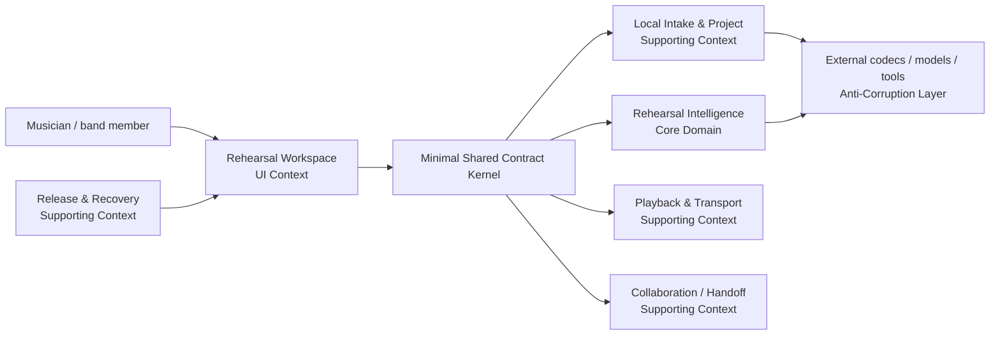
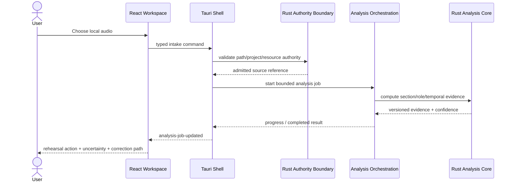

# BandScope Product-Technical Gap Baseline

Last updated: 2026-09-01
Evidence capture: 2026-09-01 20:04 KST unless a row says otherwise
Protected base: `develop@749511c3ad4000090048718f685c6bee6b3d2c25`

## 1. Purpose and buyer outcome

This document is the current engineering evidence baseline for BandScope. Customer-facing behavior follows `docs/brand-story.md`: practical, rehearsal-first, non-authoritative, and explicit about uncertainty. This file connects buyer promises to implementation boundaries, tests, research, security controls, and live GitHub evidence; those internals must not leak into product copy.

BandScope is a local-first rehearsal companion for working musicians and band hobbyists who need to understand a song quickly and spend rehearsal time playing rather than decoding an arrangement.

```text
trusted install
→ admit a real song safely
→ derive evidence-backed section/role guidance
→ expose uncertainty and allow correction
→ rehearse a precise passage
→ save/recover accepted work
→ share a bounded handoff
→ update or roll back safely
```

BandScope is not a DAW, notation editor, mandatory cloud service, or an authority that claims one analysis is unquestionably correct.

### 1.1 Buyer-facing PRD

Core jobs:

1. identify what each instrument/vocal role should prepare;
2. understand form, entries/dropouts, timing, harmony, range, overlap, handoffs, and setup cues by section;
3. rehearse the highest-value passage without rebuilding transport in another tool;
4. correct uncertain analysis while retaining model/user provenance;
5. return later without losing accepted work;
6. install/update a build whose identity and provenance can be verified.

Representative user stories:

- As a player, I can open a local song and see the first useful rehearsal action without learning a DAW.
- As a band member, I can see section×role guidance rather than a single flat song-wide chord track.
- As a user, I can distinguish machine evidence from user-confirmed correction.
- As a player, I can count in, loop, navigate cues, and use the same controls from keyboard and assistive technology.
- As a returning user, I can recover the last known-good project after a crash, interrupted write, migration, or failed update.

## 2. Current architecture and responsibility boundaries

Protected `develop` remains a local desktop architecture:

- `apps/desktop`: React/Vite rehearsal workspace in a Tauri shell;
- `apps/desktop/src-tauri`: native command/orchestration boundary;
- `apps/desktop/core`: Rust authority/input validation helpers;
- `packages/shared-types`: versioned cross-layer contracts;
- `services/analysis-engine`: current Python orchestration plus still-mixed music-analysis code;
- `services/analysis-engine/rust`: `bandscope_numeric` Rust/PyO3 numerical kernels.

Typed Tauri IPC and bounded stdin/stdout JSON are the local orchestration path; ordinary local analysis does not require a loopback HTTP server or cloud service. Files, URLs, project data, model artifacts, PDFs, subprocess output, exports, and diagnostics are untrusted at their owning boundaries.

### 2.1 DDD context map



Core subdomain: **Rehearsal Intelligence**. Supporting subdomains: Local Intake & Project, Playback & Transport, Release & Recovery, and bounded Collaboration/Handoff. Generic concerns: logging, localization, accessibility primitives, release metadata, and supply-chain evidence.

Shared Kernel stays intentionally small: stable identifiers plus section/role/cue/confidence/provenance and versioned interchange contracts. Codec, Demucs/librosa-era, PDF, platform, and accelerator types remain behind Anti-Corruption Layers.

### 2.2 Ubiquitous language, aggregates, invariants, events

| Term | Meaning | Invariant / transaction boundary |
|---|---|---|
| `RehearsalProject` | durable work for one admitted rehearsal source | one published project version; no partial publication |
| `SongSection` | time-bounded structural region | ordered, finite range inside admitted media duration |
| `RehearsalRole` | instrument, vocal function, or useful subdivision | guidance belongs to a section/project and retains provenance |
| `RehearsalCue` | actionable entry/stop/pickup/handoff/range/setup/timing instruction | referenced section/time/role remains resolvable |
| `AnalysisEvidence` | versioned machine estimate with confidence/provenance | never silently promoted to user-confirmed truth |
| `ManualOverride` | user-confirmed correction | preserves original evidence and authoring provenance |
| `RehearsalTransport` | count-in/loop/playback/navigation state | one authoritative state machine; no competing writers |

Candidate domain events: `AnalysisCompleted`, `CueConfirmed`, `SectionBoundaryCorrected`, `LoopActivated`, `ProjectSnapshotPublished`, `ProjectRecovered`, and `UpdateRollbackCompleted`.

## 3. Technical design contract (TRD)

### 3.1 Rust owns repository core computation

Protected `develop` is still mixed: Rust owns selected numerical kernels, while material DSP/feature/ranking work remains Python/NumPy. That is a product-technical gap, not a permanent target architecture.

Target contract:

- repository-owned mathematical, DSP, vector, matrix, exploratory/data-science, ranking/weighting, token-size, and other core analysis computation is Rust;
- Python may remain only as bounded orchestration/compatibility while migration is incomplete;
- CPU execution uses bounded multithreading with avoidable context switching removed;
- accelerator support is explicit and measured: CPU baseline, then validated CUDA/OpenCL/MLX adapters where meaningful;
- Rust↔Python parity proves migration correctness but does not justify a hidden permanent Python numerical fallback;
- no heuristic weight or rule-of-thumb threshold is accepted without a documented measurement model, calibration dataset, or research basis.

Migration order follows buyer impact and dependency leverage: temporal/beat and harmony → range/pitch/role features → prioritization/weighting → source-separation integration → remaining vector/matrix utilities.

### 3.2 Real-audio measurement contract

Synthetic fixtures are acceptable for unit tests but are not product-accuracy evidence. GA evidence requires licensed or redistribution-safe real audio and human-verified ground truth.

Task-specific metrics remain separate:

- harmony/chords: benchmark-defined chord metric such as Weighted Chord Symbol Recall;
- beat/timing: listener-annotated event metrics compatible with the chosen MIREX task contract;
- source separation: SI-SDR plus task-appropriate robustness/perceptual evidence;
- range/pitch/transcription: reference-note/frame/event metrics declared with the corpus;
- section/cue boundaries: time-tolerant event metrics whose tolerance comes from annotation uncertainty and rehearsal error cost, not an unexplained constant.

Acceptance criteria are preregistered before tuning. Candidate-vs-baseline inference reports uncertainty across tracks; CI thresholds are never invented merely to obtain green status.

### 3.3 Persistence, playback, release, privacy

- **Project source of truth — Issue #962:** atomic publication, known-good backup, deterministic/idempotent migration, bounded inputs, explicit single-writer/locking ownership, tested crash recovery.
- **Active rehearsal player — Issue #961:** precise loop/count-in/rate/cue/role interaction; timing-sensitive transport belongs in Rust; real-time callbacks do no unbounded allocation, blocking I/O, network access, or lock-heavy work.
- **Trusted distribution — Issue #960:** signed/notarized artifacts, verifiable updater metadata, SPDX SBOM/provenance, staged rollout and rollback evidence.
- **Private diagnostics — Issue #963:** ordinary logs/support bundles exclude raw private audio, secrets, full local paths, and dependency-controlled exception payloads.

## 4. Capability and gap matrix

| Capability | Current direction | Remaining buyer-visible gap |
|---|---|---|
| Local file intake | implemented authority boundary | complete resource budgets and cross-platform fault evidence |
| YouTube import | policy-constrained/partial | honest failure guidance; no DRM/login bypass |
| Section×role hierarchy | represented | real-audio accuracy + correction round trip |
| Harmony guidance | implemented/mixed compute | calibrated evidence, Rust ownership, uncertainty quality |
| Groove/beat/timing | implemented/mixed compute | real-audio benchmark, Rust ownership, full production integration |
| Range/overlap | implemented | reference-audio validation + Rust migration |
| Stems/source separation | partial | platform/accelerator coverage, artifact provenance, real-audio SI-SDR |
| Confidence/provenance | represented | calibration + user correction persistence |
| Rehearsal action map | many open slices | consolidate micro-PRs into coherent section/role UX |
| Active player | incomplete | #961 |
| Crash-safe project/autosave | incomplete | #962 |
| Signed/notarized update/rollback | partial | #960 |
| Private support bundle | incomplete | #963 |
| Licensed first-run demo | incomplete | #964 |
| WCAG/Figma/Storybook parity | incomplete | #965 |
| Sustainable merge train | incomplete | #966 |

## 5. Live backlog and delivery evidence

Fresh repository searches in this delivery cycle report **185 open BandScope pull requests** and **18 open BandScope issues**, both with `incomplete_results=false`, above protected `develop@749511c3ad4000090048718f685c6bee6b3d2c25`. These counts are volatile operational evidence, not product constants.

The most recent full organization recount recorded by canonical PR #1116 saw **73 accessible ContextualWisdomLab repositories** and an end-of-recount organization-wide search of **2,681 open pull requests**. That organization-wide recount was sequential and is retained only as capture-time prioritization evidence; this file does not represent it as an exact current total without another complete recount. Its last high-backlog capture was BandScope 185, TEPP 144, OriginWeave 140, newsdom-api 130, and naruon 125. BandScope remains the selected delivery lane because it combines the largest captured backlog with direct ownership of the end-user rehearsal product.

### 5.1 Current merge-loop evidence

Protected `develop` currently requires these status contexts: `ci / build-and-test`, `dependency-review`, `security-audit`, `sbom`, `release-preflight`, Windows/macOS build gates, `trivy-fs`, `coverage-evidence`, `opencode-review`, `strix`, `scan-pr-queue`, `osv-scan`, `scorecard`, and CodeQL JavaScript/TypeScript + Python analysis. Required contexts are read from live branch protection before merge; this list is evidence from this capture, not permission to infer future policy.

Current canonical ownership and succession evidence:

- **#783 is protected dependency-security truth.** It merged normally on 2026-08-25 as `7ad56cf0065d068ec6463d92726de4855a6e201d`; protected `develop@749511c3...` descends from it. Open feature branches must not keep treating the old inherited npm HIGH set as an unmerged external owner or suppress it locally.
- **#1103 remains the canonical desktop CSV NUL-hardening owner.** #1121 was closed only after its unique NUL-only regression transferred into #1103 in normal non-force history. No predecessor checks or reviews transferred.
- **#1007/#1094 first-part-handoff succession is not yet closable.** #1007 exact head `5261b1cbb15fd6587425c954c3480991394afc74` now contains mounted Workspace selected-role wiring, stale-role fail-open behavior, and the #1094 scientific requirement that heuristic fallback cannot manufacture handoffs. Exact-head Windows and macOS build gates remain queued, so #1094 stays open until the unchanged canonical head is revalidated and unique-requirement parity is reconfirmed.
- **#1116 is the canonical `docs/product-technical-gap-baseline.md` owner.** This source update replaces its stale 188-PR/72-repository and pre-transfer paragraphs with the live BandScope counts and current ownership evidence. The resulting commit creates a new exact head, so all predecessor check/review evidence is invalidated.
- **#968 is the canonical executable #966 queue-contract lane, stacked on #1116.** Its exact head at this capture is `ec825fa3226075a2cdf5281e487ccb2992cb11be`. Live GitHub evidence proved that `git/matching-refs/heads/` spans multiple pages in this repository; the prior single-response implementation could falsely declare a stacked base absent. #968 now has regression-first bounded branch-ref pagination, pagination-bound failure, malformed-page rejection, exact current PR heads, independent base-tip resolution, deterministic sorting, and symlink-safe atomic publication. It remains Draft with zero exact-head check runs, which is non-passing rather than green.
- **#1119 owns Trivy PR-head SARIF coverage.** Its PR body is stale relative to the actual branch head: the live head is `162247e2827434fa531c2d12204023c113d63b9c`, a one-file trigger commit for an existing bounded policy-repair writer. The stale `test_supply_chain_policy.py` assertion still needs the actual source repair and marker cleanup. This lane already has an active writer; do not create a duplicate policy-test writer or treat the trigger as product-fix evidence.
- **Central review-control repair #1546 is protected truth** in `ContextualWisdomLab/.github/main@5686de41660d51a7a7f22b8840dfa6ccfe5ff3f1`. The post-#1546 `scripts/ci` coverage regression remains outside BandScope source ownership. Canonical central owner #1567 is still open at exact head `400f2b5a63a5cdaf95a42ee4d49a4e492132738b`; it carries the 100% coverage restoration plus stacked Noema cleanup and needs its own fresh exact-head checks/review before protected-main integration.

Operational invariant: queued/pending/neutral/skipped/cancelled/failed, absent, predecessor-head, protected-base, self/author, status-only, and model-only evidence is non-passing. Central-gate defects are repaired in the owning central repository; member branches do not weaken gates or use administrative bypass.

## 6. Prioritized product-technical backlog

Priority is buyer impact × dependency leverage × risk, not PR age.

### P0 — trustworthy product completion

1. **Sustainable exact-head merge throughput — #966.** Consolidate duplicate/superseded writers, require current-head terminal gates, zero actionable threads, and current qualifying independent non-author approval.
2. **Real-audio accuracy — #770.** Licensed corpora, human truth, task-specific metrics, preregistered statistical acceptance, reproducible artifacts.
3. **Rust core-computation migration.** Inventory every DSP/math/vector/matrix/data-science call path and move production ownership to Rust with CPU multithread + explicit accelerator boundaries.
4. **Resource/filesystem authority completion.** Bounded duration/size/allocation, cancellation, path containment, model/PDF bounds, and cross-platform production-path fault tests.

### P1 — close the rehearsal loop

5. **Active rehearsal player — #961.**
6. **Crash-safe project/autosave — #962.**
7. **Trusted distribution/update/rollback — #960.**
8. **Private diagnostics/supportability — #963.**
9. **Licensed first-run rehearsal — #964.**
10. **WCAG 2.2 AA + Figma/Storybook/shipped parity — #965.**

### P2 — analytical depth after the core loop is reliable

11. Replace unbounded “first-X” plan-field micro-PR growth with coherent engine-generated role guidance, conflict rules, priority, and edit provenance.
12. Replace untraceable weights/priors with documented literature/calibration evidence and sensitivity tests.
13. Preserve the `song → section → role → time` hierarchy; use multilevel/time-dependent evidence where it materially improves rehearsal decisions instead of atomistic aggregation.
14. Harden model artifact provenance and reproducibility across CPU/CUDA/OpenCL/MLX-supported paths.
15. Expand collaboration only behind a stable local-first project/handoff contract and a clear buyer outcome.

## 7. Quality, UX, test, security, and operability baseline

### 7.1 Coverage and documentation

- Python production coverage/docstring policy is 100% in repository guidance.
- Protected JavaScript configs still contain 90% thresholds in parts of the repository; this is below the target contract.
- Target: **100% statement coverage, 100% branch/edge-case coverage, and 100% public/repository-owned API documentation coverage** for owned production surfaces. A lower configured threshold is a gap, not equivalent evidence.

### 7.2 Realistic validation

Minimum scenario inventory includes supported 44.1/48/96 kHz audio, mono/stereo, short/long recordings, pickup before bar one, odd meter, tempo change, silence near boundaries, unsupported codecs, moved/replaced files, device changes, cancellation, disk full, corrupted project state, migration interruption, unavailable source separation, and uncertainty correction round trips.

### 7.3 UI/design acceptance

Storybook is the executable component/interaction inventory; Figma is reviewed design/handoff evidence, not a second runtime authority. UI changes require screenshot-backed validation of relevant states and edge cases, keyboard/focus behavior, touch target sizing, responsive layout, typography/color contrast, animation/reduced-motion, forms/feedback, navigation, and data visualization alternatives. Repeated visual objects belong behind shared tokens/components, not per-feature drift.

Customer copy names the next action and never exposes repository/module boundaries. English/Korean semantics stay aligned.

### 7.4 Security and supply chain

- ordinary analysis stays local and network-independent;
- files/URLs/metadata/models/PDFs/project state/subprocess output are untrusted;
- capabilities are narrow and allowlisted; no generic exec/read/write surface;
- Dependency Review, OSV, Trivy, CodeQL, secret scanning, SBOM, release provenance, and cross-platform build controls remain fail-closed;
- suppressions are not a substitute for root-cause remediation;
- signing/release credentials never enter repository files or ordinary artifacts.

### 7.5 Release/operability

GA requires protected-source identity, reproducible build evidence, checksums, SPDX SBOM/provenance, supported architecture matrix, signatures, macOS notarization, verified update metadata, offline startup, and tested repair/rollback. A development artifact alone is not GA evidence.

## 8. UML / state supplements

### 8.1 Import → analyze → rehearse



### 8.2 Project state machine

```mermaid
stateDiagram-v2
    [*] --> Clean
    Clean --> Dirty: accepted mutation
    Dirty --> Staging: autosave/manual save
    Staging --> Published: validate + atomic replace
    Staging --> Dirty: failure; retain known-good
    Published --> Dirty: next mutation
    Published --> RecoveryAvailable: unclean shutdown/newer recovery evidence
    RecoveryAvailable --> Published: restore validated snapshot
    RecoveryAvailable --> Clean: discard recovery evidence
```

## 9. Research and standards traceability

Standards are evaluation structures, not decoration:

- ISO/IEC 25010:2023 supplies the product-quality model for specifying/evaluating software quality characteristics.
- NIST SP 800-218 SSDF v1.1 supplies outcome-oriented secure-development practices and traceable security requirements/design decisions.
- WCAG 2.2 is the current W3C Recommendation baseline for desktop-webview accessibility.
- MIREX task definitions provide domain-relevant precedent using real audio and human/listener annotation.
- MIR evidence remains task-specific: Foote for self-similarity/novelty, Viterbi for sequence decoding, Le Roux et al. for SI-SDR, and benchmark-specific corpora/metrics for harmony. These references do not justify unrelated hand-tuned product weights.

### References (APA 7th)

Foote, J. (1999). Visualizing music and audio using self-similarity. In *Proceedings of the Seventh ACM International Conference on Multimedia* (pp. 77–80). Association for Computing Machinery.

International Organization for Standardization, & International Electrotechnical Commission. (2023). *ISO/IEC 25010:2023 Systems and software engineering—Systems and software Quality Requirements and Evaluation (SQuaRE)—Product quality model* (2nd ed.). ISO.

Le Roux, J., Wisdom, S., Erdogan, H., & Hershey, J. R. (2019). SDR—Half-baked or well done? In *2019 IEEE International Conference on Acoustics, Speech and Signal Processing (ICASSP)* (pp. 626–630). IEEE.

Music Information Retrieval Evaluation eXchange. (2025). *Audio beat tracking*. MIREX Wiki. https://music-ir.org/mirex/wiki/2025:Audio_Beat_Tracking

Souppaya, M., Scarfone, K., & Dodson, D. (2022). *Secure Software Development Framework (SSDF) Version 1.1: Recommendations for mitigating the risk of software vulnerabilities* (NIST Special Publication 800-218). National Institute of Standards and Technology. https://doi.org/10.6028/NIST.SP.800-218

Viterbi, A. J. (1967). Error bounds for convolutional codes and an asymptotically optimum decoding algorithm. *IEEE Transactions on Information Theory, 13*(2), 260–269.

World Wide Web Consortium. (2023). *Web Content Accessibility Guidelines (WCAG) 2.2*. https://www.w3.org/TR/WCAG22/

## 10. Re-runnable verification

```bash
# protected source identity
git rev-parse develop

# organization-wide open PR count; -f remains a GET query because the method is explicit
gh api --method GET search/issues -f q='org:ContextualWisdomLab is:pr is:open' --jq '.total_count'

# BandScope current queue
gh pr list --state open --limit 500 --json number --jq 'length'

# BandScope current issue count
gh issue list --state open --limit 500 --json number --jq 'length'

# exact-head merge evidence for a candidate
gh pr view <PR> --json number,state,isDraft,headRefOid,baseRefOid,reviews,statusCheckRollup

# product/doctoring Mermaid inventory
git grep -n '```mermaid' -- docs ARCHITECTURE.md

# JS threshold gap
git grep -n '90' -- apps/desktop/vite.config.ts packages/shared-types/vitest.config.ts

# Rust numerical ownership and remaining Python production modules
git grep -n 'checkerboard_novelty\|viterbi_decode' -- services/analysis-engine/rust services/analysis-engine/src
find services/analysis-engine/src/bandscope_analysis -type f -name '*.py' -print

# real-audio test fixture inventory
find . -type f \( -path '*/tests/*' -o -path '*/test/*' \) \
  \( -iname '*.wav' -o -iname '*.flac' -o -iname '*.mp3' \) -not -path './.git/*' -print
```

Every GitHub state in this document is capture-time evidence. Immediately before a merge, re-fetch the unchanged exact head, current branch protection, all required checks, review decision, unresolved threads, dependency/ancestry order, and concurrent writer state.
